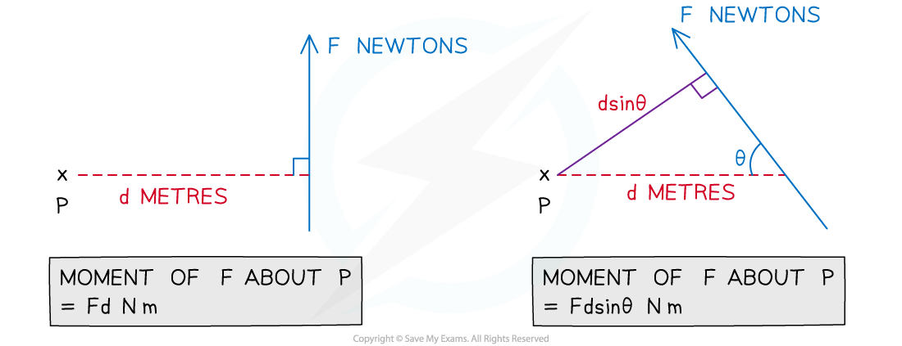
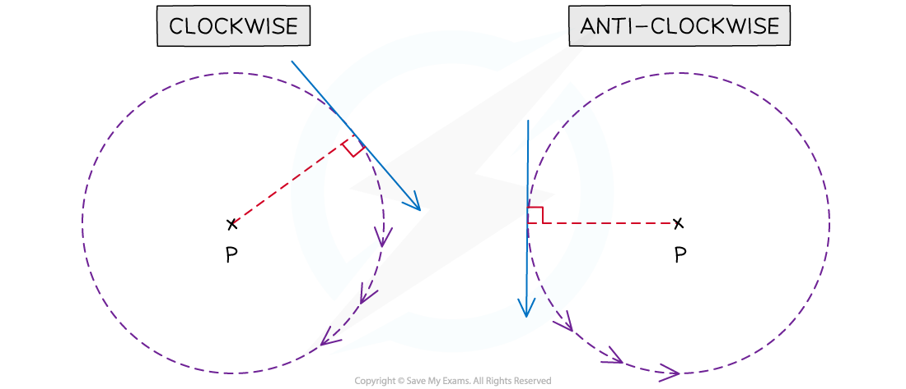

# Moments Diagrams

## Moments Diagrams

> **Spec point** — `spcpt_gwDNP8pgh2FJjrxv`

## Moments diagrams

When an object is modelled as a ***particle*** we do **not** need to consider the **rotation** of the object due to forces. When we model an object as a ***rigid body*** then we need to consider the rotation of the object.

### What is a moment?

- The **moment** of a force is the measure of its ability to cause a body to **rotate** about a specific point (usually called the **pivot**)
- The **units** for moments are **newton metres** (N m)
- A force can cause a body to rotate **clockwise** or **anti-clockwise**
- The moment of a force about a point is calculated by **multiplying** the magnitude of the **force** by the **perpendicular distance** from the line of action of the force to the point

  - We can choose the **positive direction** to be **clockwise** or **anti-clockwise** and the **negative direction** is the **opposite**
  - A **zero moment** will not cause a body to rotate
- The **moment** of a force about a point is **zero** if the line of action of the force goes through the point
- If the force is not acting perpendicular to the distance given you will need to use right-angled **trigonometry** to find the perpendicular distance

### How do I know if a moment is clockwise or anti-clockwise?

- ** **A clockwise moment will cause a body to rotate in the clockwise direction
- To visualise this:

  - Imagine that the perpendicular line from the point to the force is the radius of a circle
  - The direction of the force tells you which way the circle goes round

### What is the resultant moment?

- The **resultant** moment is the **sum** of **all** the moments acting on a body (both positive and negative)
- To find the resultant moment:

  - Define the positive direction (clockwise or anti-clockwise)
  - **Add together** all the moments in **that direction**
  - **Subtract all** the moments in the **opposite direction**
  - The overall value is the resultant moment
- The **sign** of the **resultant** moment indicates which direction the body will rotate

  - Positive will be the direction chosen as positive
  - Negative will be the opposite direction

> **Worked Example**
> Calculate the resultant moment about P of the forces indicated in the following diagram.
> 
> **Answer:**
> 
> 
> 
> 

> **Exam Hint**
> - Always define a positive direction as either clockwise or anti-clockwise.
> - It is best to state the magnitude of a moment and write its direction when giving a final answer.
