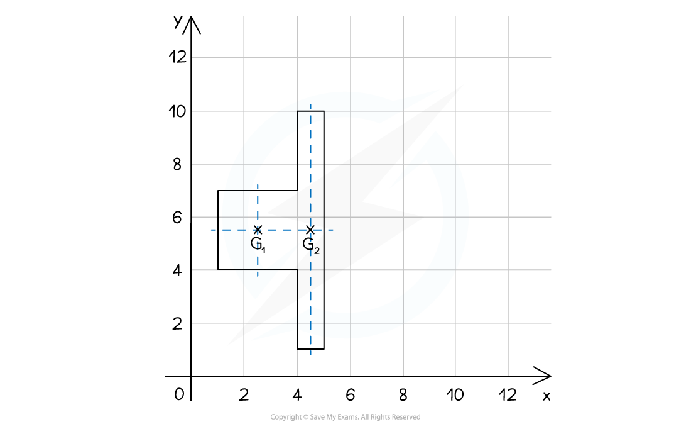
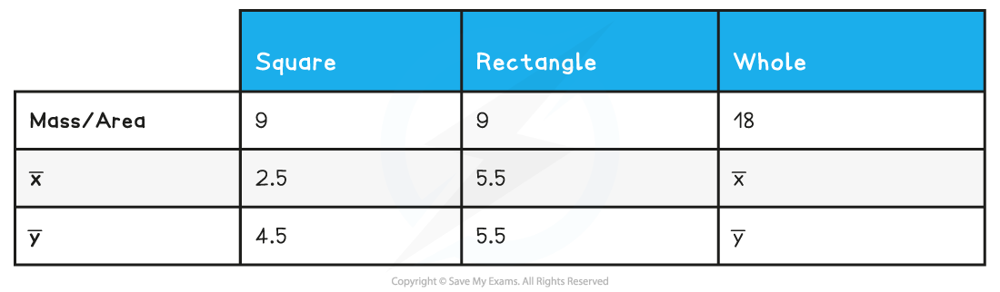

# Composite Laminas

## Composite Laminas

> **Spec point** — `spcpt_BmcFcHKtKXtfzjCH`

## Composite Laminas

#### A brief reminder of centre of mass …

- The **centre** **of** **mass** is the **point** at which the **total** **mass** of a body (or a system of bodies) can be considered to **act** **as** **one**

#### What is a composite lamina?

- A **composite** **lamina** is a non-standard shaped lamina that can be constructed from **two** **or** **more** of the **standard** **uniform** **laminas** – **rectangles**, **circles**, **sectors** and **triangles**
- Examples include

  - two rectangular laminas made into a L-shaped shelf
  - a semi-circular lamina cut from a larger semi-circular lamina to create a rainbow shaped sign
  - two overlapping circular laminas
- In Mechanics 2 both **uniform** (this Revision Note) and **non**-**uniform** laminas (Revision Note 2.1.7) are considered

#### What modelling assumptions are used with composite laminas?

- (For this Revision Note) all laminas making a composite lamina are made from the **same** **uniform material**

  - **uniform** means the **mass** per **unit** **area** ($m$ kg) is **equal** at **every** **point** on a lamina
  
    - the **mass** of a lamina is **proportional** to its **area** ($A$ m2)
    - i.e. Mass of a lamina = $Am$ kg
  - **every** lamina being **made** from the **same** **material** means that the mass per unit length will be the **same** for every lamina
  
    - i.e. $m$ will be the **same** for every lamina
    - $m$’s cancel in the equation for finding the position of the centre of mass
    - only the value of *A*(i.e. the **area** of each lamina) is needed in calculations
- A composite lamina is flat so is modelled as existing in a (2D) plane

  - the third dimension will be small compared to the other two so is negligible
- Any material/mass used in the process to join laminas is negligible

#### How do I find the centre of mass of a composite lamina?

- In short, find the **area** and **position** of the **centre** of **mass** for the **individual** parts of the composite lamina, then treating these as ***particles*** with **mass** **equal** to the **area**, use the equation below (Revision Note 2.1.1) to find the position vector of the centre of mass of the composite lamina

$\underset{}{\sum}m_{i}r_{i}=\overline{r}\underset{}{\sum}m_{i}$

STEP 1        Sketch a diagram, or add to a diagram if one has been given

Create your own axes if necessary

Split the composite lamina into two or more standard laminas

e.g.

STEP 2       Calculate the area and the position of the centre of mass for each standard lamina

List the results in a table to make the equation easier in the next step

(For both squares and rectangles, the position of the centre of mass will be their centres; G1(2.5, 5.5) and G2(4.5, 5.5) which are easy to ‘see’, similarly the areas of these shapes are simple to calculate so the table can be completed directly.)

STEP 3       Treat *G**1* and *G**2* as the positions of **particles** with **masses** the area of the standard laminas.

Use $\summ_{i}r_{i}=\overline{r}\summ_{i}$to find the ***position vector*** of the centre of mass *(G)* of the composite lamina.

Remember to give the final answer in the required format.

e.g.    `begin mathsize 16px style 9 left parenthesis 2.5 bold i plus 5.5 bold j right parenthesis plus 9 left parenthesis 4.5 bold i plus 5.5 bold j right parenthesis equals 18 left parenthesis top enclose x bold i plus top enclose straight y bold j right parenthesis end style`

`begin mathsize 16px style 18 left parenthesis top enclose x bold i plus top enclose y bold j right parenthesis equals 63 bold i plus 99 bold j end style`

`left parenthesis top enclose x bold i plus top enclose y bold j right parenthesis equals 3.5 bold i plus 5.5 bold j`

So the coordinates of the centre of mass *(G)* of the composite lamina are(3.5, 5.5)

Looking back at the diagram this seems a sensible answer.

- In the example above

  - $x$ and $y$ could’ve been treated separately rather than use vector notation
  - the line $y$ = 5.5 is an axis of symmetry of the **composite** lamina so the $y$-coordinate of the centre of mass could’ve been written down without any calculations being made
- **Composite** **laminas** also include cases where a **standard** lamina has been **removed** from another standard lamina – the **worked** **example** below demonstrates this

> **Worked Example**
> A uniform lamina in the shape of a triangle has a circle of radius 1 cm and centre (3, 5) removed from it as shown in the diagram below.
> 
> 
> 
> Find the coordinates of the centre of mass of the resulting lamina, giving your coordinates to three significant figures.
> 
> **Answer:**
> 
> 

> **Exam Hint**
> - Sketch diagram(s) or add to any given in a question.
> - If not referenced in a question create a coordinate system of your own, making it clear on your diagrams where your origin is.
> - For composite laminas that have parts removed, treat the parts removed as having negative area.
> - You do not have to use vector notation; you can treat each dimension separately.  However, do ensure your final answer is in the required format.
> - Beware!  The formula booklet lists the formulae for laminas and frameworks together.
