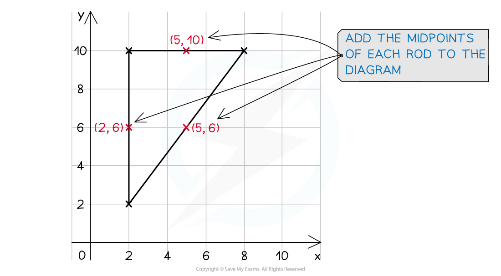
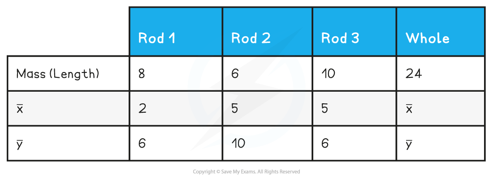
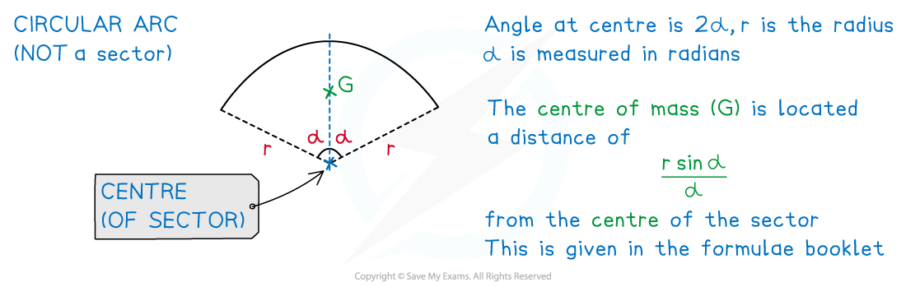

# Frameworks

## Frameworks

> **Spec point** — `spcpt_my56RTTfbKXhBwDD`

## Frameworks

#### A brief reminder of centre of mass …

- The **centre** **of** **mass** is the **point** at which the **total** **mass** of a body (or a system of bodies) can be considered to **act** **as** **one**

#### What is a framework?

- A **framework** is created by joining thin-linear-shaped bodies (e.g. a pole or post) together to create a **flat** design or shape
- Such bodies can be **modelled** **mathematically** as ***rods*** or ***wires***
- Examples include

  - the supporting structure for the roof of a house
  - four straight rope lights joined together to make a rectangular rope light
- In Mechanics 2 both **uniform** (this Revision Note) and **non**-**uniform** rods (Revision Note 2.1.7) are considered
- A framework would not be split into standard shapes as **perimeter** rather than the **area** is being worked with

#### What modelling assumptions are used with frameworks?

- (For this Revision Note) all rods (or wires) making a framework are made from the **same** **uniform material**

  - **uniform** means the **mass** per **unit** **length** ($m$ kg) is **equal** at **every** **point** along a rod
  
    - the **mass** of a rod is **proportional** to its **length** ($l$ m)
    - i.e. Mass of a rod =$lm$* *kg
  - **every** rod/wire being **made** from the **same** **material** means that the mass per unit length will be the **same** for every rod/wire
  
    - i.e. $m$ will be the **same** for every rod
    - $m$’s cancel in the equation for finding the position of the centre of mass
    - only the values of $l$(i.e. the **lengths** of each rod) are needed in calculations
- A framework is flat so is modelled as existing in a ***(2D) plane***

  - the third dimension will be small compared to the other two so is negligible
- Any material/mass used in the process to join rods (or wires) is negligible

#### How do I find the centre of mass of a framework?

- In short, find the **length** and **position** of the **centre** of **mass** for each **individual** rod, then treating these each as a ***particle*** with **mass** **equal** to the **length** of the rod, use the equation  `sum for blank of m subscript i r subscript i space equals top enclose r space stack sum m subscript i with blank below` to find the position vector of the centre of mass of the framework (Revision Note 2.1.1)

STEP 1   Sketch a diagram, or add to a diagram if one has been given

Create your own axes if necessary

Identify the different rods making up the framework

e.g.

STEP 2   Find the length and the position of the centre of mass of each rod using midpoints

List the results in a table to make the equation easier in the next step

The length of the diagonal rod (Rod 3) is found by Pythagoras’ Theorem, $\sqrt{8^{2}+6^{2}}=10$

STEP 3   Treat the **midpoints** as the positions of **particles** with **masses** the length of the rods.

Use `begin mathsize 16px style sum for blank of m subscript i r subscript i space equals top enclose r sum for blank of m subscript i end style` to find the ***position vector*** of the centre of mass (G) of the framework.

Remember to give the final answer in the required format.

e.g.  `8 left parenthesis 2 bold i space plus 6 bold j right parenthesis space plus space 6 left parenthesis 5 bold i space plus 10 bold j right parenthesis plus 10 left parenthesis 5 bold i plus 6 bold j right parenthesis space equals space 24 left parenthesis top enclose x bold i plus top enclose y bold j right parenthesis`

`24 left parenthesis top enclose x bold i plus top enclose y bold j right parenthesis equals 96 bold i bold space plus 168 bold j`

`top enclose straight r space equals open parentheses top enclose x bold i plus top enclose y bold j close parentheses space equals 4 bold i plus 7 bold j`

So the coordinates of the centre of mass (*G*) of the framework are (4, 7)

Looking back at the diagram this seems a sensible answer.

- In the example above $x$ and $y$ could’ve been treated separately rather than use vector notation

#### What if a rod or wire is curved (circular)?

- In Mechanics 2 if a **curved** **rod** or **wire** is involved in a **framework** it will be in the shape of a **circular** **arc**
- Recall that the formulae for the **length** of an **arc** is “$l=rθ$” where *l* is the length of the arc, *r* is the radius and θ is the angle at the centre measured in radians
- The formula for finding the **position** of the **centre** of **mass** of a **circular** **arc** is **similar** but **different** to that for a **sector** of a **circle** **lamina**

- This is given in the formulae booklet
- Some questions may work with a **circular** **arc** **only**, some may work a **sector** of a **circle** that would include the two radii

> **Worked Example**
> A light-up shop sign is a framework made from two straight wires and one circular arc wire creating the shape of a sector of a circle.  The angle at the centre of the sector is $\frac{π}{3}$ radians and the two straight wires are both 60 cm in length.  All three wires are made from the same uniform material.
> 
> (a) State the significance of all three wires being made from the **same** **uniform** **material**.
> 
> (b) Describe the position of the centre of mass of the shop sign in relation to the centre of the sector.
> 
> (a)  State the significance of all three wires being made from the **same** **uniform** **material**.
> 
> 
> 
> (b)  Describe the position of the centre of mass of the shop sign in relation to the centre of the sector.
> 
> **Answer:**
> 
> 
> 
> 

> **Exam Hint**
> - The methods for finding the position of the centre of mass for a sector and a circular arc are similar but different.  Both are given in the formulae booklet.  Ensure you are clear about which you are working with.
> - Beware!  The formula booklet lists the formulae for laminas and frameworks together.
