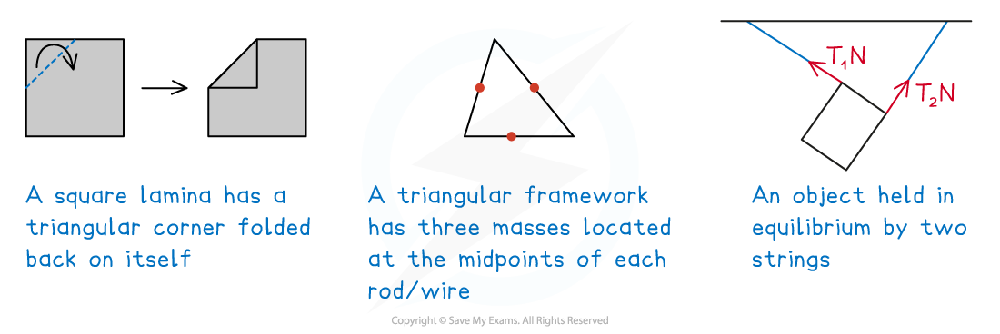

# Non-uniform Objects & Other Problems

## Non-unform Objects & Other Problems

> **Spec point** — `spcpt_tfkRwhFnDhW2V73x`

## Non-unform Objects & Other Problems

#### What is meant by a non-uniform lamina/framework?

- Strictly speaking a ***non-uniform*** ***lamina*** would be one that has **different** **densities** at **different** **points** on its **surface** and a **non**-**uniform** ***framework*** would be one that is made from rods/wires that have **different** **densities** **along** their **lengths**.

  - e.g. a plank of wood (timber) may have knots in places on its surface
- However, for the problems you encounter in IAL Mechanics 2 **non**-**uniform** **means** each **individual** **lamina** making a **composite** **lamina** may be of a **different** **density** but each **individual** **lamina** is ***uniform***
- Similarly, for a **framework**, each **individual** **rod**/**wire** will be **uniform**, but the **framework** may be **made** from rods/wires of **different** **densities**.

#### What other problems may I encounter in IAL Mechanics 2 (M2)?

- **Non**-**uniform** **problems**

  - Non-uniform (composite) **laminas** may be created by having uniform laminas **overlapping** each other or by taking **part** of a **lamina** and **folding** it back upon itself
  - Non-uniform **frameworks** would be made from **rods**/**wires** that have **different** (but related) **densities** or **thickness**
  - The **relationship** between the **different** **densities** will be **explained** in a **question**
  
    - e.g. part of a (uniform) lamina folded back on itself creates an area of double density
    - e.g. one cable in a framework is twice the thickness of the others
  - In solving problems remember, due to **uniformity**, we use can use **area** (**laminas**) and length (frameworks) rather than **mass** – so if we have **double** **density**, we **double** the **area**/**length** where necessary
- Another type of problem is where a **lamina** or a **framework** have an **object** (or **masses**) **attached** to them.

  - This will **affect** the **position** of the **centre** of **mass** of the lamina or framework
  
    - e.g. a framework made from metal rods could be holding up spotlights above a stage and so have lights (masses) attached to some (or all) rods
- Problems may involve laminas or frameworks being **suspended** by **more** **than** **one** **string** to keep them in a particular position

  - e.g. A sign hanging from a ceiling that needs to be pointing directly left
  - Such problems normally involved finding the position of the centre of mass and/or the tension in the strings, using skills from various parts of the mechanics course

> **Worked Example**
> A rectangular uniform lamina has one edge folded back upon itself as shown in the diagrams below.
> 
> 
> 
> (a) Find the coordinates of the centre of mass of the folded lamina
> 
> (b) The folded lamina is suspended from a ceiling by two strings attached at the points *P* and *Q*. The folded lamina remains horizontal in equilibrium. Find the tension in the two strings.
> 
> (a) Find the coordinates of the centre of mass of the folded lamina
> 
> **Answer:**
> 
> 
> 
> (b) The folded lamina is suspended from a ceiling by two strings attached at the points *P* and *Q*. The folded lamina remains horizontal in equilibrium. Find the tension in the two strings.
> 
> **Answer:**
> 
> 

> **Exam Hint**
> - Ensure you know whether you are working with a lamina or a framework.
> - Folded and overlapping laminas may form shapes that have axes of symmetry which can cut down the work in finding the position of the centre of mass.
