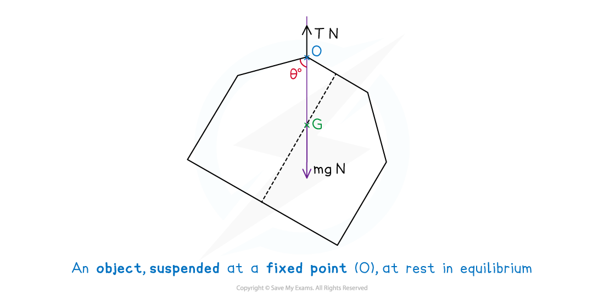
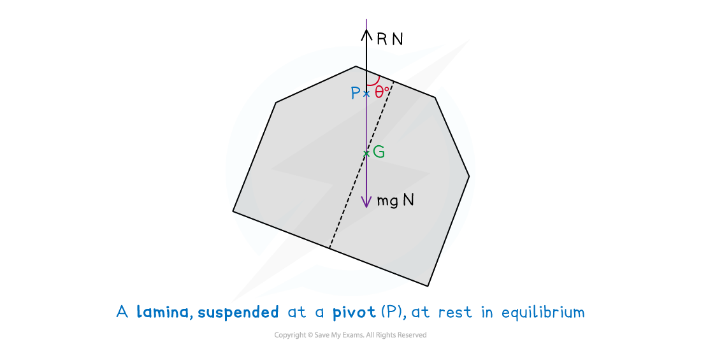

# Objects Suspended in Equilibrium

## Objects Suspended in Equilibrium

> **Spec point** — `spcpt_wr7k8jFjbRRkM7F3`

## Objects Suspended in Equilibrium

#### What is meant by objects suspended in equilibrium?

- An **object** can be **suspended** at a fixed point by a ***string*** such that it is allowed to **hang** **freely** and be in **equilibrium** (at rest)

  - e.g. A sign hung from the ceiling of a shop by single rope (string)
  - An **object** will either be a ***uniform*** ***lamina*** or a ***uniform*** ***framework***
- **Equilibrium** means

  - there is **zero** **resultant** (net) **force** acting on the object
  - there is **zero** **resultant** (net) **moments** about the point of suspension

- Objects suspended in **equilibrium** have two forces acting on them

  - **tension** in the string (acting at the **fixed** **point**)
  - **weight** (acting at the position of the **centre** of **mass**)
- These forces act through a **vertical** line which passes through the **point** of **suspension** and the **position** of the **centre** of **mass**
- Problems often require the **angle** that is created between this **vertical** line and an edge of the **object** to be found

- A **lamina** could be suspended at a **fixed** **point** from a **vertex** (as above) or along an **edge**, or, suspended by a **point** on its **surface** that it would then be able to **pivot** (rotate) around
- A **lamina** suspended at a **pivot** will have two forces acting on its

  - **reaction** force (acting at the **pivot**)
  - **weight** (acting at the position of the **centre** of **mass**)
- As with the fixed-point scenario above, these forces will act through a vertical line which passes through the point of suspension and the position of the centre of mass

- The mathematics involved in finding the angle is the same for both the fixed-point and pivot scenarios but you should be aware of the different phrasing in questions

#### How do I solve problems involving freely suspended laminas and frameworks?

STEP 1     Sketch a diagram or use a given one and add to it as you make progress

STEP 2     Find the position of the centre of mass of the object

Ensure you know whether you are working with a

**                           lamina** or a **framework** and the **differences** in finding the

**                           position** of the **centre** of **mass**

STEP 3     On your diagram, add the **position** of the **centre** of **mass**

Draw a **line** to represent the ***downward*** **vertical**

This will be a **straight** line connecting the **point** at which the **body** is **suspended** to the point of the **centre **of **mass**

**                           Identify** the **angle** required

STEP 4    Use trigonometry to find the required angle

**       Interpret** the result in the context of the problem and answer the question accordingly

> **Worked Example**
> As part of the set in a theatre production, a large polystyrene letter E is to be produced and will hang above the stage by a single rope attached to the ceiling.
> 
> 
> 
> The polystyrene letter is modelled as a uniform lamina and the rope is modelled as a light inextensible string.
> 
> Find the angle the rope makes with the side *PQ* when the sign is at rest and suspended from the point *P*.
> 
> **Answer:**
> 
> 

> **Exam Hint**
> - Ensure you know whether you are working with a lamina or a framework.
> - Once you have drawn the downward vertical line on your diagram turn your page (rather than trying to sketch it) to get an idea of how the lamina or framework would look like when suspended from the given point.
