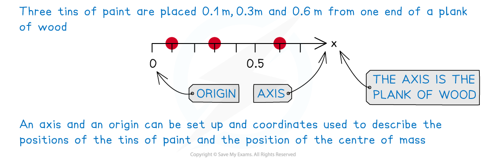
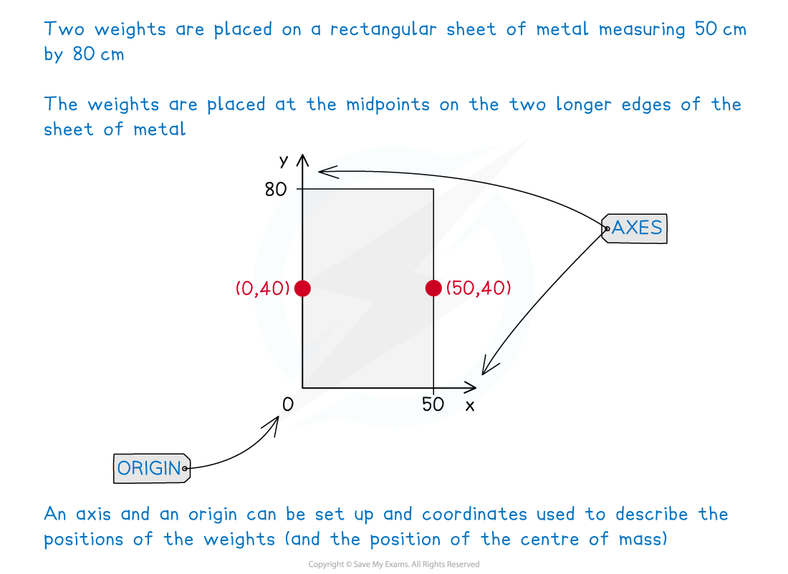

# Centres of Mass with Particles

## Particles Along a Straight Line

> **Spec point** — `spcpt_KWhgsKdbVnrJwpt7`

## Particles Along a Straight Line

#### What is/are centres of mass?

- The **centre** **of** **mass** of a **body** (or a **system** of **bodies**) is the **point** at which the **total** **mass** of the **body** (or **system**) can be considered to **act** **as** **one**

  - It is the **single** **point** at which the (force) **weight** ( **W = mg**)of the **whole** **system** acts
- Bodies are modelled as ***particles***

#### What is meant by particles along a straight line?

- This is when several **particles** making a **system** are arranged in a straight line
- This will be either horizontally or vertically – usually with reference to the *x*-axis or *y*-axis

  - $(\overline{x},0)$ would be the coordinates of the centre of mass along the x-axis
  - $(0,\overline{y})$ would be the coordinates of the centre of mass along the y-axis

#### So the particles do not have to be connected to each other?

- Not necessarily.
- Any **object** that is used to **connect** the **particles** can affect the centre of mass (see Revision Note 2.1.7 Non-uniform Objects & Other Problems) ***unless*** it is **modelled** as being ***light***

  - e.g. Tins of paint (particles) placed at various points along a plank of wood (connecting object)
  
    - If the plank of wood is **modelled** as **light** it will have no influence on the position of the centre of mass – i.e. it can be ignored

#### How do I find the centre of mass of a system of particles along a straight line

- Firstly, if no **axis** or **origin** have been given in a question, you will need to **create** **your** **own**

  - For example, the left-hand edge of the plank of wood could be the origin with the $x$-axis increasing towards the right-hand edge of the plank of wood

- In general for a system of *n* **particles** with **masses** $m_{1},m_{2},m_{3},.....m_{n}$ placed along the *x*-axis at the points with **coordinates** $(x_{1},0),(x_{2},0),(x_{3},0),....(x_{n},0)$, the **centre** of **mass**, point ($\overline{x}$ , 0) is found by solving

`sum from i space equals 1 to n of m subscript i x subscript i space equals x with bar on top space sum from i space equals 1 to n of m subscript i`

- We’re sure you can figure out the equivalent equation for particles placed along the y-axis!

STEP 1        Draw a diagram indicating the particles and their positions on the line.

This does not need to be a scale diagram but should indicate the axis and origin.

(Remember you may have to create your own axis and origin.)

If given a diagram, add anything necessary to it.

STEP 2       Set up an equation for the -coordinate for the centre of mass using

$\underset{}{\sum}$$m_{i}x_{i}=\overline{x}\underset{}{\sum}$$m_{i}$

(This is the same equation as above but you may sometimes see

it with the *n*  and the *i* =1 removed, as we have done here.)

STEP 3       Solve the equation and answer the question.

This may be giving the centre of mass as coordinates or describing its position relative to an object or body.

You can check your answer is sensible by comparing it to the location of the particles.

> **Worked Example**
> A set of 3 disco lights are modelled as being particles placed every 20 cm along a horizontal light rod.  The first light is located 15 cm from the end of the rod that is connected to the electricity supply.  Starting with the first light, in order, the lights have masses of 5 kg, 7 kg and 8 kg.
> 
> Describe the position of the centre of mass of the disco lights in terms of its distance from the end of the rod that is connected to the electricity supply.
> 
> 

> **Exam Hint**
> - Sketch diagram(s) or add to any given in a question.
> - If not referenced in a question create a coordinate system of your own, making it clear on your diagram(s) where the origin is.

## Particles in a (2D) plane

> **Spec point** — `spcpt_SbpcKYdQR7mqWw3f`

## Particles in a (2D) plane

#### What is meant by particles in a (2D) plane?

- Particles in a (2D) **plane** refers to a system where **particles** are arranged on a **surface**

  - e.g. The playing pieces (particles) on a chess board (plane)
- The two dimensions are horizontal and vertical

  - **Cartesian** (*x -y* axes) **coordinates** are used to describe the positions of the particles with $(\overline{x},\overline{y})$ being the coordinates of the **centre** of **mass** of the system
- **If** the particles are connected by an **object** – including the plane itself - the centre of mass may be affected (see Revision Note 2.1.7 Non-uniform Objects & Other Problems) - ***unless*** the connecting object is **modelled** as being ***light***

#### How do I find the centre of mass of a system of particles in a (2D) plane?

- Firstly, if no **axis** or **origin** have been given in a question, you will need to **create** **your** **own**

  - For example, the bottom left corner of a sheet of metal edge could be the origin with the *x*-axis running along the bottom edge of the sheet and the *y*-axis running up the left hand side of the sheet.

- In general for a system of n **particles** with **masses** $m_{1},m_{2},m_{3},....$ placed in a 2D plane at the points with **coordinates** $(x_{1},y_{1})$, $(x_{2},y_{2}),(x_{3},y_{3}).....,(x_{n},y_{n}),$the **centre** of **mass**, point $(\overline{x},\overline{y})$ is found by solving

`sum from i equals 1 to n of m subscript i r subscript i space equals space r with bar on top sum from i equals 1 to n of m subscript i`

where $r_{i}=x_{i}i+y_{i}j$ are the ***position vectors*** of the particles and
 `top enclose r space equals top enclose x bold i space plus top enclose y bold j` is the position vector of the centre of mass

- (Position) **vectors** can be given as **column** **vectors**; `open parentheses table row x row y end table close parentheses` or in **i-j ** **notation**; $xi+yj$
- Alternatively the two dimensions can be separated creating two systems of particles in a straight line

  - Use the equations  $\summ_{i}x_{i}=\overline{x}\summ_{i}$ and $\summ_{i}y_{i}=\overline{y}\summ_{i}$   to find the coordinates of the centre of mass, separately
  - Remember to give your final answer in the form $(\overline{x},\overline{y})$

STEP 1       Draw a diagram indicating the particles and their positions on the plane.

This does not need to be a scale diagram but should indicate the axes and origin.

(Remember you may have to create your own axes and origin.)

If given a diagram, add anything necessary to it.

STEP 2       Set up an equation for the position vector of the centre of mass using

$\summ_{i}r_{i}=\overline{r}\summ_{i}$

(This is the same equation as above but you may sometimes see it with the *n*  and th *  i* =1 removed, as we have done here.)

Alternatively, you can set up separate equations for $\overline{x}$  and $\overline{y}$.

STEP 3        Solve the equation(s) and answer the question.

This may be giving the position of the centre of mass as coordinates, a position vector or describing its position relative to an object or body (including the plane).

You can check your answer is sensible by comparing it to the location of the particles.

> **Worked Example**
> A system of two particles lies in the $x$-$y$ plane.  The first particle has mass 2.4 kg and is located at the point (-3, -2) . The second particle has mass 7.6 kg and is located at the point $(p,q)$.  Given that the coordinates of the centre of mass of the system is (0.04, 3.32) find the values of $p$  and $q$.
> 
> **Answer:**
> 
> 

> **Exam Hint**
> - Sketch diagram(s) or add to any given in a question.
> - If not referenced in a question create a coordinate system of your own, making it clear on your diagram(s) where the origin is.
> - You do not have to use vector notation; you can treat each dimension separately.  However, do ensure your final answer is in the required format.
