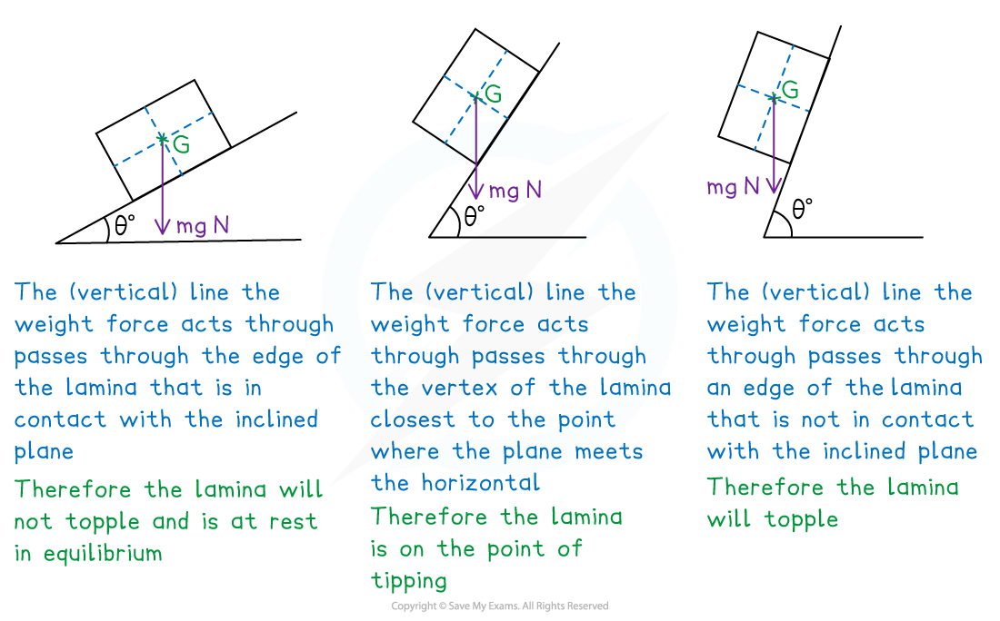

# Point of Tipping

## Point of Tipping

> **Spec point** — `spcpt_mfJv7BXtG6CH8CYD`

## Point of Tipping

#### What is meant by point of tipping/toppling?

- These types of problems involve a **lamina** being placed along one of its edges on a ***rough*** ***inclined plane***
- The (main) **modelling** **assumption** here is that the **frictional** **force** between the **plane** and the **lamina** is **sufficient** such that the lamina will **not** **slide** (or **slip**) down the plane (regardless of the angle of incline)

#### How do I solve tipping/toppling problems?

STEP 1   Sketch or add anything useful to a given diagram

**  Define** **axes** if necessary and add these to your diagram

- make the $x$-axis **parallel** to the plane
- make the $y$-axis **perpendicular** to the plane
- have the **origin** (*O*) at the **vertex** of the **lamina** that is in **contact** with the **plane** and **closest** to the **point** where the **plane** meets the **horizontal** (“bottom left”)
- **Add** to the **diagram** as you **progress** through the question

STEP 2   Find the **position** of the **centre** of **mass** *(G)* of the lamina; use your diagram,

axes and symmetry (where possible) to help

The **lamina** may be a **standard shape** or a **composite lamina**

Add the **position** of the **centre** of **mass** to your diagram; also **add** a downward

**   vertical** **line **(that weight  acts through) but you **cannot** use your diagram to

**   accurately** determine whether the lamina will topple

STEP 3   Use **trigonometry** (A new diagram of a right-angled triangle with *OG* as the

hypotenuse can help) to determine the angle at which the **lamina **would be

on the **point** of **tipping**

STEP 4   **Interpret** the result in the context of the problem and answer the question accordingly

> **Worked Example**
> A symmetrical T-shaped lamina is made from two congruent 12 cm by 4 cm rectangles manufactured from the same uniform material.
> 
> The lamina is placed on a plane inclined at an angle of $θ^{\circ}$, as shown below.
> 
> 
> 
> Determine the maximum angle that the plane can be raised to before the lamina will topple.  You may assume that the frictional force between the lamina and the plane is sufficient to prevent the lamina sliding down the plane.
> 
> **Answer:**
> 
> 

> **Exam Hint**
> - Whilst a diagram (sketched or given) will help you work through the stages of your solution, you cannot rely on it to accurately determine whether the (downward vertical) line that weight acts through passes through the edge of the lamina in contact with the plane.
> - If defining your own axes, have the x-axis and the y-axis parallel and perpendicular to the plane, with the origin on the “bottom left” vertex of the lamina.
