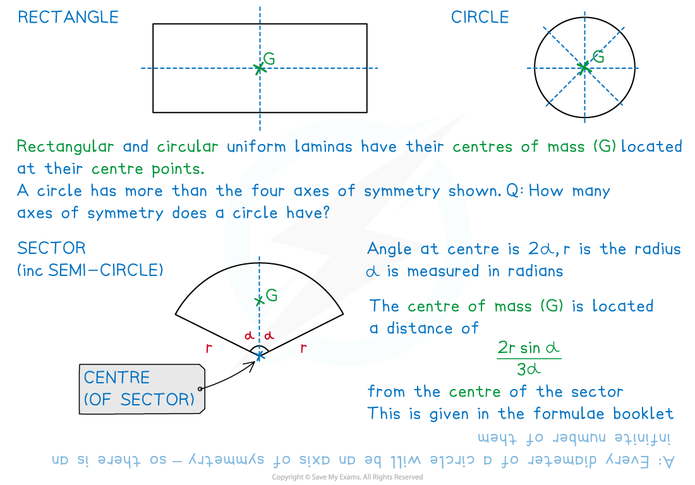
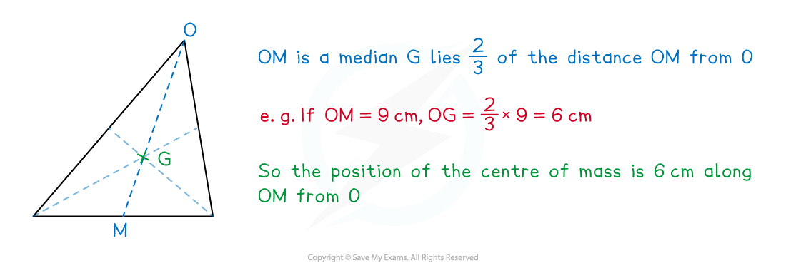
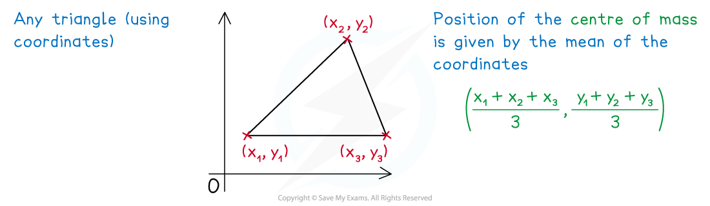
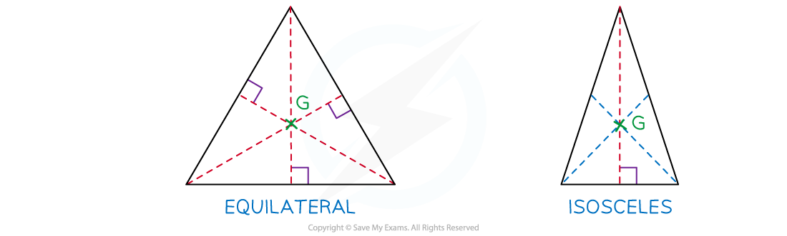

# Uniform Laminas

## Uniform Laminas

> **Spec point** — `spcpt_xNNchMvqZTcKMfhC`

## Uniform Laminas

#### A brief reminder of centre of mass …

- The **centre** **of** **mass** is the **point** at which the **total** **mass** of a body (or a system of bodies) can be considered to **act** **as** **one**

#### What is a lamina?

- A **lamina** is a (3D) body that has **one** **very** **small** **dimension** compared to the other **two dimensions **which means the third dimension is negligible and the body can be modelled as a ***(2D) plane***

  - Common examples include
  
    - a sheet of paper, card, wood, metal, plastic, cloth, etc
    - a wall

#### What modelling assumptions are used with laminas?

- (For this Revision Note) all laminas are **uniform**

  - **uniform** means the **mass** per **unit** **area (*****m *****kg)** is **equal** at **every** **point** on the lamina
  
    - In the real world a uniform lamina is very difficult to achieve – particularly with natural materials such as timber where knots and other imperfections occur
    - The cloth on a professional snooker table needs to be as close as possible to a uniform lamina - it should have no imperfections (such as a small tear) if the table and balls are to play as a professional would expect
- In Mechanics 2 both **uniform** (this Revision Note) and **non**-**uniform** laminas (Revision Note 2.1.7) are considered

#### How do I find the centre of mass of a (standard) uniform lamina?

- If the **shape** of a **lamina** has an **axis** of **symmetry**, the position of the centre of mass will be somewhere on that **axis**
- If the **shape** of a **lamina** has **more** **than** **one** **axes** of **symmetry,** the position of the centre of mass will be the **intersection** of those **axes**
- The most **common** shapes – **rectangles** (including squares), **triangles**, **circles** and **sectors** (including **semi**-**circles**) are referred to as **standard** uniform laminas

#### How do I find the centre of mass of a triangular lamina?

- Triangles are a little more complicated
- In **any** triangle a **median** is a line joining a **vertex** to the **midpoint** of the **opposite** **side**
- In **any** **uniform** triangle the position of the centre of mass

  - lies $\frac{2}{3}$**of the way along a median** when measured from its **vertex**.
  This is stated in the formulae booklet
  - is the **point** of **intersection** of the **medians**

- The **coordinates** of the **centre** of **mass** of **any uniform** triangle can be found if the coordinates of its **three** **vertices** are known

  - The coordinates of the centre of mass of** any uniform triangular lamina** is the **mean** of the coordinates of its vertex
  - This only works for triangles and is **not true** for all other polygons

- In addition to the above, for **equilateral** and **isosceles** triangles only

  - In an **equilateral** triangle all three **medians** are also **axes** of **symmetry**
  - In an **isosceles** triangle one of the **medians** is an **axis** of **symmetry**
  - The position of the centre of mass will always lie on an **axis** of **symmetry** so for **both** **equilateral** and **isosceles** triangles only **one** **median** need be used
  - An **axis** of **symmetry** is **perpendicular** to the side they **bisect** so any missing lengths can be found using **Pythagoras’** **theorem** and/or basic **trigonometry**

> **Worked Example**
> A shop sign is made from a sheet of wood in the shape of an isosceles triangle with its two equal sides of length 60 cm meeting at the vertex *O* with an angle of  $\frac{2π}{3}$ radians.
> 
> (a) State any modelling assumptions regarding the sheet of wood being used to make the shop sign.
> 
> (b) Describe the position of the centre of mass of the shop sign in relation to vertex *O*.
> 
> The shop sign is adapted slightly to make the shape of a sector of a circle with the two equal sides of the isosceles triangle forming two radii of the sector and vertex *O* becoming the centre of the circle
> 
> (c) Describe the new position of the centre of mass of the shop sign in relation to vertex *O*.
> 
> (a)  State any modelling assumptions regarding the sheet of wood being used to make the shop sign.
> 
> **Answer:**
> 
> 
> 
> (b)  Describe the position of the centre of mass of the shop sign in relation to vertex *O*.
> 
> **Answer:**
> 
> 
> 
> The shop sign is adapted slightly to make the shape of a sector of a circle with the two equal sides of the isosceles triangle forming two radii of the sector and vertex *O* becoming the centre of the circle
> 
> (c) Describe the new position of the centre of mass of the shop sign in relation to vertex *O*.
> 
> **Answer:**
> 
> 

> **Exam Hint**
> - Sketch diagram(s) or add to any given in a question – this may help you to see an axis of symmetry.
> - If a triangle is involved, be clear about the type of triangle (and the information about it) you have been given.
> - Remember that a semi-circle is a sector of a circle with angle π radians at the centre.
> - Beware!  The formula booklet lists the formulae for laminas and frameworks together.
