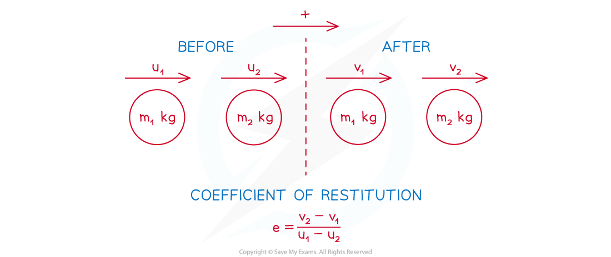
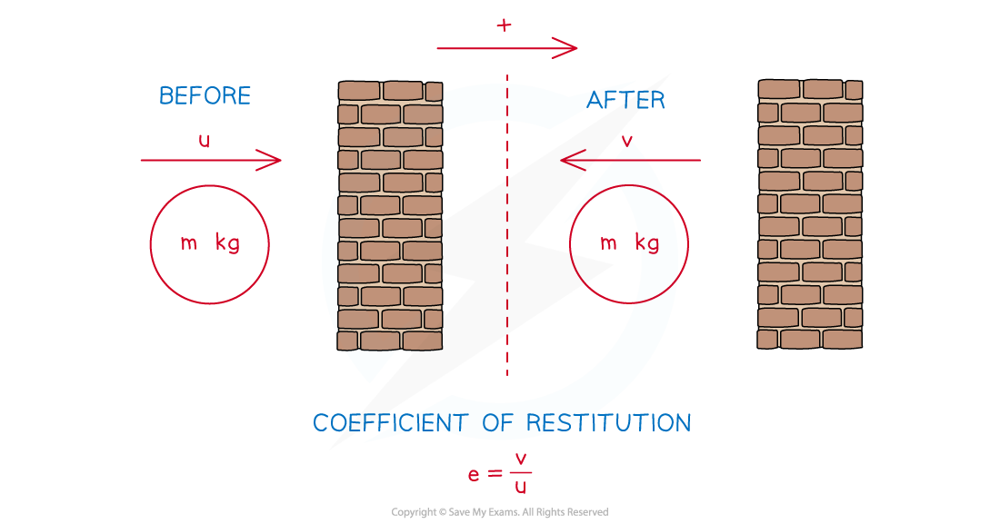

# Coefficient of Restitution

## Coefficient of Restitution

> **Spec point** — `spcpt_G7F5HGsWqKHtKfPs`

## Coefficient of Restitution

#### What is the coefficient of restitution?

- The coefficient of restitution (also known as **Newton's Experimental Law**) is the **ratio** of the **relative speed of separation** and the **relative speed of approach** when two objects collide

  - Essentially this just means the speed of separation divided by the speed of approach
- The coefficient of restitution is **denoted *****e***

  - *e* is ***dimensionless***** **as it is a ratio
  - The value of *e*** **in a particular situation will depend on the materials that the two particles are made from
- In this course *e* can take the values in the range **0 ≤ *****e ≤ *****1**

  - ***e***** =1**: These are called **perfectly elastic** collisions and in these collisions there is **no loss in kinetic energy**
  - ***e***** =0**: These are called **perfectly inelastic** collisions and in these collisions the objects ***coalesce***

**How do I calculate the coefficient of restitution between two objects?**

- $e=\frac{\mathrm{Speed} \mathrm{of} \mathrm{seperation} \mathrm{of} \mathrm{the} \mathrm{objects}}{\mathrm{Speed} \mathrm{of} \mathrm{approach} \mathrm{of} \mathrm{the} \mathrm{objects}}$
- The speed of approach depends on whether the objects are travelling towards each other or in the same direction. For example, if the speeds of the two objects **before** the collision are 5 m s-1  and 2 m s-1 then the **speed of approach** is:

  - 3 m s-1 if they are moving in the **same direction** (each second the objects approach each other by a further 3 metres)
  - 7 m s-1 if they are moving in **opposite directions** (each second the objects approach each other by a further 7 metres)
- The speed of separation depends on whether the objects are travelling away from each other or in the same direction. For example, if the speeds of the two objects **after** the collision are 5 m s-1  and 2 m s-1  then the **speed of separation** is:

  - 3 m s-1 if they are moving in the **same direction** (each second the objects separate by a further 3 metres)
  - 7 m s-1 if they are moving in **opposite directions** (each second the objects separate by a further 7 metres)
- If the velocities of the two objects before the collision are u1 m s-1  and u2 m s-1 and the velocities after the collision are v1m s-1 and  v2 m s-1  then:

  - $e=\frac{v_{2}-v_{1}}{u_{1}-u_{2}}$
  - Note that **velocities can be negative** so be careful with signs

** **

#### How do I calculate the coefficient of restitution between an object and a wall?

- As the wall does not have any velocity

  - $e=\frac{\mathrm{Speed} \mathrm{of} \mathrm{rebound} \mathrm{of} \mathrm{the} \mathrm{object}}{\mathrm{Speed} \mathrm{of} \mathrm{approach} \mathrm{of} \mathrm{the} \mathrm{object}}$
- If the **speed** of the object **before** the hitting the wall is *u* m s-1 and the **speed** **after** is  *v* m s-1 then the formula above simplifies to:

  - $e=\frac{0-(-v)}{u-0}$
  - $e=\frac{v}{u}$

#### How do I solve collision problems involving the coefficient of restitution?

- **STEP 1**: **Draw** a before/after diagram and label the **positive direction**

  - There may be multiple diagrams if there are multiple collisions
- **STEP 2**: Form an equation using the **coefficient of restitution**

  - The unknown(s) could be the coefficient of restitution or any of the speeds or directions
- **STEP 3**: Form an equation using the principle of **conservation of momentum**

  - In the case of a collision with a wall you may be given the impulse or some other information instead
- **STEP 4**: **Solve** and give your answer in **context**

  - You may have to solve simultaneous equations
  - You may have to solve an inequality
  - You may have to form an inequality using 0 ≤ *e* ≤ 1 or using the fact that velocity is positive (or negative) if the object is going forwards (or backwards)

> **Worked Example**
> Two balls $A$ and $B$ are of equal radius and have masses 2 kg and 5 kg respectively.  $A$ and $B$ collide directly.  Immediately before the collision, $A$ and $B$ are moving in the same direction along a straight line on a smooth horizontal surface with speeds 9 $ms^{-1}$ and $1ms^{-1}$   respectively.  Immediately after the collision, the direction of motion of $A$ is reversed.  The coefficient of restitution between $A$ and $B$ is $\frac{3}{4}$.
> 
> Find the speeds of $A$ and $B$ immediately after the collision.
> 
> **Answer:**
> 
> 

> **Worked Example**
> A sphere $A$ is projected with speed $5ms^{-1}$along a straight line towards another sphere $B$, of equal radius, which is at rest on a smooth horizontal surface. After the collision, $B$ moves with speed $vms^{-1}$ and $A$moves in the opposite direction with speed $1ms^{-1}$ . The coefficient of restitution between $A$ and $B$ is $e$ .
> 
> (a) Show that $v=5e-1$.
> 
> (b) Hence, find the range of possible values of e.
> 
> **Answer:**
> 
> 

> **Exam Hint**
> - Exam questions refer to spheres as having equal radii, this just means the objects are the same size  so that dimensions don't affect the collision. Exam questions often leave velocities in terms of *e*  . If you know the direction of the object then you know whether the velocity is positive or negative. This can be used to form an inequality for the range of possible values of *e* for that scenario.
