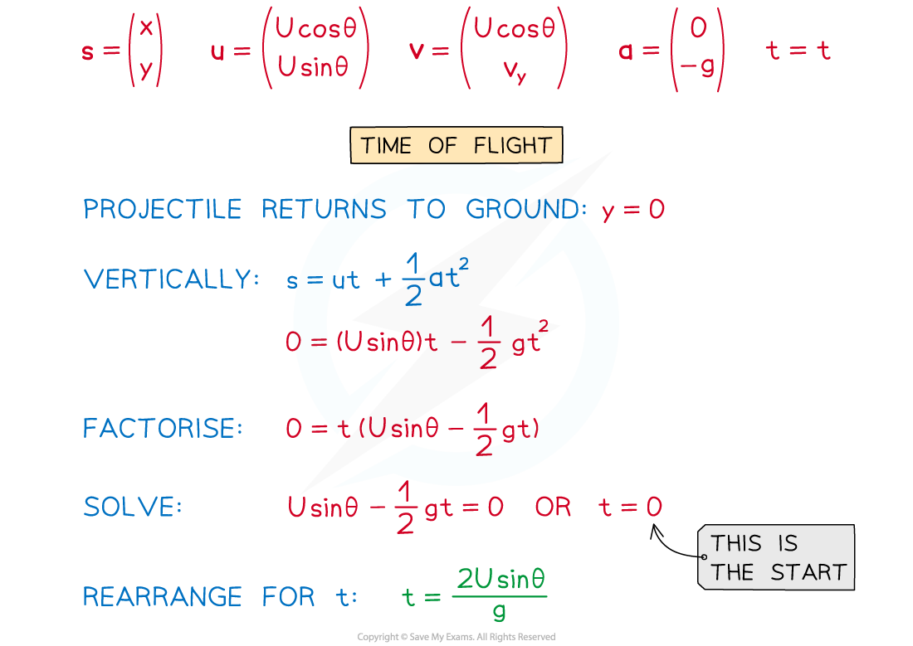
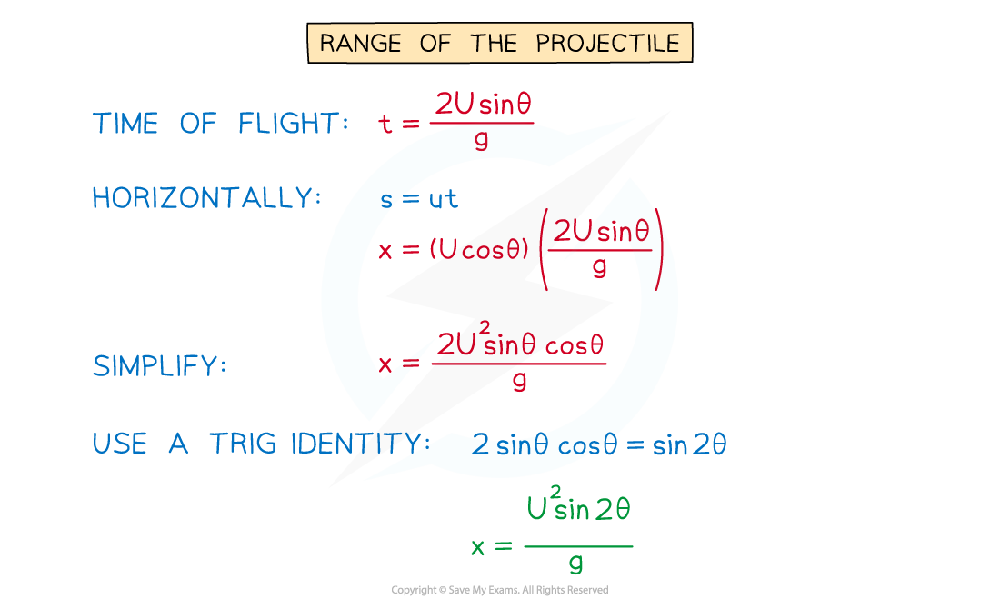
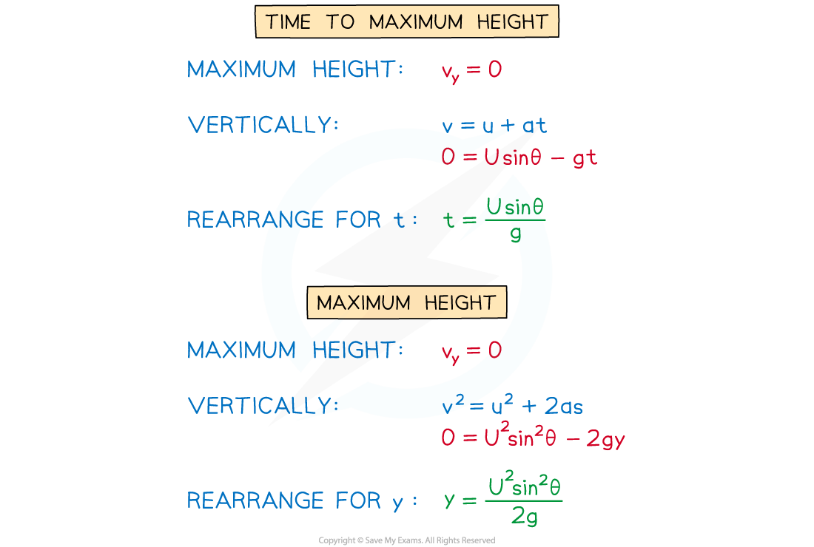

# Deriving Projectile Formulae

## Deriving Projectile Formulae

> **Spec point** — `spcpt_YPdhNKDXcHJm8HKG`

## Deriving projectile formulae

### What projectile formulae do I need to be able to derive?

- In the previous notes the **equation** of the **trajectory** of a particle was **derived**
- Other equations you need to be able to derive are

  - $\mathrm{time} \mathrm{of} \mathrm{flight}(\mathrm{between} \mathrm{launch} \mathrm{and} \mathrm{land})=\frac{2\text{U}\mathrm{sin}θ}{g}$
  - $\mathrm{the}(\mathrm{horizontal})\mathrm{range} \mathrm{of} \mathrm{the} \mathrm{projectile}=\frac{U^{2}\mathrm{sin}2θ}{g}$
  - $\mathrm{the} \mathrm{time} \mathrm{taken} \mathrm{to} \mathrm{reach} \mathrm{the} \mathrm{maximum} \mathrm{height}=\frac{\text{U}\mathrm{sin}θ}{g}$
  - $\mathrm{the} \mathrm{maximum} \mathrm{height}=\frac{U^{2}\mathrm{sin}^{2}θ}{2g}$
- These are derived using the suvat equations
- Whilst you do not need to memorise every step of the derivations, you should concentrate on the methods used and know how to approach each one
- There is no worked example with this revision note, instead see if you can use your knowledge of the suvat equations as well as geometrical and algebraic reasoning to derive the above equations before reading on

### How do I derive the projectile formulae?

- A particle is projected with speed *U* m s-1 at an angle of *θ*° to the horizontal
- All of the derivations assume that:

  - the launching and landing site are at the same vertical level
  - the projectile travels over horizontal ground
  - there are no forces acting on the particle other than the force due to gravity

> **Exam Hint**
> - Always draw a sketch!
> - The trickiest part about this is the algebra so do not rush these questions as that is when you are more likely to make mistakes.
> - Make sure you can follow the derivations above as they could be asked. After reading through this revision note practice replicating the derivations from memory.
