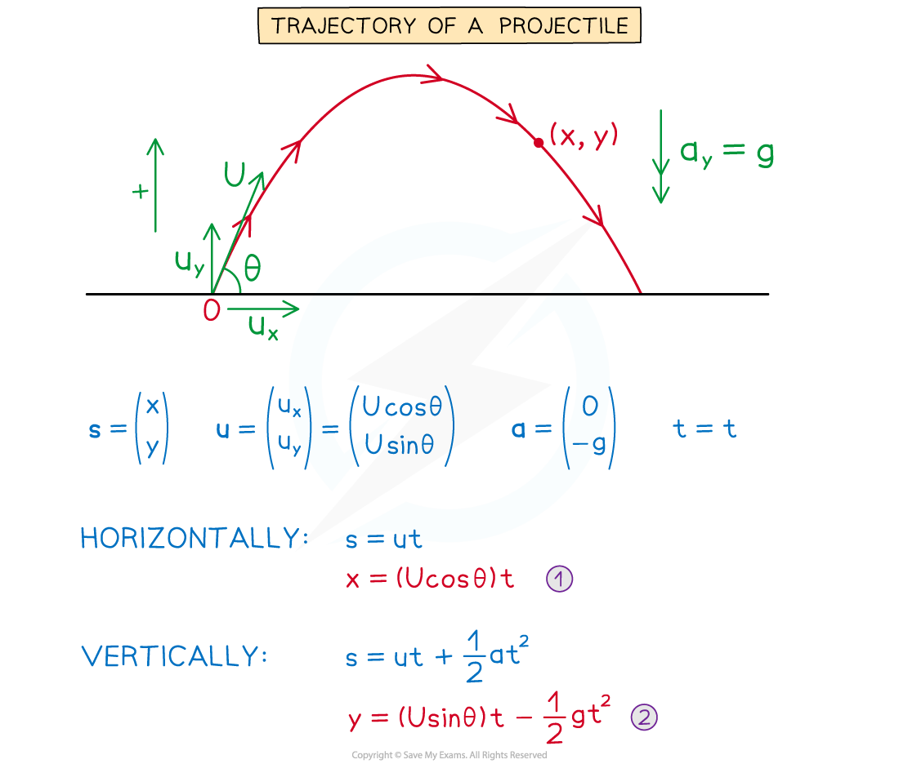
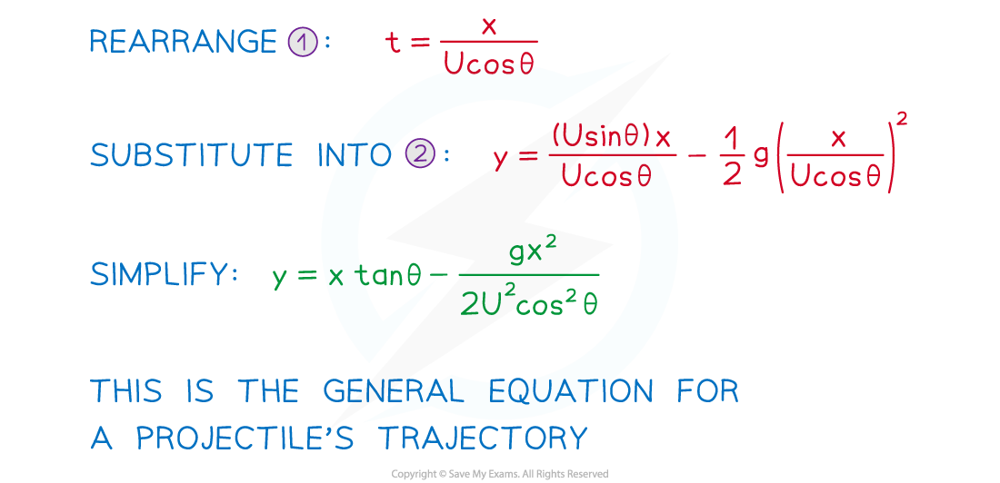

# Equation of a Trajectory

## Equation of a Trajectory

> **Spec point** — `spcpt_scnXTjK798w4kzCC`

## Equation of a trajectory

### What is the trajectory of a projectile?

- The **trajectory** of a projectile is the **path** it follows during its motion
- The modelling **assumptions** mean it is **symmetrical**
- It follows a path called a **parabola**
- So far, motion has been described using the suvat formulae and we have produced parametric equations with time as the parameter
- A **Cartesian** equation links the horizontal (*x*) and vertical (*y*) components of the displacement y = f(x)

### How do I find the equation for the trajectory of a projectile?

- *U* is the initial speed of the projectile at an angle of θ° to the horizontal

> **Worked Example**
> A particle is projected from a point on horizontal ground at a speed of *V* m s-1 at an angle α°  to the horizontal. The trajectory of the particle is given by the equation
> 
> $y=x\mathrm{tan}α-\frac{gx^{2}}{2V^{2}\mathrm{cos}^{2}α}$
> 
> where $y$ is the vertical height of the particle and $x$ is the horizontal distance travelled by the particle.
> 
> (a)  State two assumptions that have been made.
> 
> (b)  In the case when *V* = 16 m s-1 and α = 70°  find, to three significant figures, the height of the particle after it has travelled 12 m horizontally.
> 
> **Answer:**
> 
> 

> **Exam Hint**
> The steps are always the same so the only way the questions can be made difficult is for them to use confusing letters. They could use similar letters to suvat including capital letters. Alternatively, they could use unusual letters like ***a***, instead of *θ*, for angles.
> 
> - Make sure you show enough working out to convince the examiner that you know the steps especially if it is a "show that" question.
> - Sometimes you might have to use trigonometric identities from pure maths.
