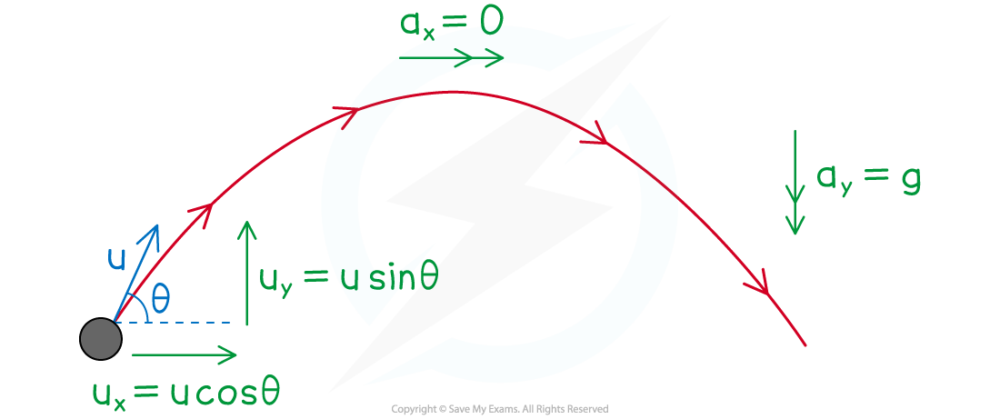
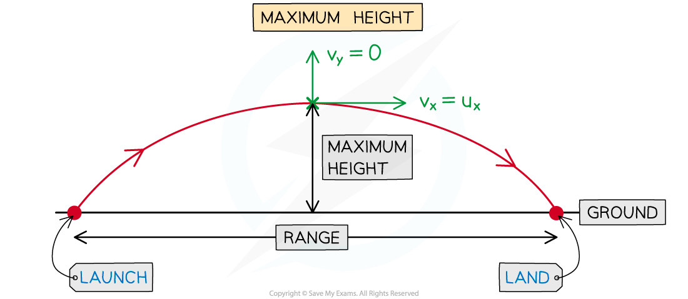

# Using suvat

## Using suvat

> **Spec point** — `spcpt_6vPzRxtjQy8Kn7yf`

## Using suvat with projectiles

### How do I use the suvat equations in projectile problems?

- For projectile motion with acceleration **a** m s-2 and initial velocity **u** m s-1

  - **a****x**** = 0**, **a****y**** = ±g **(depending on which direction is positive)
  - **u****x**** = U cos*****θ*****, u****y**** = U sin*****θ***
- Acceleration is constant so the suvat equations apply

- Projectile motion is **2D** so **s**, **u**, **v** and **a** are **vectors**

  - **1D** suvat formulae can be applied to the directions **separately**
  
  (Note the formula **v****2**** = u****2**** + 2as** still applies in 1D)
- Remember that acceleration is **different** for each direction

  - **a****x**** = 0 **so the suvat formulae reduce to horizontally

### How do I solve problems involving the maximum height?

- Projectile motion follows a **symmetrical** curve (a ***parabola***)
- Therefore there will be a **maximum** **height** that the projectile reaches
- At the maximum height

  - **Horizontal** velocity, **v****x** m s-1, will be the same as the initial horizontal velocity **u****x**
  - **Vertical** velocity, **v****y** m s-1 will be instantaneously zero
  - If the projectile **launches and lands** at the same height then the **horizontal distance** to the **maximum height** is **half** of the ***range of the projectile***
- Time **t** is the parameter that will be the same for both the horizontal and vertical components

### How can projectiles questions be made harder?

- You will need all your skills from your previous work with **suvat**

  - Speed is the **magnitude** of velocity and can be found by using Pythagoras’ Theorem
  - A good understanding of the relationship between **distance** and **displacement**
  - Simultaneous equations
  - Finding the point of intersection of two projectiles
- Sometimes the launch and landing points will be at different heights such as if a stone is thrown from the top of a cliff into the sea

  - Think carefully about the vertical displacement from the start to the end
- You might get asked to use the model of a projectile to decide whether an object passes over a certain height

  - Find the time taken to travel the horizontal distance and use this to find the maximum vertical height of the projectile

> **Worked Example**
> A stone is thrown from the top of a building which is 8 m tall. The stone is projected with speed 7 m s-1 at an angle of 60° to the horizontal. The stone is modelled as a particle and air resistance is ignored.
> 
> (a)  Find the maximum height above the ground that the stone reaches.
> 
> **Answer:**
> 
> 
> 
> (b)  Find the time taken for the stone to hit the ground.
> 
> **Answer:**
> 
> 
> 
> (c)  Find the horizontal distance from the building to the point where the stone lands.
> 
> **Answer:**
> 
> 

> **Exam Hint**
> - **Always** draw a diagram and add to it as you work through the question. Make it clear which direction you are using as positive.
> - Questions could ask you to find the speed at an instant, to do this remember to first find both components of the velocity and then find the magnitude of the velocity.
> - Not all projectiles are projected upwards, for example a cannonball fired from the turret of a castle aimed at an enemy on the ground!
