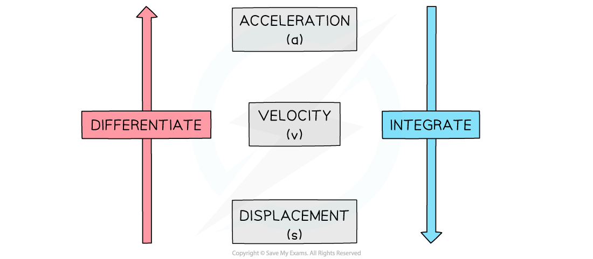

# Using Calculus in 1D

## Using Calculus in 1D

> **Spec point** — `spcpt_JqNkg4qXvkzKyC8N`

## Using calculus in 1D

### How is calculus used in kinematics?

- **s**, **v** and **a** are all functions of time
- Velocity, **v**, is the rate of change of displacement, **s**, with respect to time
- Acceleration, **a**, is the rate of change of velocity, **v**, with respect to time
- **Differentiate** to go from **s** to **v** and from **v** to **a**
- **Integrate** to go from **a** to **v** and from **v** to **s**

  - There will be a **constant of integration**, c, **each time** you integrate
- The use of **calculus** can be seen using **velocity-time graphs** 

  - **Acceleration** is the **gradient** which is found using **differentiation**
  - **Displacement** is the **area **under the graph which is found using **integration**

### How do I find the constant of integration in kinematics?

- The value of c can be found by substituting known values, as in integration for pure maths
- Information to find c may be given in words – look out for common phrases …

  - “… **starting** from **rest** …”: this means ***v***** = 0** when ***t***** = 0**
  - “… **initially** …” – this means*** t***** = 0**

### How can I use definite integration in kinematics?

- Integrating acceleration between two values of time gives the change in velocity of the object between those times
- Integrating velocity between two values of time gives the displacement of the object between those times

  - This could be **different** to the **distance** travelled between those times
  - To find the **total distance** travelled you would need to calculate the **areas above** and **below** the x-axis separately

> **Worked Example**
> The velocity, v m s-1, of a particle is modelled by v = t3 — 4t2 + 3t, where t is time in seconds.
> 
> (a)  Find the acceleration of the particle in terms of $t$.
> 
> **Answer:**
> 
> 
> 
> 
> 
> (b)  Find the displacement of the particle, from its starting position, after 3 seconds.
> 
> **Answer:**
> 
> 

> **Exam Hint**
> - Look for key words and phrases that indicate **scalar**, rather than **vector** quantities:
> 
>   - “distance …”, “speed” and “magnitude of …” are **scalar**
>   - Displacement, velocity, acceleration are **vectors**
> - A sketch of the velocity-time graph is always helpful as you can use it to see important features such as times when the object is stationary. This is especially useful you are asked to find the **total distance **travelled.
