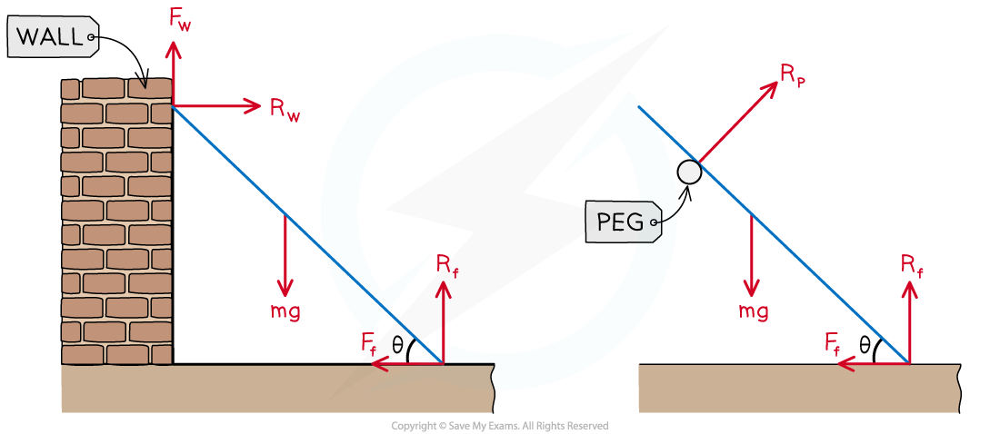
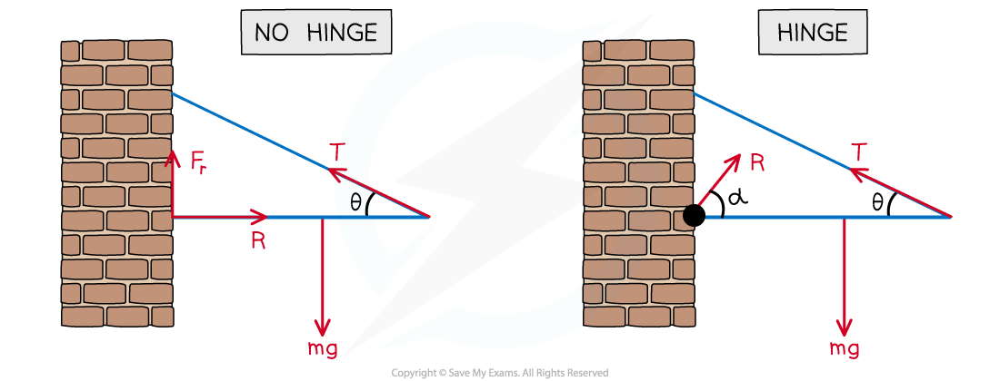

# Ladders & Hinges

## Moments - Ladder Problems

> **Spec point** — `spcpt_HTVvD7TQ9K8MwHD7`

## Moments (ladder problems)

### How do I model a ladder?

- We can model the ladder as a **rod**
- There will be **two** (likely different) **reaction** forces

  - a **vertical reaction** force Rf between the **bottom of the ladder** and the **floor**
  - a **perpendicular reaction** between the **ladder** and the **surface that it is leaning on**
  
    - if it is a peg then the reaction force Rp will be perpendicular to the peg
    - if it is a **vertical wall** then the **reaction force R****w** will be **horizontal**
- There could be **frictional forces** keeping the ladder in equilibrium

  - The frictional force on the floor Ff will act **horizontally towards the wall**
  - The frictional force on a vertical wall will act **vertically upwards**
  - The **coefficients of friction** between the ladder and the floor/wall might be **different**

### How do I solve problems involving ladders?

- Include the **weight** of the ladder

  - If it is modelled as being **uniform** then the weight will act at the **midpoint** of the ladder
- Include any **extra weights** for any additional objects on the ladder such as a person standing on it
- Form **two equations** using the **horizontal forces** and the **vertical forces**
- If the coefficient of friction is involved then:

  - use ***F***** ≤ *****µR*** ** **if the ladder is in equilibrium
  - if the ladder is said to be on the point of slipping it is in limiting equilibrium and so use ***F***** = *****µR***
- Form **moment equations**

  - Useful pivots include the **points of contact** between the ladder and the floor, wall or peg
  - You will have to **use right-angled trigonometry** to find the **perpendicular distances**
- **Solve the equations** to find any unknown distances, angles, masses or force

> **Worked Example**
> A uniform ladder of mass 15 kg and length 10 m rests with one end at point A on a rough vertical wall and the other end at point B on a rough horizontal ground. The ladder is in equilibrium at an angle of 30o to the horizontal. The magnitude of the frictional force at the wall is 50 N. Find
> 
> (i) the magnitude of the normal reaction force at the wall,
> 
> (ii) the magnitude of the normal reaction force at the ground,
> 
> (iii) the magnitude of the frictional force at the ground.
> 
> **Answer:**
> 
> 

> **Exam Hint**
> - If the ladder is resting on the peg then it might be a good idea to resolve forces **parallel and perpendicular to the ladder** instead of horizontal and vertical. Your answer will be the same, it just depends on what you find easier.

## Using Moments - Harder

> **Spec point** — `spcpt_MFrzcGnC5rpQ6bKQ`

## Moments (hinges)

### How do I solve problems involving hinges?

- ** **If one end of a rod is **hinged** to a surface then that end is **fixed** to that point but the **rod is free to rotate** about that point
- There will be a **resultant force** acting on the rod **from the hinge**

  - This force will **not be perpendicular** to the surface – it will be acting at an angle
- Taking moments about the hinge is a good way to avoid including the force from the hinge
- If you are asked to find the **magnitude** and **direction** of the force from the hinge:

  - **Step 1**: Find the horizontal and vertical components of the force
  - **Step 2**: Find the magnitude by using Pythagoras
  - **Step 3**: Find the direction by using right-angled trigonometry
- There are two common ways a rod will be held horizontally at a wall:

  - The rod could be **without a hinge** so that there is contact with the wall which means there is a **normal reaction force** and a **frictional force** to **stop** the rod **sliding down the wall**
  - The rod could be **with a hinge** so that there is a resultant force from the hinge acting at an **angle of α°** to the horizontal which **stops** the rod **rotating** about the hinge
  - Splitting the resultant force from the hinge into horizontal and vertical components makes both scenarios mathematically similar

> **Worked Example**
> A non-uniform rod AB of weight 100 N and length 4 m is freely hinged at A to a vertical wall. The rod is held in a horizontal position by a light inextensible cable attached at B.
> The other end of the cable is attached to the wall at point C vertically above A. The angle ABC is 30° as shown in the diagram below. The centre of mass of the rod is 1 m from B.
> 
> 
> 
> (a)  Find the magnitude of the tension in the cable.
> 
> (b)  Find the magnitude and direction of the resultant force exerted on the rod by the hinge at *A*.
> 
> **Answer:**
> 
> 

> **Exam Hint**
> - Try not to let hinges scare you! Just remember there will be vertical and horizontal components. If you draw them in the wrong direction (up instead of down or left instead of right) then don’t panic, it just means your answer for that direction will be a negative.
