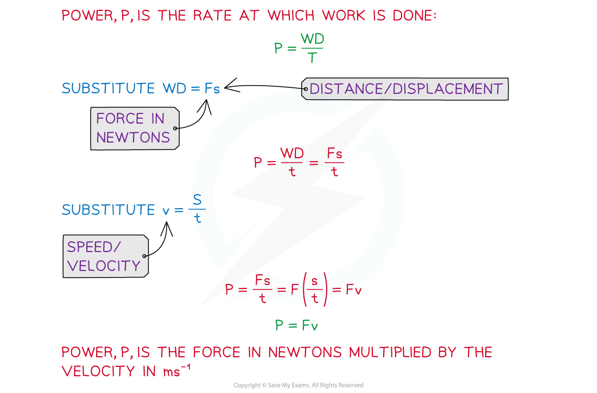

# Power

## Power

> **Spec point** — `spcpt_7Vr8CRSfk99mvTKR`

## Power

#### What is power?

- Power is developed as an engine or machine does **work**
- Power is the rate of doing work, usually by the **driving force** of an engine

  - It is the same as **work done per second**
  - The work done is converting fuel (a type of chemical energy) into a driving force
- In your Mechanics A Level course, power will usually be in questions about moving vehicles
- Power is a **scalar **quantity and can only take a positive value

#### How is power calculated?

- Power is the rate of doing work and can be calculated by the formula

$P=\frac{WD}{t}$

Where *WD* is the **work done** by the driving force in **Joules** and *t* is the **time** in **seconds**

- If a **driving** **force**, *F* N, is acting on an object moving with **velocity**, *v* m s-1 then power can be calculated using the formula

$P=Fv$

- The velocity must be in the same direction as the force
- For a constant velocity and a constant force, the above formula can be derived by recalling the formula

$v=\frac{s}{t}$

where $v$ is speed or **velocity** and $s$ is distance or **displacement**.

- The derivation can also be shown for a constant force, *F* N and considering the rate of doing work over a very small interval of time

  - $P=F\frac{δs}{δt}$
  - As the time δt gets smaller and approaches  $\frac{ds}{dt}$then
  - $P=F\frac{ds}{dt}=Fv$

- The units for power are **watts (W) **or **kilowatts (kW)**

  - **1 watt = 1 joule **per **second**
  - **1 kilowatt = 1000 watts**

#### How is power used in calculating maximum speed?

- As a vehicle gains speed the driving force can decrease to create the same amount of power
- If the vehicle maintains maximum power its driving force will decrease as its speed increases and it will eventually reach a point where its **resultant force** is zero (the driving force will balance the resistance forces)

  - When the resultant force becomes zero, by Newton’s Second Law, acceleration will also become zero and the vehicle will be travelling at **maximum speed**
  - The **maximum power output **of a vehicle can be found when the vehicle is moving at its maximum speed and the acceleration is zero
  - If the maximum power output is known, then maximum speed can be found when the vehicle is travelling at its maximum power with zero acceleration and the resultant forces are balanced

> **Worked Example**
> A car of mass 1300 kg, including the driver, moves forwards on a straight horizontal road. There is a constant resistive force of 900 N acting on the car. Its maximum possible speed is 40 m s-1  Calculate the maximum power that the engine of the car can produce.
> 
> **Answer:**
> 
> 

> **Exam Hint**
> - Make sure you are using the correct force in your calculation, power is **only** generated by the **driving force** of an engine and so only this force should be used in the formula.
> - Always draw a diagram and add the forces. If the question involves an inclined slope remember to resolve the weight into components parallel and perpendicular to the slope first.
> - Remember to check the units carefully, power questions could be given in watts or kilowatts. It is also important to give your answer in the correct units, or if not specified, choose the most appropriate units for the question.
