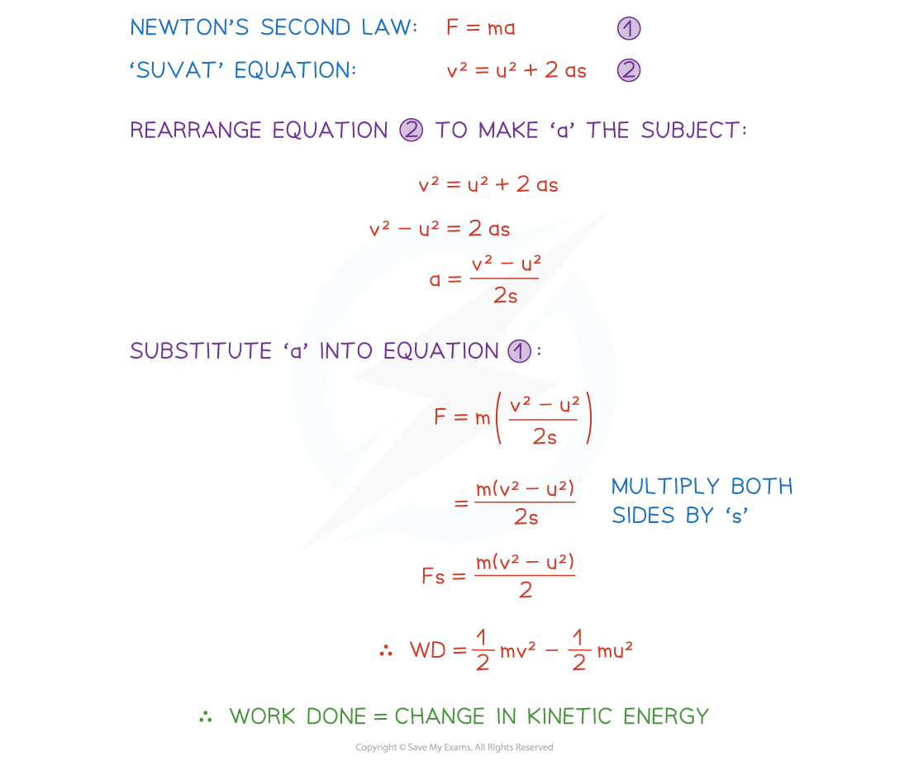

# Energy

## Energy

> **Spec point** — `spcpt_Sxsvg9Fx9jvM5X65`

## Energy

There are many different forms of energy including, but not limited to, heat energy, light energy, chemical energy and nuclear energy. In this course we deal with a type of energy called **mechanical energy **which exists in two forms**, kinetic energy (KE)** and **gravitational potential energy (GPE)**.

## Kinetic Energy

> **Spec point** — `spcpt_XKx2bhHQMTtjRT7B`

## Kinetic Energy

#### What is kinetic energy?

- Kinetic Energy is the energy formed by an object’s movement.
- Kinetic energy is a **scalar quantity**, it can not be negative
- The **work done** by a resultant force that acts to move an object in a particular direction will be equal to the **change in kinetic energy** of the object

#### How is kinetic energy calculated?

- A particle can only have kinetic energy when it is moving
- If a particle with mass, *m* kg is moving with speed v** **m s-1 then its kinetic energy can be calculated using the formula

$KE=\frac{1}{2}mv^{2}$

- If the particle is moving in two dimensions with the velocity vector **v **then kinetic energy can be calculated in two ways

  - Using the formula on each component individually and finding the sum of the KE in each component
  - Finding the magnitude of the velocity to get the speed and then using the formula for KE
- Kinetic energy is measured in **joules (J)**

  - 1 Kilojoule = 1000 joules (1 kJ = 1000 J)

#### How do we derive the formula for the change in kinetic energy?

- The **work done** by the resultant force is equal to the **change in kinetic energy**

  - This is the** final kinetic energy **minus the** initial kinetic energy**
  - The formula for the **change in kinetic energy** is

** **$\frac{1}{2}mv^{2}-\frac{1}{2}mu^{2}$

where ***u***** **is the initial velocity and ** *****v*****  **is the final velocity

- This is often written as $\frac{1}{2}m(v^{2}-u^{2})$

- Newton’s Second Law ($F=ma$) and the '*suvat*'  equation $v^{2}=u^{2}+2as$** **can be used to** **derive the formula for the change in kinetic energy

> **Worked Example**
> A jogger increases her speed from 2 m s-1 to 3 m s-1 and her change in kinetic energy is 150 J, find the mass of the jogger.
> 
> **Answer:**
> 
> 

> **Exam Hint**
> - Always double check the units are in kg for mass and m s-1 for velocity before carrying out any calculations.
> - Be careful not to make the mistake of using the difference between the velocities with the equation, remember it should be the difference between the squares of the speeds.
> - Make sure you are familiar with the method for the derivation of the formula for the change in kinetic energy.

## Gravitational Potential Energy

> **Spec point** — `spcpt_swd9VZNScXBZsRYX`

## Gravitational Potential Energy

#### What is potential energy?

- Potential energy is the energy stored in a **stationary** object
- **Gravitational potential energy (GPE)** is the energy a particle possesses when it is at a **fixed height** and **gravity** is acting on it
- There are other types of potential energy but in this module only **GPE **is dealt with and so sometimes GPE is referred to as **potential energy (PE)**
- GPE will change as the vertical height of an object changes

  - The **work done against gravity **on a particle as it moves **upwards** is equal to its **increase** in** GPE**
  - The **work done by gravity **on a particle as it moves **downwards** is equal to its **decrease** in** GPE**

#### How is gravitational potential energy calculated?

- Gravitational potential energy is equal to the **product** of the force of the **weight** of an object and its vertical **height, *****h***** ** , above a fixed point

$GPE=mgh$

- If the object is sitting on the ground or the point chosen as the fixed base level, the object will have no gravitational potential energy
- As the object moves upwards, its GPE will increase
- As the object moves downwards again, its GPE will decrease
- When **mass** is measured in **kg**, **acceleration due to gravity** is measured in **m s****-2** and height is in metres, m, gravitational potential energy is measured in **joules (J)**

  - 1 kilojoule = 1000 joules (1 kJ = 1000 J)

> **Worked Example**
> A ball of mass 400 grams is thrown vertically upwards from a height of 1 metre above the ground.  It reaches a maximum height of 4 metres before falling to the ground again. Stating clearly whether is represents a gain or a loss, write down the change in the gravitational potential energy of the ball
> 
> (i) between the instant it is thrown and the instant it reaches its maximum height,
> 
> (ii) between the instant it is thrown and the instant it hits the ground.
> 
> **Answer:**
> 
> 

> **Exam Hint**
> - Always double check the units are in **kg **for mass and **m** for height before carrying out any calculations.
> - Remember that it is the **vertical height** that must be used within the calculations for** GPE, **if you are given the slant height you must use trigonometry to find the vertical height first.
