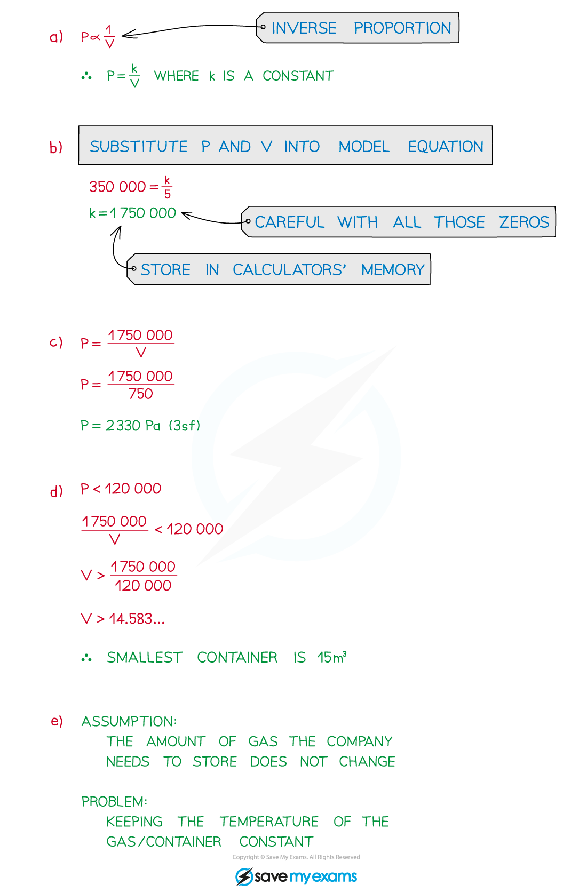

# Modelling with Functions

## Modelling with Functions

> **Spec point** — `spcpt_24J2PH8kkjWXbv26`

## Modelling with functions

### What is a mathematical model?

- A **mathematical** **model** simplifies a real-world situation so it can be described using mathematics which can then be used to make predictions

  - The path a stone will take if thrown from the top of a cliff
  - The number of toys a factory can produce in a day
- **Assumptions** about the situation are made in order to simplify the mathematics

  - Air resistance on the stone can be ignored
  - The machines/people at the factory produce toys at a constant rate
- Models can be **refined** (improved) if further information is available or the model is compared to real-world data

  - The mass of the stone needs to be considered
  - 30-minutes downtime per day is allowed for machine repairs/maintenance

### How do I use mathematical models?

- There will be no one-size-fits-all step-by-step guide to solving modelling questions
- A combination of skills and **problem**-**solving** skills will be needed

** **

> **Exam Hint**
> - Reciprocal graphs generally have two parts/curves
> 
>   - Only one – usually the positive – may be relevant to the model
>   - Think about why **x**/**t**/**θ** can only take positive values?

> **Worked Example**
> 
