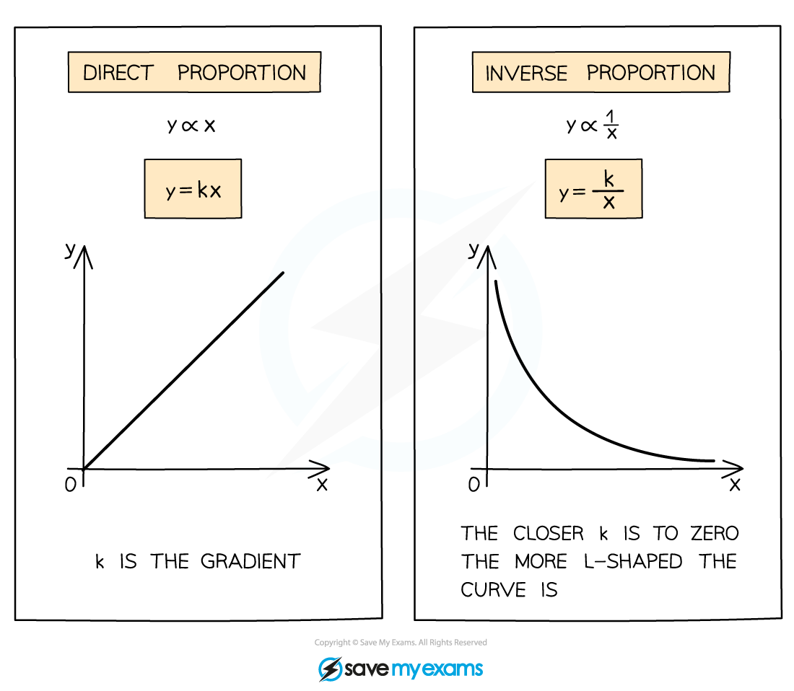

# Proportional Relationships

## Proportional Relationships

> **Spec point** — `spcpt_9jZKqgCyNnJhWhdw`

## Proportional relationships

### What are proportional relationships?

- Proportional relationships describe a proportional connection between two variables
- This can happen in two ways

  - Direct proportion $y=kx$
  
    - one variable increases or decreases the other does the same
  - Inverse proportion $y=\frac{k}{x}$
  
    - one variable increases the other decreases and vice versa
- Proportional relationships use the symbol $\propto$ which means is proportional to

- Both direct and inverse proportion can be represented graphically

  - Direct proportion creates a linear graph where k is the gradient
  - Inverse proportion creates a reciprocal graph

### What is direct proportion?

- $y\proptox$ means y is proportional to x
- **y** increases as **x** does, **k** determines the **rate** (gradient)
- by changing this to the equation** **$y=kx$ we can substitute in given values and solve to find k 

  - Note that this means the **ratio** of x and y is constant **k = y / x**

### What is inverse proportion?

- $y\propto\frac{1}{x}$ means y is proportional to $\frac{1}{x}$ or y is inversely proportional to x
- **y** decreases as **x** increases and vice versa, **k** determines the rate
- by changing this to the equation** **$y=\frac{k}{x}$ we can substitute in given values and solve to find k

  - Note that this means the **product** of x and y is constant **k = xy** 

- Set up your proportional relationship using $\propto$ then change to = k
- Be clear about what **y** is proportional to …

  - “… the square of **x**” (**x****2**)
  - “… **x** plus four” (**x + 4**)
- **Calculate** or **deduce** the value of **k** from the information given or a graph
- Once you've found k sub it back in to your original proportion equation
- You can now find any values using this proportional relationship

- **y = mx + c** rearranges to **y – c = mx** so (**y - c**) is **directly** proportional to **x**
- **Proportional** **relationships** are often used in modelling

#### 

> **Worked Example**
> 
> 
> 
