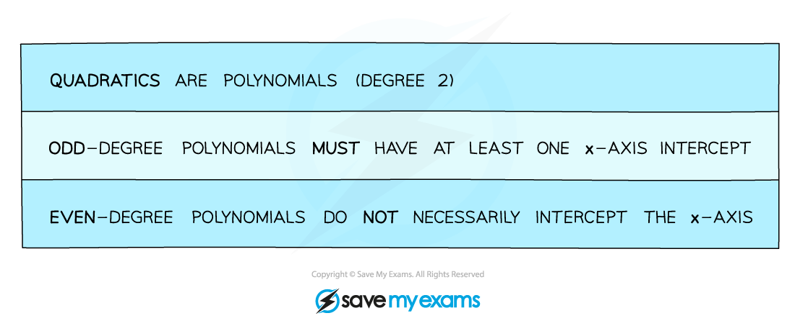

# Sketching Polynomials

## Sketching Polynomials

> **Spec point** — `spcpt_gR38fxvsvTv9tWVP`

## Sketching polynomials

### How do I sketch the graph of a polynomial?

- A polynomial is any finite function with non-negative indices, that could mean a quadratic, cubic, quartic or higher power

- When asked to sketch a polynomial you'll need to think about the following

  - **y**-axis intercept
  - **x**-axis intercepts (**roots**)
  - turning points (**maximum** and/or **minimum**)
  - a smooth** curve **(this takes practice!)

### What steps should I take when sketching a polynomial?

STEP 1        Find the **y**-axis intercept by setting **x = 0**

STEP 2        Find the **x**-axis intercepts (roots) by setting **y = 0**

STEP 3        Consider the shape and “start”/”end” of the graph

eg. a **positive** **cubic** graph starts in third quadrant (“bottom left”) and “ends” in first quadrant (“top right”)

STEP 4        Consider where any turning points should go

STEP 5        Draw with a smooth curve

- Coordinates of turning points can be found using **differentiation**
- Except with a *point of inflection*, repeated roots indicate the graph *touches* the **x**-axis

> **Worked Example**
> 
