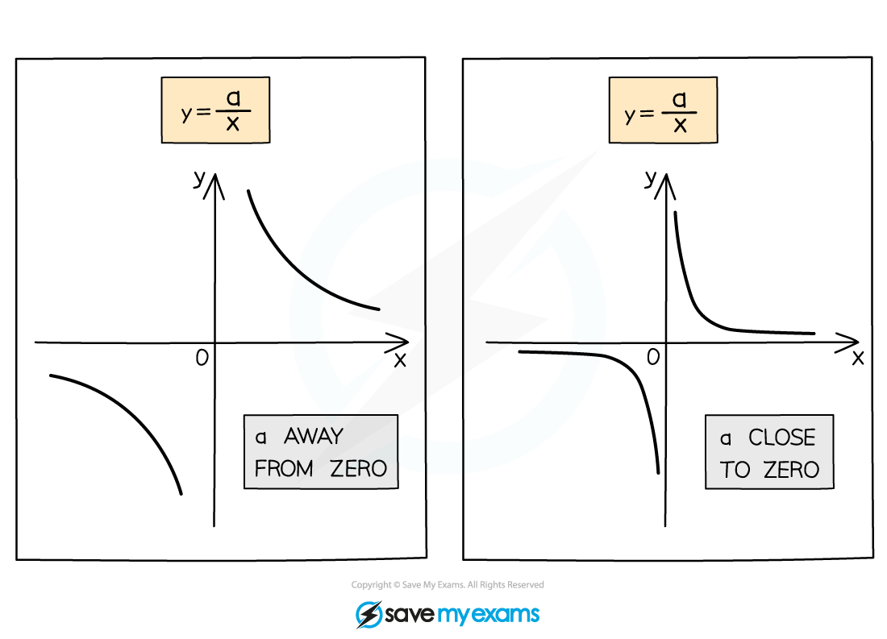
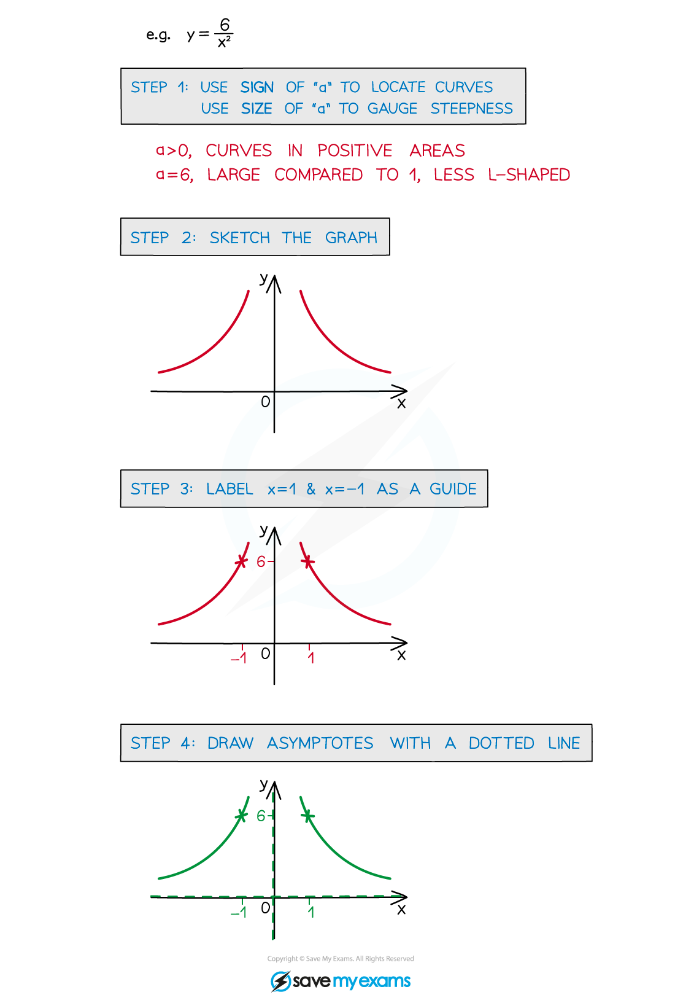

# Sketching Reciprocal Graphs

## Reciprocal Graphs - Sketching

> **Spec point** — `spcpt_5KxxFcs2n8fKDzMb`

## Sketching reciprocal curves

### What are reciprocal graphs?

- Reciprocal graphs involve equations with an $x$ term on the denominator e.g. $\frac{1}{x}$
- There are two basic reciprocal graphs to know for A level

** **$y=\frac{1}{x}$** **and  $y=\frac{1}{x^{2}}$** **

- The second one of these is always positive 

### More reciprocal graphs

- You also need to recognise graphs where the numerator is not one

- The **sign** of **a** shows which part of the graph the curves are located

The **size** of **a** shows how steep the curves are

- The closer **a** is to 0 the more **L-shaped** the curves are

- All have two *asymptotes*

  - horizontal, **y = 0** (**x**-axis)
  - vertical, **x = 0** (**y**-axis)

### How do I sketch a reciprocal graph?

- **STEP 1**
Use the sign of “a” to locate the curves and use the size of “a” to gauge the steepness of the curve
- **STEP 2**
Sketch the graph
- **STEP 3**
Label the points **x = 1** and **x = -1** as a guide to the scale of your graph
- **STEP 4**
Draw **asymptotes** with **dotted** lines
- These graphs do not intercept either axis
- **Graph** **transformations** of them could cross the axes (see Translations)

> **Worked Example**
> 
