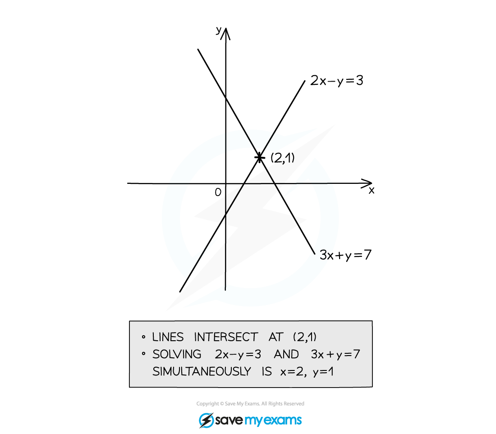
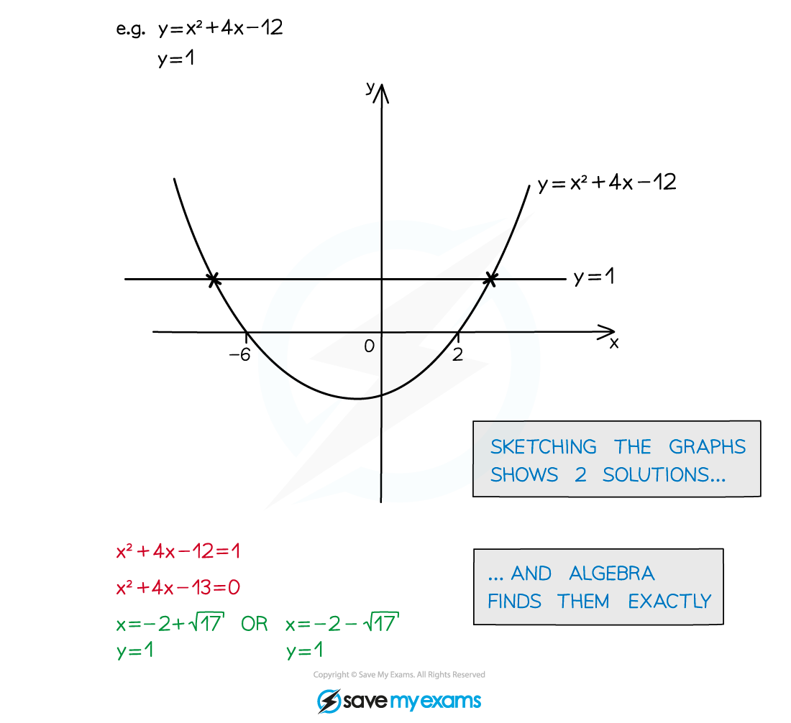
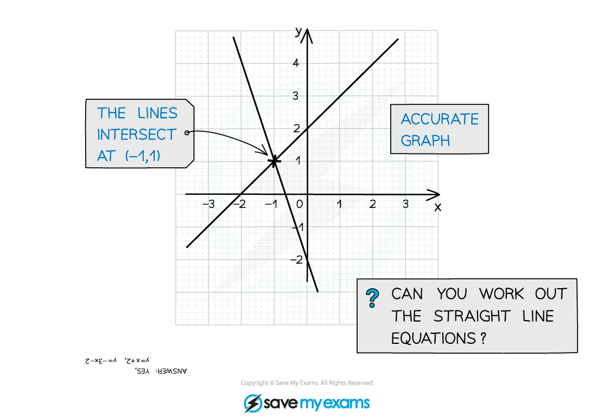

# Solving Equations Graphically

## Solving Equations Graphically

> **Spec point** — `spcpt_4FyzMxCjDT3yDDFP`

## Solving equations graphically

### What does solving simultaneous equations graphically mean?

- This is a way to solve **simultaneous** **equations** (see Simultaneous Equations)
- Coordinates of the *intersections* are the **solutions**

### How do I solve simultaneous equations using a graph?

- Use **graphs** and **algebra** together
- **Sketch** a graph if it has not been given
- **Read/interpret** a graph if it has been given

- It can be difficult to tell from a sketch if graphs intersect once, more, or not at all

> **Exam Hint**
> When writing out your solutions to simultaneous equations, always pair the correct *x* solution with the correct *y* solution

> **Worked Example**
> 
> 
> 
