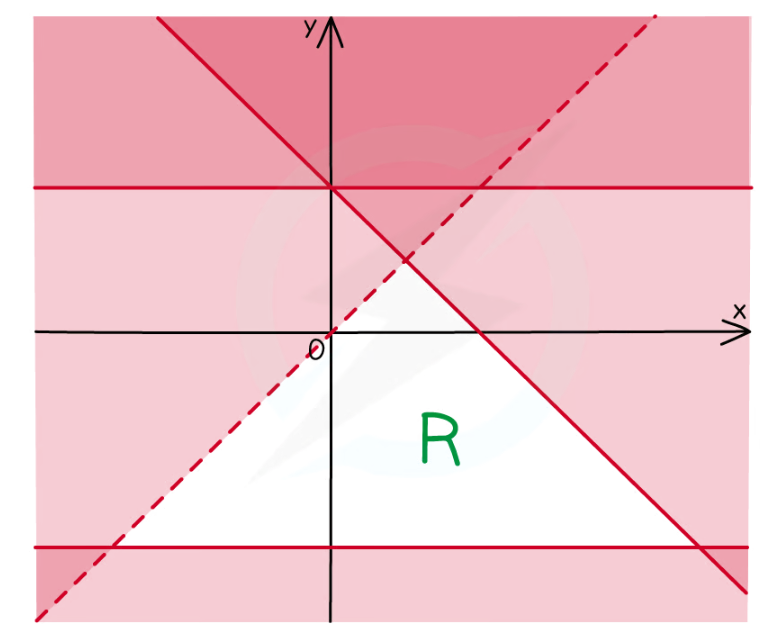
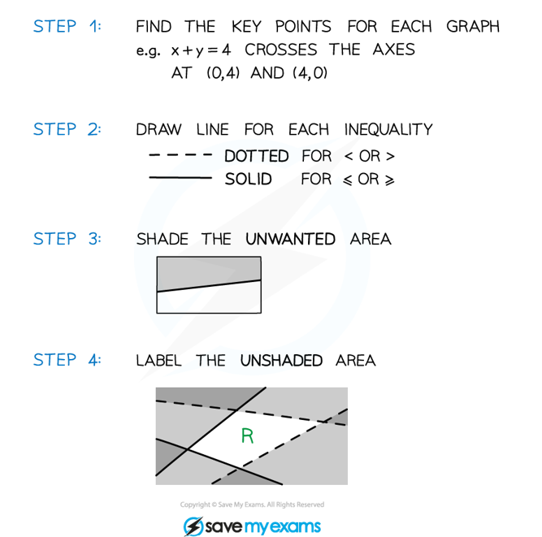

# Inequalities on Graphs

## Inequalities on Graphs

> **Spec point** — `spcpt_RjPbtb8VFvWCkKR4`

## Inequalities on graphs

### What are inequalities on graphs?

- Inequalities can be represented on graphs by shaded regions and dotted or solid lines

- These inequalities have two variables, **x** and **y**
- Several inequalities are used at once
- The solution is an **area** on a graph (often called a **region**)
- The inequalities can be **linear** or **quadratic**

### How do I draw inequalities on a graph?

- Sketch each graph

  - If the inequality is **strict (< or >)** then use a **dotted line**
  - If the inequality is **weak (≤ or ≥)** then use a **solid line**
- Decide **which side** of the line **satisfies** the inequality

  - Choose a coordinate on each side and **test** it in the inequality
  
    - The origin is an easy point to use
  - If it satisfies the inequality then that whole side of the line satisfies the inequality
  
    - For example: (0,0) satisfies the inequality y < *x*2 + 1 so you want the side of the curve that contains the origin

> **Exam Hint**
> - **Recognise** this type of inequality by the use of **two** variables
> - You may have to **deduce** the inequalities from a **given** graph
> - Pay careful attention to which **region** you are **asked to shade**
> - Sometimes the exam could ask you to shade the region that **satisfies the inequalities, this means** you should **shade** the region that is **wanted**
> - As long as your final answer is clear you should get the marks!

> **Worked Example**
> 
