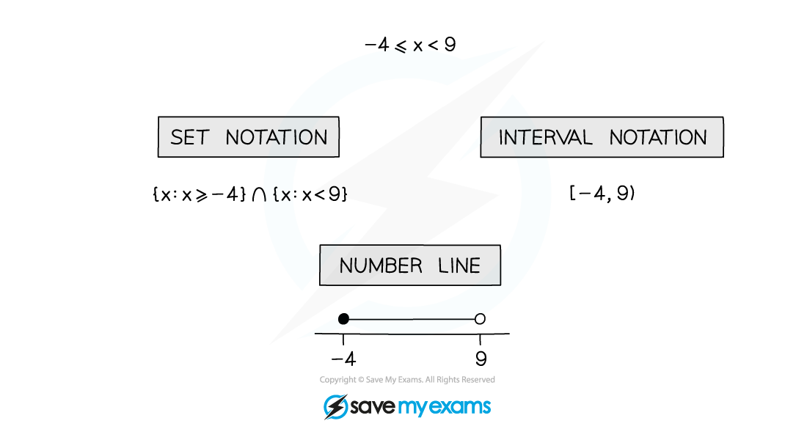
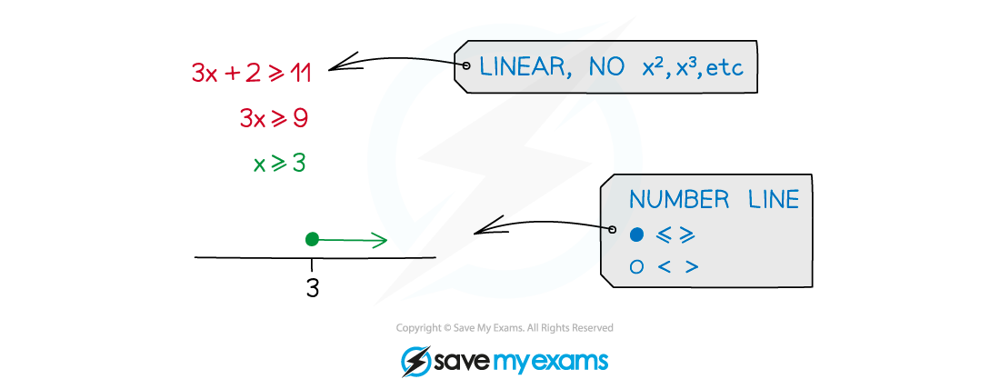
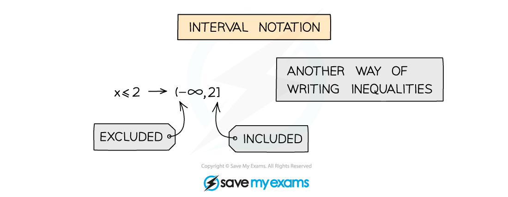
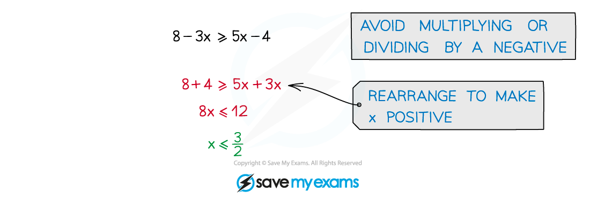

# Linear Inequalities

## Linear Inequalities

> **Spec point** — `spcpt_6KN7hJXfk6tv7V52`

## Linear inequalities

### What are linear inequalities?

- Linear inequalities are similar to equations but answers take a range of values
- Linear means there will be no terms other than degree 1

  - no squared terms or higher powers, no fractional or negative powers
- Inequalities use the following symbols

  - $>$Greater than e.g. $5>3$
  - $<$Less than e.g. $-8<7$
  - $\geq$ Greater than or equal to
  - $\leq$Less than or equal to
- Inequalities can be represented in many ways using number lines, set notation and interval notation

### How do I use number lines?

- Number line diagrams are made up from circles and lines set above a number line

  - A filled-in circle or empty circle above a number denotes whether the number is included or not
  
    - filled in for the greater/less than or equal to symbols
    - empty for the greater/less than symbols

  - Arrows show the range of values that are allowed

### How do I use set notation for inequalities?

- Set notation is a formal way of writing a range of values
- Use of curly brackets { }
- *Intersection ∩ and union ∪* may be used
- Not to be confused with interval notation

### How do I use interval notation for inequalities?

- Interval notation uses different brackets to indicate whether a number is included or not
- Use of square [] and round () brackets
- [ or ] mean included
- ( or ) mean excluded

  - (4,8] means 4 < *x*  ≤ 8
- Note ∞ always uses ( or )
- Not to be confused with set notation

### Skills for solving linear inequalities

- representing and interpreting inequalities displayed on a number line
- **writing** and **interpreting** set notation

  - eg **{x : x > 1} ∩ {x : x ≤ 7}** is the same as **1 < x ≤ 7**
- **writing** and **interpreting** interval notation

  - eg **[-4, 6)** is the same as **-4 ≤ x < 6**

### How do I solve linear inequalities?

- Treat the inequality as an equation and solve

  - avoid multiplying or dividing by a negative
  - if unavoidable, “flip” the inequality sign so < → >, ≥ → ≤, etc
  - try to rearrange to make the x term positive

> **Worked Example**
> 
