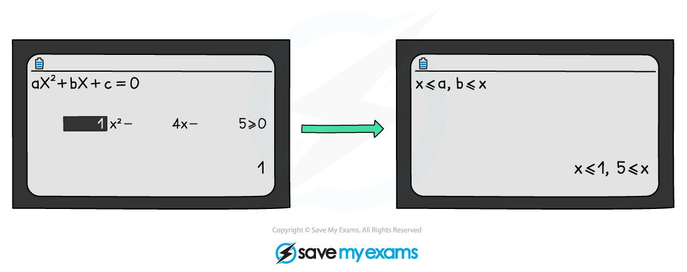

# Quadratic Inequalities

## Quadratic Inequalities

> **Spec point** — `spcpt_ZbfMMFt5FmHmcsbj`

## Quadratic inequalities

### What are quadratic inequalities?

- Similar to quadratic equations, quadratic inequalities just mean there is a range of values that satisfy the solution
- Sketching a quadratic graph is essential
- Can involve the **discriminant** or **applications** in **mechanics** and **statistics**

### How do I solve quadratic inequalities?

- **STEP 1**: **Rearrange** the inequality into quadratic form with a **positive squared term**

  - ***ax*****2**** + *****bx***** + *****c***** > 0** (>, <, ≤ or ≥)
- **STEP 2**: Find the **roots** of the quadratic equation

  - **Solve** *ax*2 + *bx* + *c *= 0 to get ***x*****1*** *and* ****x*****2 **where** *****x*****1**** < *****x*****2**
- **STEP 3**: **Sketch** a graph of the quadratic and **label the roots**

  - As the squared term is positive it will be **"U" shaped**
- **STEP 4**: **Identify** the **region** that satisfies the inequality

  - For ***ax*****2**** + *****bx***** + *****c***** > 0 **you want the region **above** the *x*-axis
  
    - The solution is ***x *****< *****x*****1** **or** ***x *****> *****x*****2**** **
  - For ***ax*****2**** + *****bx***** + *****c***** < 0 **you want the region below the *x*-axis
  
    - The solution is ***x >***** *****x*****1** **and** ***x *****< *****x*****2****  **
    - This is more commonly written as ***x*****1**** < *****x***** < *****x*****2**
- **avoid** multiplying or dividing by a negative number if unavoidable, “**flip**” the inequality sign so **<** → **>**, **≥** → **≤**, etc

  - **avoid** multiplying or dividing by a **variable** (**x**) that **could** be negative (multiplying or dividing by **x****2** guarantees positivity (unless **x** could be 0) but this can create extra, invalid solutions)
  - **do** rearrange to make the x2 term positiveBe careful:

### How do I solve quadratic inequalities on a calculator?

- Be aware of unconventional ways calculators can display an answer eg        **8 > x > 2** rather than **2 < x < 8**

> **Exam Hint**
> - A calculator can be super-efficient but some marks are for method.
> - Use your judgement:
> - is it a “show that” or “prove” question?
> 
>   - how many marks?
>   - how long is the question?

> **Worked Example**
> 
