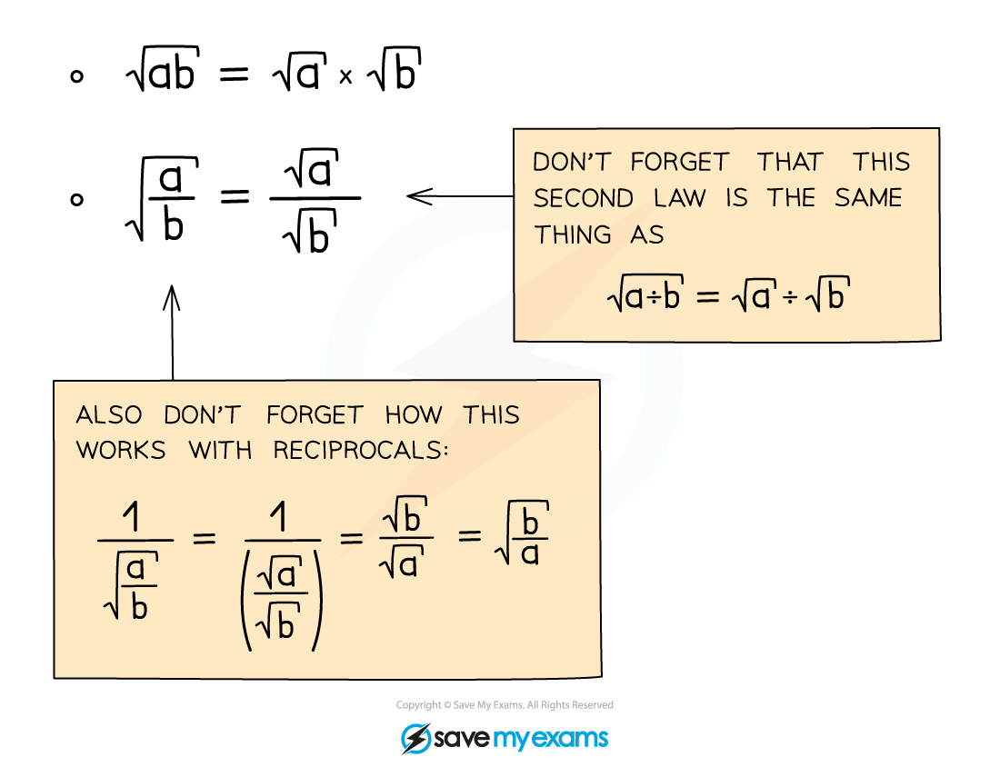
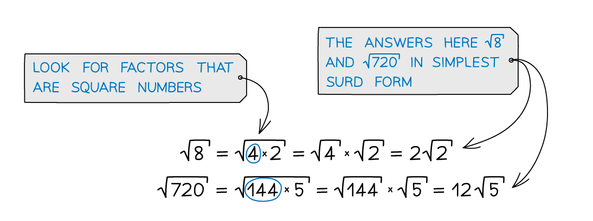

# Manipulating Surds

## Manipulating Surds

> **Spec point** — `spcpt_GwXDbw6JDb2bSZmK`

## Manipulating surds

### What are surds?

- If ***n***** **is a positive integer and is not a square number, then **√*****n*** (or any multiple of **√*****n*** ) is a **surd**

- Surds are examples of *irrational numbers*

### What do I need to know about manipulating surds?

- There are two basic rules you need to know in order to manipulate and simplify surds:

- When simplifying, look for square factors

- You can collect like terms with surds like you do with letters in algebra:

- But be careful not to confuse this with the multiplication and division rules... cannot add or subtract 'under the surd': 

### Where can surds be useful?

- Using surds lets you leave answers in exact form

  - e.g. $5\sqrt{2}$ rather than $7.071067812$
- Understanding how to simplify surds can help reduce expressions and collect like terms

> **Exam Hint**
> - Leaving answers in surd form can be really helpful when you need to carry an exact value through to another part of working
> - When simplifying surds, remembering your square numbers is really helpful!

> **Worked Example**
> 
