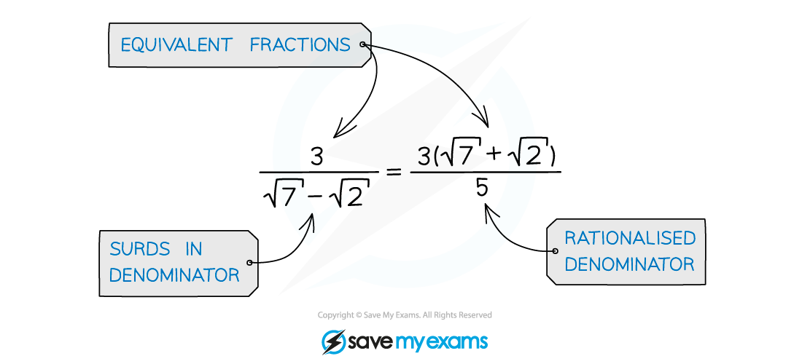
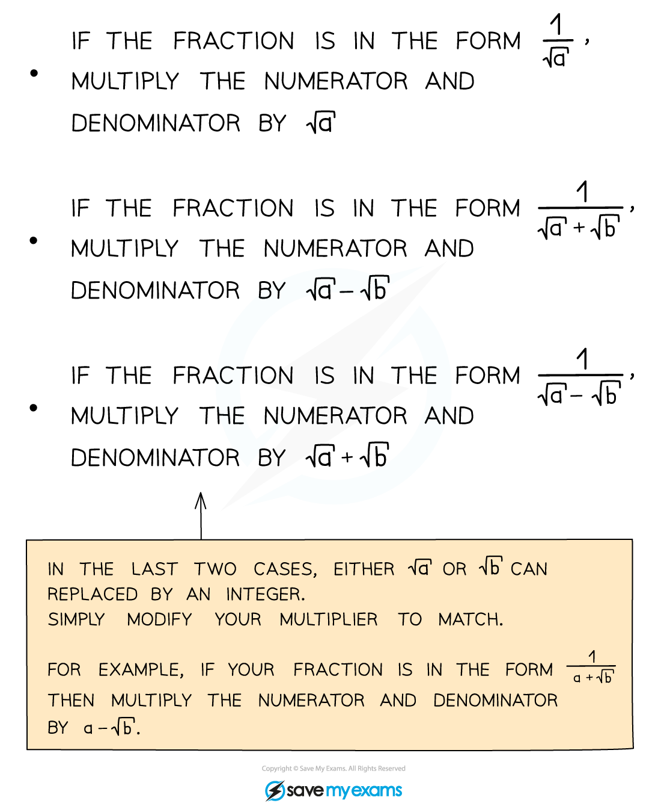

# Rationalising the Denominator with Surds

## Surds - Rationalising the Denominator

> **Spec point** — `spcpt_d3rh6sVBRp5fkj9p`

## Rationalising the denominator with surds

### How do I rationalise the denominator?

- Rationalising a denominator changes a fraction with surds in its denominator, into an equivalent fraction where the denominator is a *rational number* (usually an integer) and any surds are in the numerator

- There are three cases you need to know how to deal with when rationalising denominators:

> **Exam Hint**
> - If an exam question asks you to give an answer, for example, "in the form ***p***** + *****q*****√3** , where ***p*** and ***q*** are rational numbers", this does NOT mean that ***p*** and ***q*** have to be integers, or positive!
> - Remember: both integers and fractions (both positive and negative) are rational numbers

> **Worked Example**
> 
