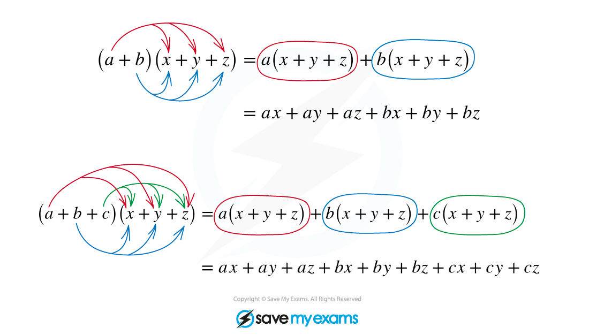

# Expanding Brackets

## Expanding Brackets

> **Spec point** — `spcpt_MpfYg3hhs699hs8X`

## Expanding brackets

### How do I expand brackets?

- To expand brackets, the rule is that each term in one set of brackets must be multiplied by each term in the other set of brackets

- 'FOIL' is a special case of this, when each set of brackets contains two terms you can multiply in order

  - e.g. to multiply out or expand these brackets (2x + 3)(x - 5)
  
    - First (**2x** + 3)(**x** - 5) gives 2x2
    - Outside (**2x** + 3)(x **- 5**) gives -10x
    - Inside (2x + **3**)(**x** - 5) gives +3x
    - Last (2x **+ 3**)(x **- 5)** gives -15
  - (2x + 3)(x - 5) = 2x2 -10x +3x -15 = 2x2 -7x -15
- If you spot something like (a + b)2 or (a + b)3 just write the brackets out twice or three times respectively

  - e.g. (3x + 2)2 = (3x +2)(3x+2) = 9x2 + 6x + 6x + 4 = 9x2 + 12x + 4
- If you are trying to expand something like **(*****a***** + *****b*****)*****n***** **for powers of ***n*** greater than 2 or 3, use the **binomial expansion**
- If you have to expand more than two sets of brackets, just expand them two at a time

> **Worked Example**
> 

> **Worked Example**
> 
