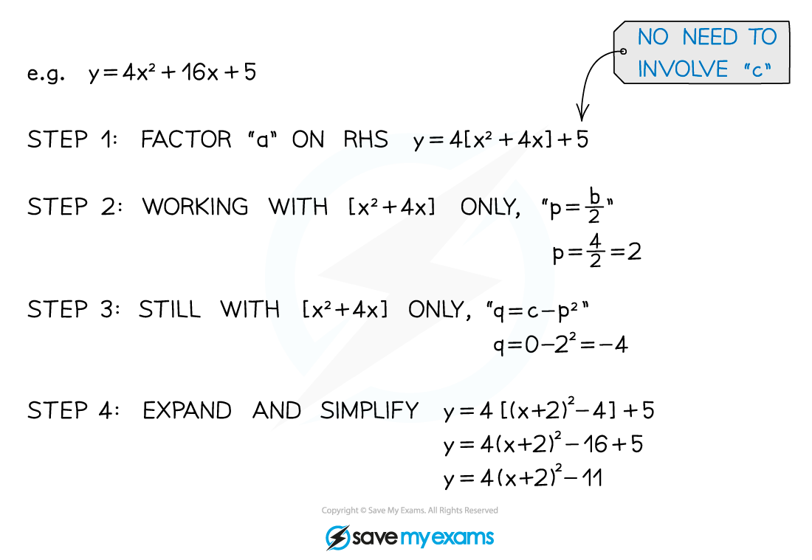
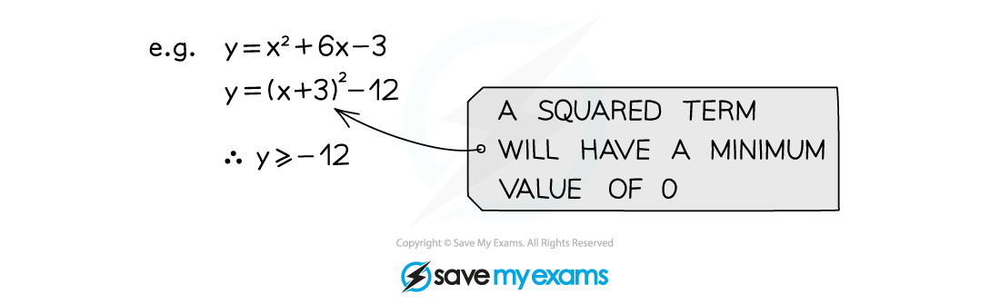

# Completing the square

## Completing the square

> **Spec point** — `spcpt_9wHvtG7MnxXjQrxQ`

## Completing the square

### What is completing the square?

- Completing the square is another method used to solve quadratic equations
- It simply means writing $y=ax^{2}+bx+c$ in the form $y=a(x+p)^{2}+q$
- It can be used to help find other information about the quadratic like coordinates of the turning point

### How do I complete the square?

The method used will depend on the value of the *coefficient* of the **x****2** term in $y=ax^{2}+bx+c$

When **a = 1**

- p is half of b
- q is c - p2

When **a ≠ 1 **

- You first need to take $a$ out as a factor of the x2 and x terms
- Then continue as above

### When is completing the square useful?

- Completing the square helps us find the **turning** **point** on a quadratic graph
- It can also help you **create the equation** of a quadratic when given the turning point

- It can also be used to **prove** and/or **show** results using the fact that a squared term will always be greater than or equal to 0

> **Exam Hint**
> - Sometimes the question will explicitly ask you to complete the square
> - Sometimes it will even remind you of the form to write it in
> - But sometimes it will expect you to spot that completing the square is what you need to do to help with other parts of the question... like finding turning points!

> **Worked Example**
> 
> 
> 
