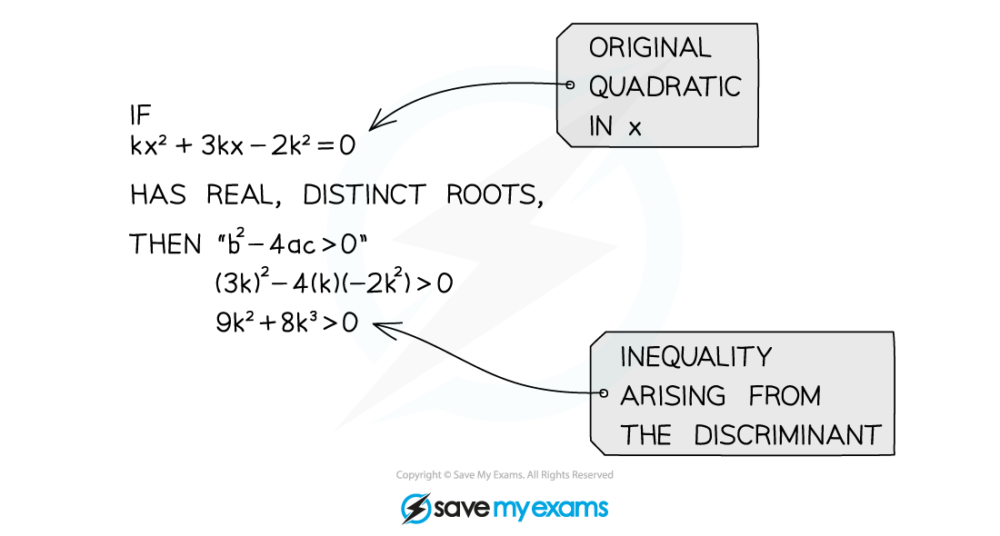

# Discriminants

## Discriminants

> **Spec point** — `spcpt_nf42jP8ryNYhJYVk`

## Discriminants

### What is a discriminant?

- The discriminant is the part of the quadratic formula that is under the square root sign $b^{2}-4ac$
- It is sometimes denoted by the Greek letter $Δ$ (capital delta)

### How does the discriminant relate to graphs and roots?

There are three options for the outcome of the discriminant:

- If $b^{2}-4ac>0$ the quadratic crosses the x-axis **twice **meaning there are **two distinct real roots**
- If  $b^{2}-4ac=0$ the quadratic touches the x-axis **once **meaning there is **one real root** (also called repeated roots)
- If  $b^{2}-4ac<0$ the quadratic **does not cross** the x-axis meaning there are no real roots

### Discriminant and inequalities

- You need to be able to **set** **up** and **solve** equations and inequalities (often quadratic) arising from the discriminant
- Sketch the quadratic and decide whether you're looking above or below zero to write your solutions correctly

> **Exam Hint**
> - When questions just mention “real roots”, the roots could be **distinct** or **repeated** (i.e. they aren't talking about complex numbers!)
> - In these cases, you only need to worry about solving $b^{2}-4ac\geq0$
> - When solving using inequalities, always sketch the quadratic and decide whether you're looking above or below zero to help write your solutions correctly

> **Worked Example**
> 
