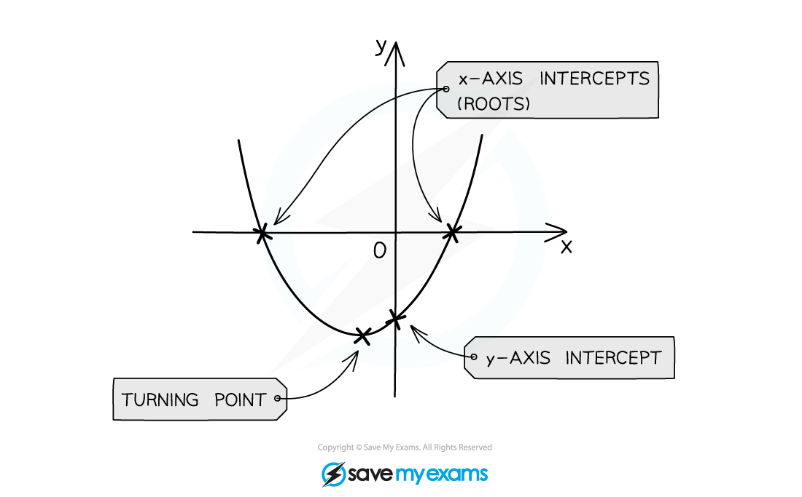

# Quadratic Graphs

## Quadratic Graphs

> **Spec point** — `spcpt_H5Cx6bgK8Tw23S9k`

## Quadratic graphs

### What are quadratic graphs?

- The general equation of a quadratic graph is $y=ax^{2}+bx+c$
- Their shape is called a parabola ("U" shape)
- Positive quadratics have a value of  $a>0$ so the parabola is upright$\cup$
- Negative quadratics have a value of $a<0$ so the parabola is upside down $\cap$

### How do I use quadratic graphs?

You need to be able to:

- **sketch** a quadratic graph given an equation or information about the graph
- determine, from the equation, the **axes** **intercepts**
- **factorise**, if possible, to find the *roots* of the quadratic function
- find the coordinates of the ***turning point*** (maximum or minimum)

You may have to rearrange the equation before you can find some of these things

> **Exam Hint**
> - Your calculator may tell you the **roots** of a quadratic function and the coordinates of the turning point
> - But don't rely on it – think about how many marks the question is worth and how much method/working you should show
> - Remember sometimes you'll need to rearrange an equation into the form $y=ax^{2}+bx+c$

> **Worked Example**
> 
