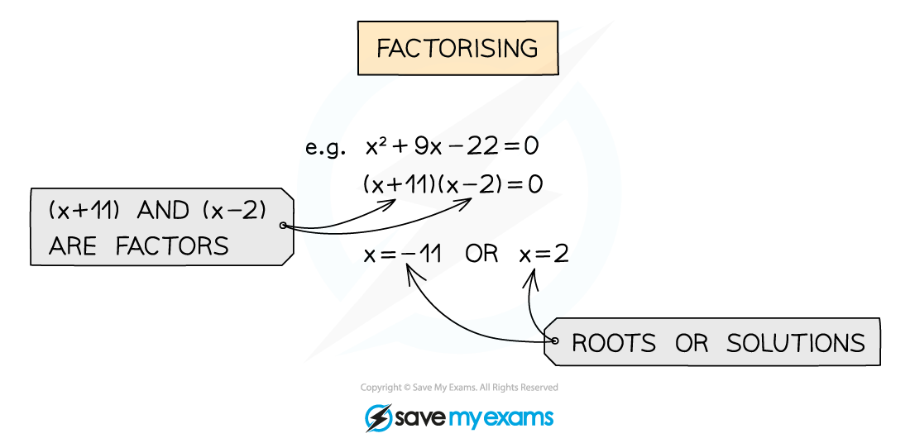
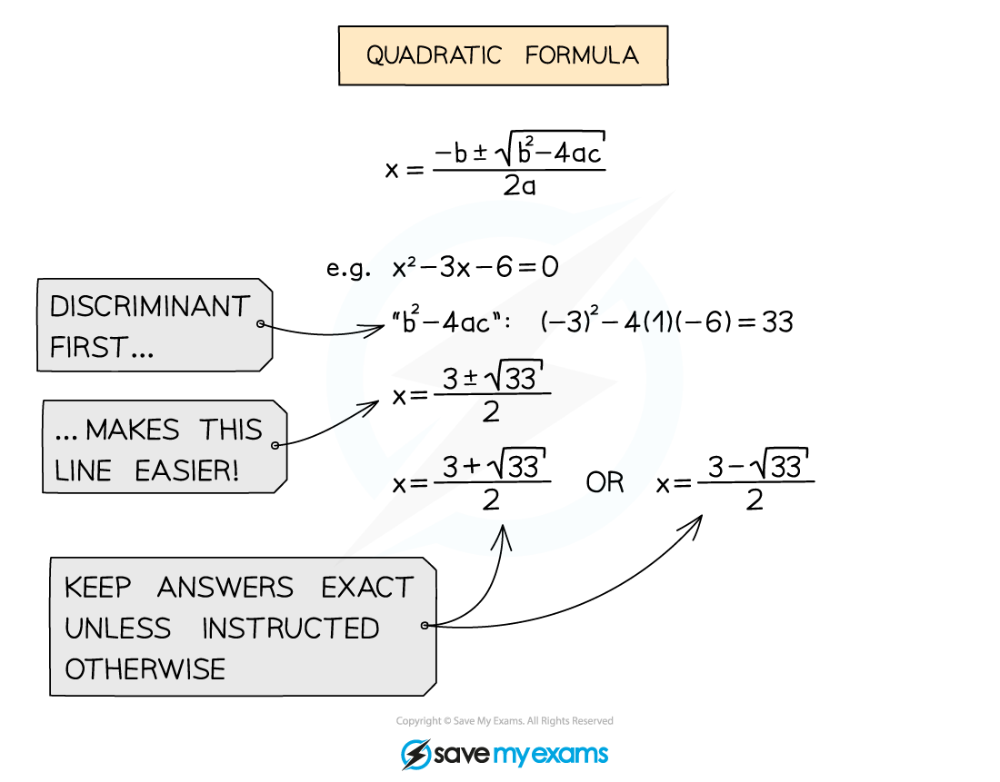

# Solving Quadratic Equations

## Solving Quadratic Equations

> **Spec point** — `spcpt_tbPsJgvsZprv2s82`

## Solving quadratic equations

### Solving quadratic equations

- We can solve quadratic equations when they are written in the form $ax^{2}+bx+c=0$
- If given an unusual looking equation, try to rearrange it into this form first
- The three ways to solve a quadratic you must know are

  - Factorising
  - Completing the square
  - Quadratic formula

### How do I solve by factorisation?

- Factorising is a great way to solve a quadratic quickly but won't work for all quadratics
- If the numbers are simple, try factorising first
- Once factorised, set each bracket to = 0 and solve

### How do I solve by completing the square?

- Completing the square will work for any quadratic
- Make sure you know how to complete the square
- Remember this will help with questions involving turning points too 

### How do I solve using the quadratic formula?

- The quadratic formula might look complicated but it just uses the coefficients a, b and c from the quadratic equation
- The quadratic formula will work for any quadratic

### How do I solve using a calculator?

- Most calculators now have the ability to solve quadratics
- Get used to how your calculator functions work 
- So the solution to the quadratic equation $2x^{2}+5x-12=0$ are **x = 1.5** and **x = -4**

> **Exam Hint**
> - A calculator can be super-efficient but be aware some marks are for method
> - There will never be many marks for solving a quadratic at AS/A level
> - Use your judgement:
> 
>   - is it a “show that” or “prove” question?
>   - how many marks?
>   - how long is the question?
> - Remember the quadratic formula with a song... there are loads of fun ones on YouTube

> **Worked Example**
> 
