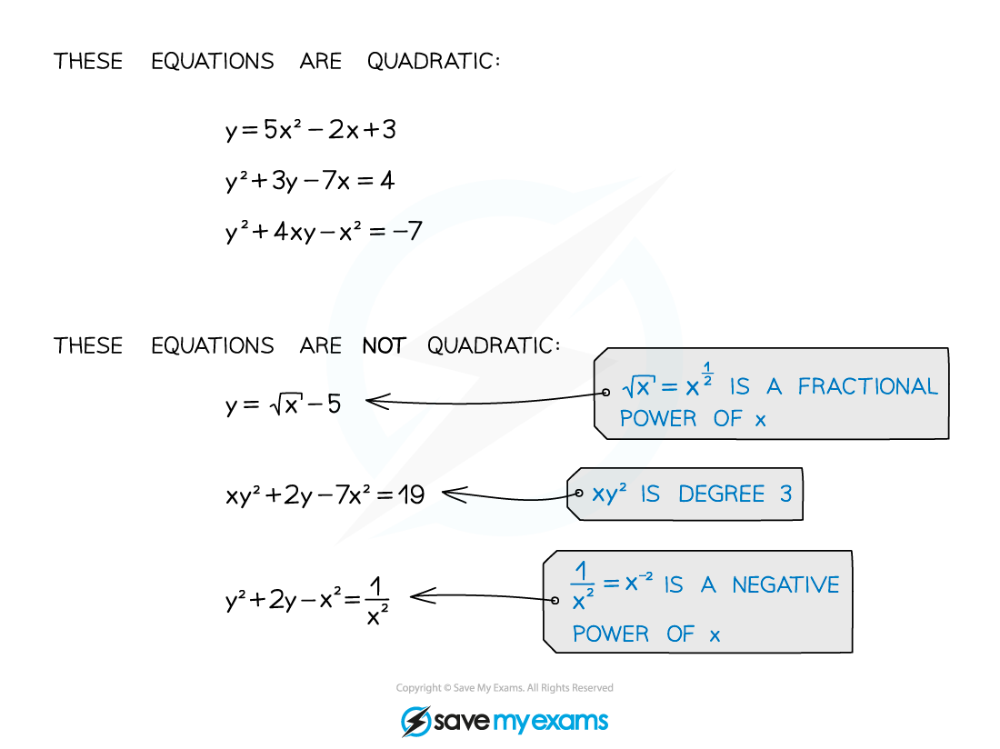

# Quadratic Simultaneous Equations

## Quadratic Simultaneous Equations

> **Spec point** — `spcpt_82NtJq6t3CwTsvB7`

## Quadratic simultaneous equations

### What are quadratic simultaneous equations?

- When you have more than one equation in more than one unknown, then you are dealing with **simultaneous equations**
- An equation is *quadratic* if it contains terms of *degree* two, but no terms of any higher degrees (and also no unknowns raised to negative or fractional powers)

- Solving two simultaneous equations in two unknowns means finding pairs of values that make both of the equations true at the same time

  - At A level usually only one equation will be quadratic and the other will be *linear*
  - For one quadratic and one linear equation there will usually be **two** solution pairs (although there can be one, or none)

### How do I solve quadratic simultaneous equations?

**Step 1:** Rearrange the **linear** equation so that one of the unknowns becomes the subject (if the linear equation is already in this form, you can skip to Step 2)

**Step 2: **Substitute the expression found in Step 1 into the quadratic equation

**Step 3:** Solve the new quadratic equation from Step 2 to find the values of the unknown (there will usually be two of these)

**Step 4:** Substitute the values from Step 3 into the rearranged equation from Step 1 to find the values of the other unknown

**Step 5: Check** your solutions by substituting the values for the two unknowns (one pair at a time!) into the original quadratic equation

> **Exam Hint**
> - You have to use substitution to solve quadratic simultaneous equations – the elimination method won't work.

> **Worked Example**
> 
