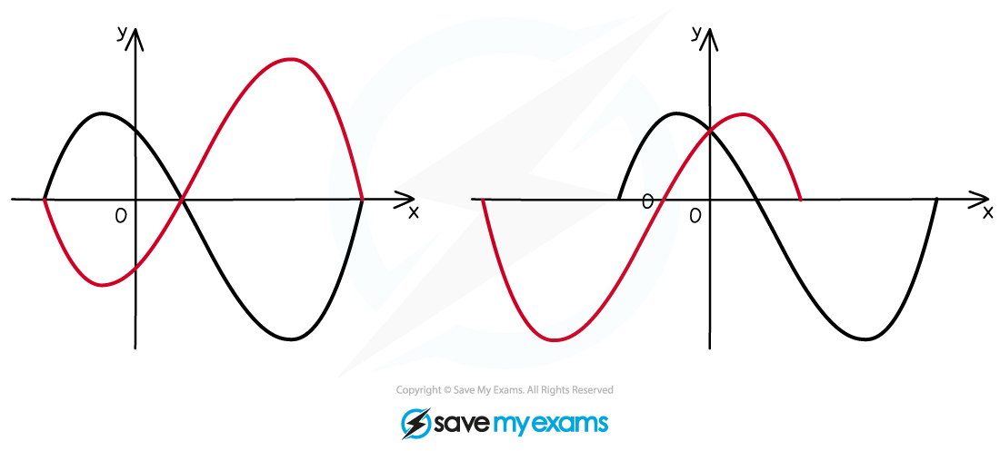
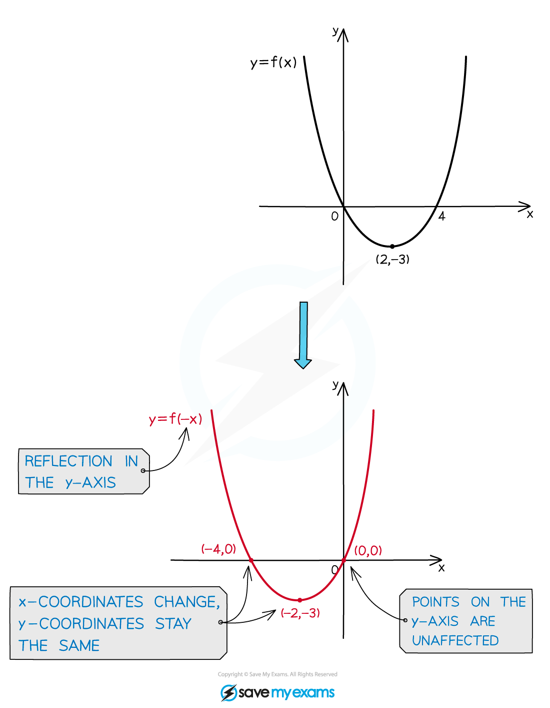
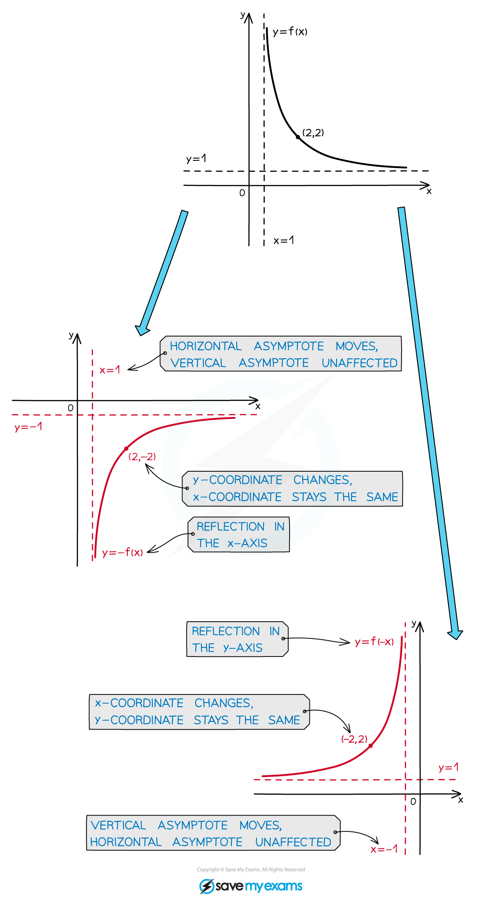

# Reflections

## Reflections

> **Spec point** — `spcpt_ck5SsBrq9RDzWFJK`

## Reflections

### What are graph reflections?

- When you alter a function in certain ways, the effects on the graph of the function can be described by geometrical transformations
- With a **reflection** all the points on the graph are reflected in either the ***x*** or the ***y *****axis**

- Any *asymptotes* of **f(*****x*****)** are also affected by the reflection (reflect them as you would reflect the function of a straight line)
- If an asymptote is one of the coordinate axes, or is perpendicular to the coordinate axis in which the graph is reflected, it will not be affected

### What do I need to know about graph reflections?

- The graph of ***y***** = *****-*****f(*****x*****)** is a reflection in the *x* axis 

  - The ***x***** **coordinates of points stay the same; ***y*** coordinates have their signs flipped (positive to negative, negative to positive)
  - Points **on** **the *****x***** axis** stay where they are
  - All other points are reflected to the other side of the ***x***** **axis

- The graph of ***y***** = f(-*****x*****)** is a reflection in the *y* axis

  - The ***y*** coordinates of points stay the same; ***x*** coordinates have their signs flipped (positive to negative, negative to positive)
  - Points **on** **the *****y***** axis** stay where they are
  - All other points are reflected to the other side of the ***y*** axis

- Any *asymptotes* of **f(*****x*****)** are also affected by the reflection (reflect them as you would reflect the function of a straight line)
- If an asymptote is one of the coordinate axes, or is perpendicular to the coordinate axis in which the graph is reflected, it will not be affected

> **Worked Example**
> 
