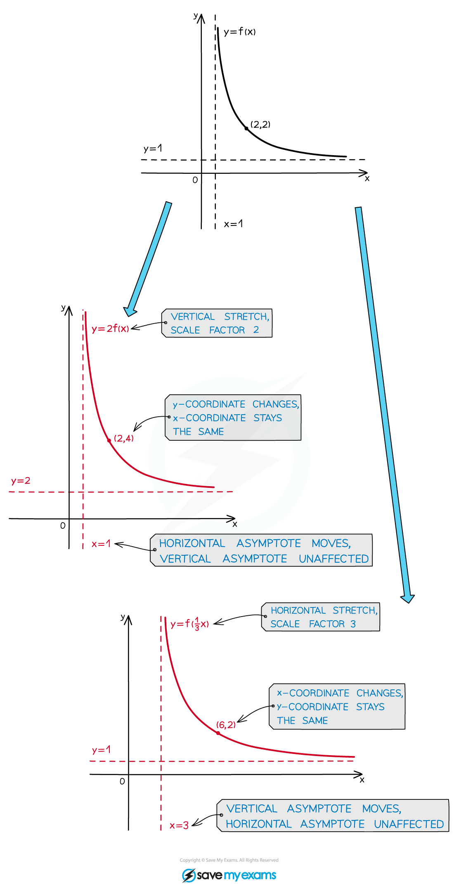

# Stretches

## Stretches

> **Spec point** — `spcpt_3fVyTss6mgDbqHS4`

## Stretches

### What are graph stretches?

- When you alter a function in certain ways, the effects on the graph of the function can be described by geometrical transformations
- With a **stretch** all the points on the graph are moved towards or away from either the ***x*** or the ***y*** axis by a constant scale factor

### What do I need to know about graph stretches?

- The graph of ***y***** = *****a*****f(*****x*****)** is a **vertical** stretch of the graph ***y***** = f(*****x*****)** by a scale factor of ***a***, centred on the ***x***** **axis 

  - The ***x***** **coordinates of points stay the same; ***y*** coordinates are multiplied by ***a***
  - Points **on** **the *****x***** axis** stay where they are
  - All other points move **parallel to the *****y***** axis**, away from (***a*** **> 1**) or towards (**0 < *****a***** < 1**) the *x* axis

- The graph of ***y***** = f(*****ax*****)** is a **horizontal** stretch of the graph ***y***** = f(*****x*****)** by a scale factor of $\frac{1}{a}$, centred on the** *****y*** axis 

  - The ***y*** coordinates of points stay the same; ***x*** coordinates are multiplied by $\frac{1}{a}$
  - Points **on the *****y***** axis** stay where they are
  - All other points move **parallel to the *****x***** axis**, away from (**0 < *****a*** **< 1**) or towards (***a***** > 1**) the *y* axis

- Any *asymptotes* of **f(*****x*****)** are also affected by the stretch (stretch them as you would stretch the function of a straight line)
- If an asymptote is one of the coordinate axes, or is parallel to the direction of the stretch, however, it will not be affected

> **Exam Hint**
> - When you sketch a stretched graph, be sure to indicate the new coordinates of any points that are marked on the original graph.
> - Try to indicate the coordinates of points where the stretched graph intersects the coordinate axes (if you don't have the equation of the original function this may not be possible).
> - If the graph has asymptotes, don't forget to sketch the asymptotes of the stretched graph as well.

> **Worked Example**
> 
