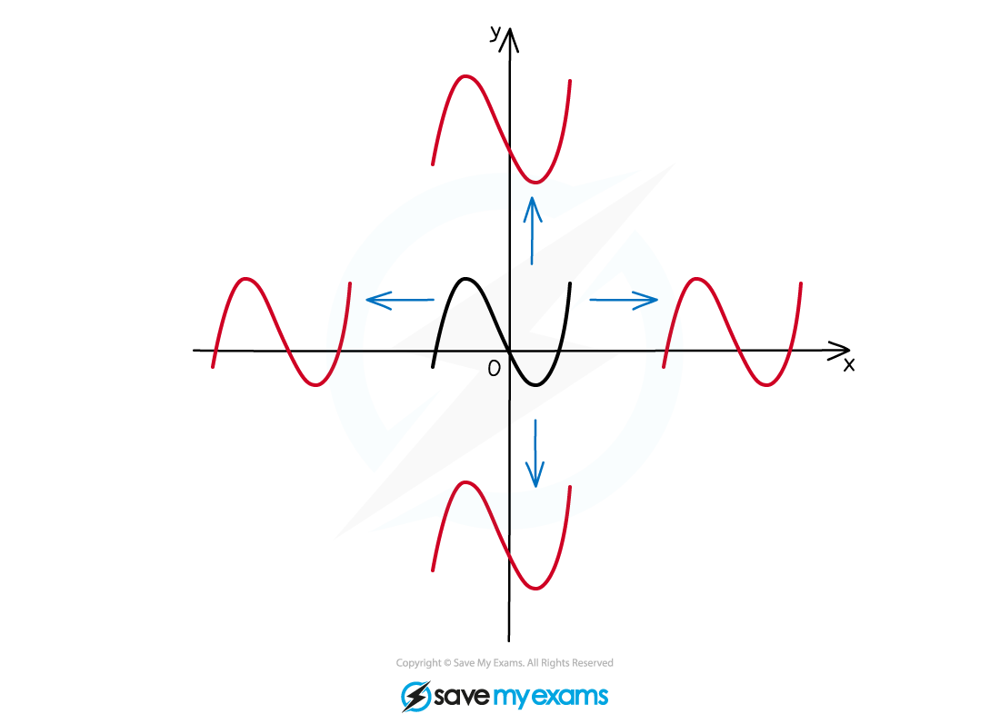
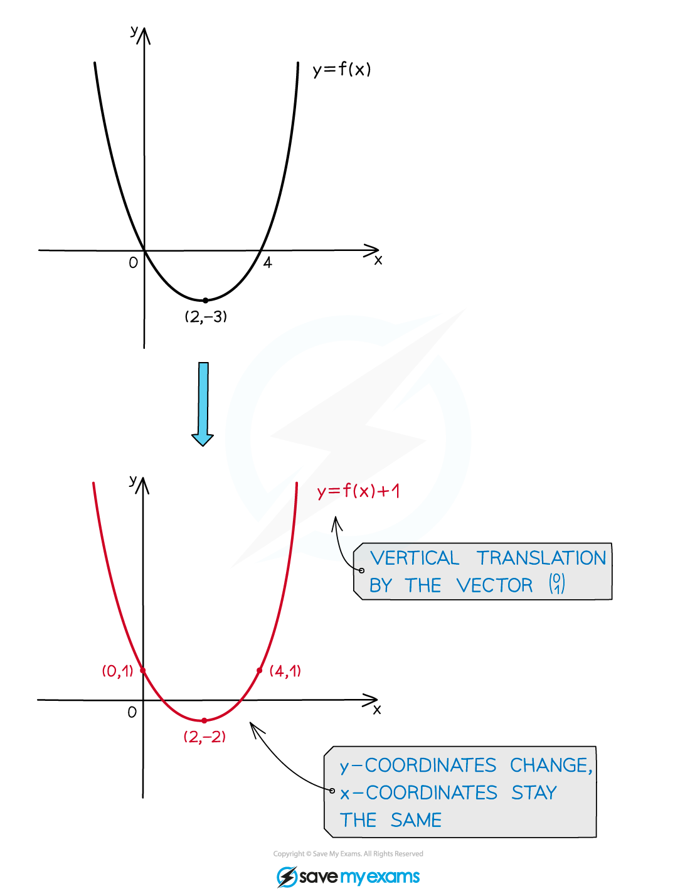
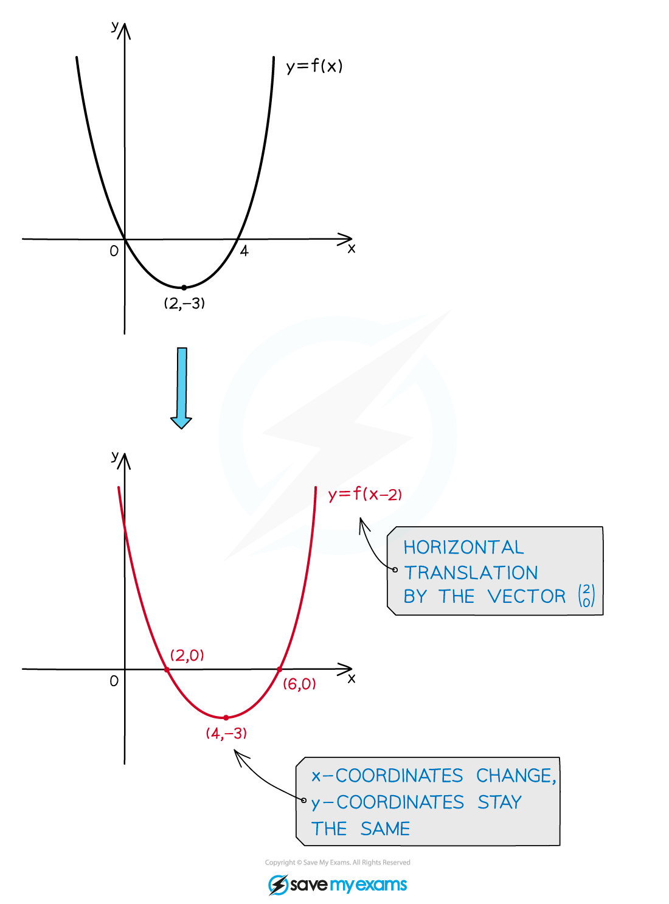
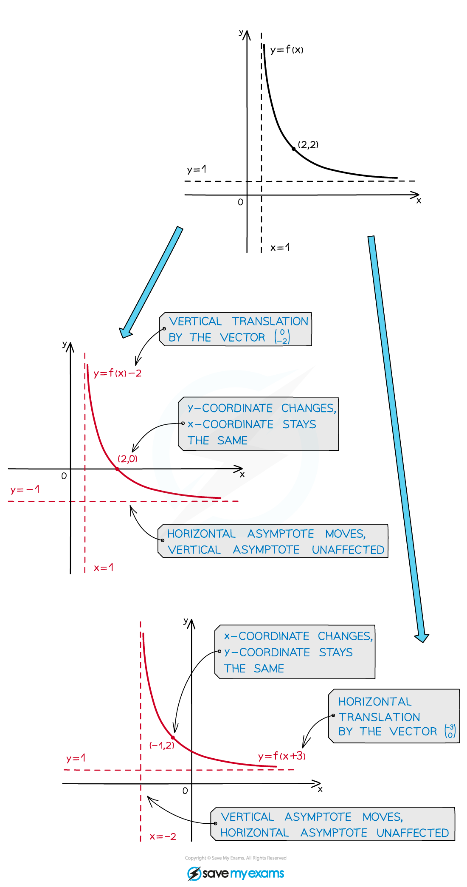

# Translations

## Translations

> **Spec point** — `spcpt_mC2jjmXphJvmxQnP`

## Translations

### What are graph translations?

- When you alter a function in certain ways, the effects on the graph of the function can be described by geometrical transformations
- With a **translation** the shape, size, and orientation of the graph remain unchanged – the graph is merely shifted (up or down, left or right) in the *xy* plane

- A particular translation (how far left/right, how far up/down) is specified by a **translation vector**:** **

### What do I need to know about graph translations?

- The graph of $y=f(x)+a$ is a **vertical** translation of the graph $y=f(x)$ by the vector `open parentheses table row 0 row a end table close parentheses`

  - The graph moves** up for positive** values of *a *and **down for negative** values of *a*
  - The *x*-coordinates stay the same

- The graph of $y=f(x+a)$ is a **horizontal** translation of the graph $y=f(x)$ by the vector `open parentheses table row cell negative a end cell row 0 end table close parentheses`

  - The graph moves** left for positive** values of *a *and **right for negative** values of *a*
  - The *y*-coordinates stay the same

- Any *asymptotes* of **f(*****x*****)** are also translated. If an asymptote is parallel to the direction of translation, however, it will not be affected

> **Worked Example**
> 
