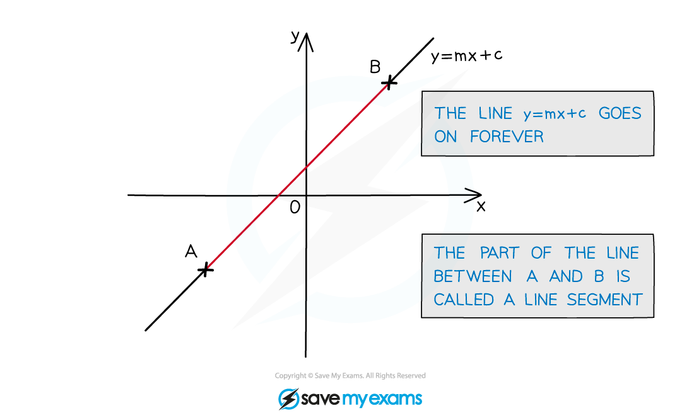
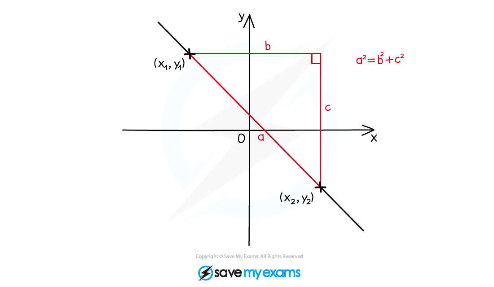
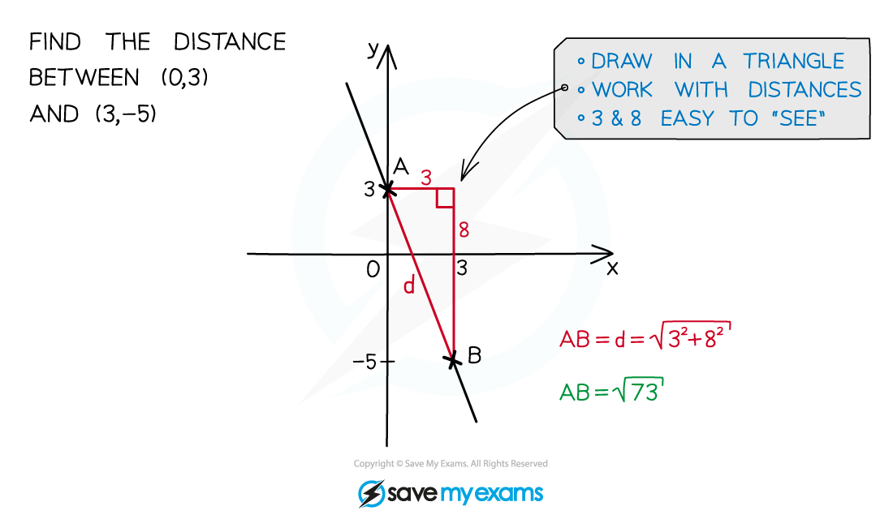
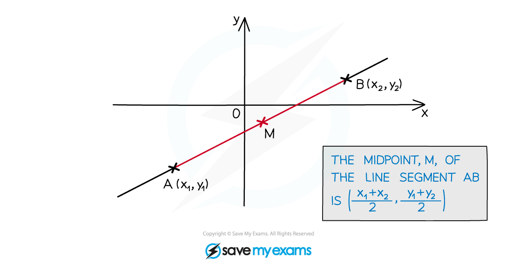

# Basic Coordinate Geometry

## Basic Coordinate Geometry

> **Spec point** — `spcpt_VHJZWXfzfpzcxfZG`

## Basic coordinate geometry

### What is basic coordinate geometry?

- Basic coordinate geometry refers to working with points, lines and shapes on the coordinate axis
- **Cartesian** coordinates are simply the **x **-**y** coordinate system
- Using coordinates you can

  - Calculate the distance between two points (length of a line)
  - Divide lines in m:n ratio,
  - Find the mid-point of a line
  - Calculate the area of a triangle (or other shapes)
  - Find missing coordinates using any of the above
- Most of these involve working with straight line graphs
- **Straight line graphs** are of the form **y = mx + c**

  - **m** is the gradient
  - **c** is the **y**-axis intercept
  - Part of a straight line is called a **line** **segment**

### How do I find the length of a line segment?

- By finding the distance, **d**, between two points (**x**1, **y**1) and (**x**2, **y**2)
- **Pythagoras’** **Theorem** (**a****2**** = b****2**** + c****2**) is used to find the length of a line

** **

** **

** **

### How do I find the midpoint of a line segment?

- M is often used as the midpoint between two points (**x**1, **y**1) and (**x**2, **y**2)
- It is the average of both the **x** and **y** coordinates

> **Exam Hint**
> - Work with the **square** of a distance for as long as possible as this avoids early rounding errors and surds.
> - Only square root when forced to or for a final answer, and use the ANS button (and other memory features) on your calculator.

### How do I find the gradient of a line segment?

- There are lots of ways to find the gradient, *m*, of a line segment

- Use the** two end points**  to find the change in y divided by change in x

$m=\frac{y_{2}-y_{1}}{x_{2}-x_{1}}$

> **Worked Example**
> 
