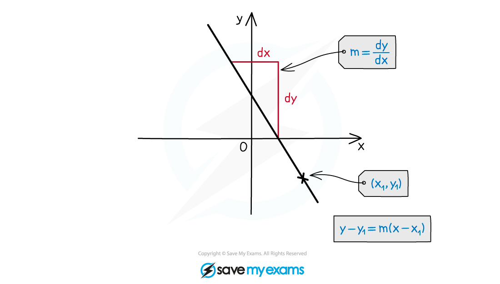
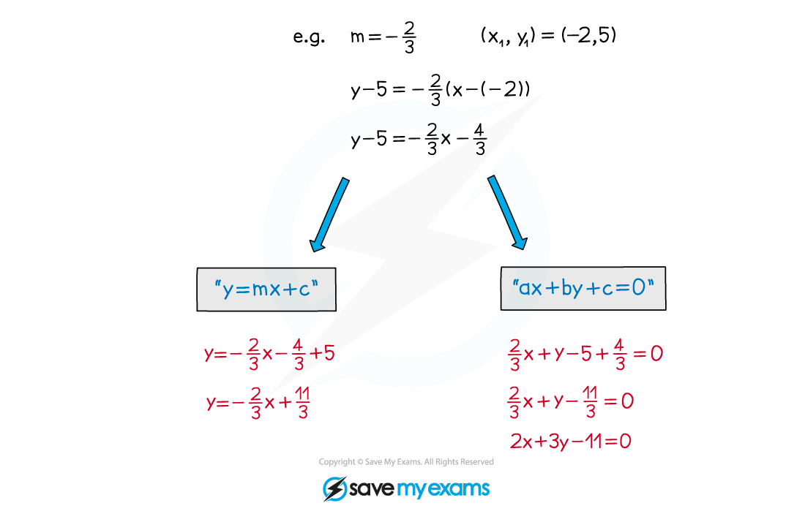
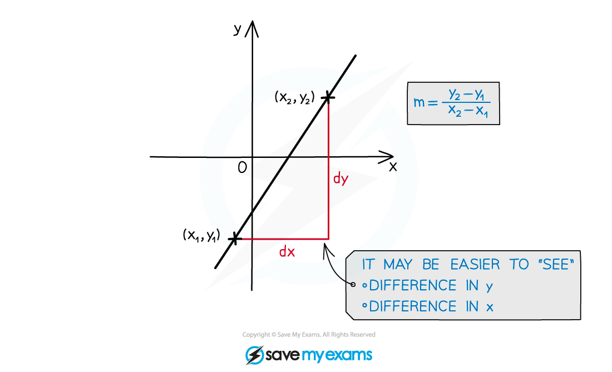
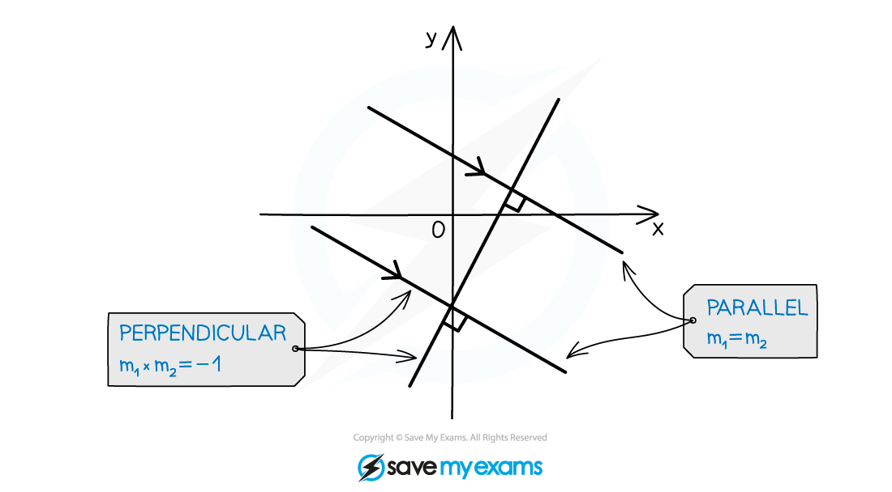
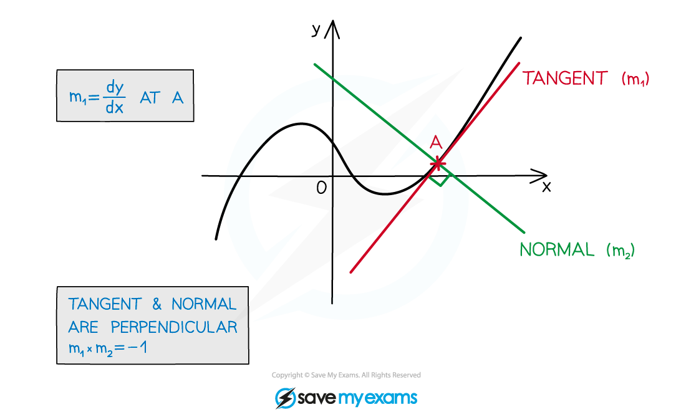

# Equation of a Straight Line

## Equation of a Straight Line

> **Spec point** — `spcpt_vHVvC2TmqrTFqBq7`

## Equation of a straight line

### What is the equation of a straight line?

- **y = mx + c **is the equation for any straight line
- **m** is **gradient** given by “difference in **y**” ÷ “difference in **x**” or **dy**/**dx**
- **c** is the **y**-axis **intercept**
- Alternative form is **ax + by + c = 0** where **a**, **b** and **c** are integers

** **

### How do I find the equation of a straight line?

- **Two** features of a straight line are needed

  - gradient, **m**
  - a point the line passes through, (**x****1**, **y****1**)

- The equation can then be found using **y – y****1**** = m**(**x - x****1**)
- This can be rearranged into either **y = mx + c** or **ax + by + c = 0**

### How do I find the gradient of a straight line?

- There are lots of ways to find the gradient of a line

- Using t**wo** **points** on a line to find the change in y divided by change in x

$m=\frac{y_{2}-y_{1}}{x_{2}-x_{1}}$

- Using the fact that lines are **parallel** or **perpendicular** to another line (see Parallel and Perpendicular Gradients)

- Using **Tangents **and **Normals** - **Differentiation **(see Gradients, Tangents & Normals)

- Other ways

  - **Collinear** lines are the same straight line so gradients are equal
  - Angle facts and **circle** **theorems** eg. a **radius** and **tangent** are **perpendicular**

> **Exam Hint**
> - Working with straight lines can involve lots of algebra, but **sketching** a diagram will always help.
> - Use a **sketch** to check if answers seem about right.

> **Worked Example**
> 
