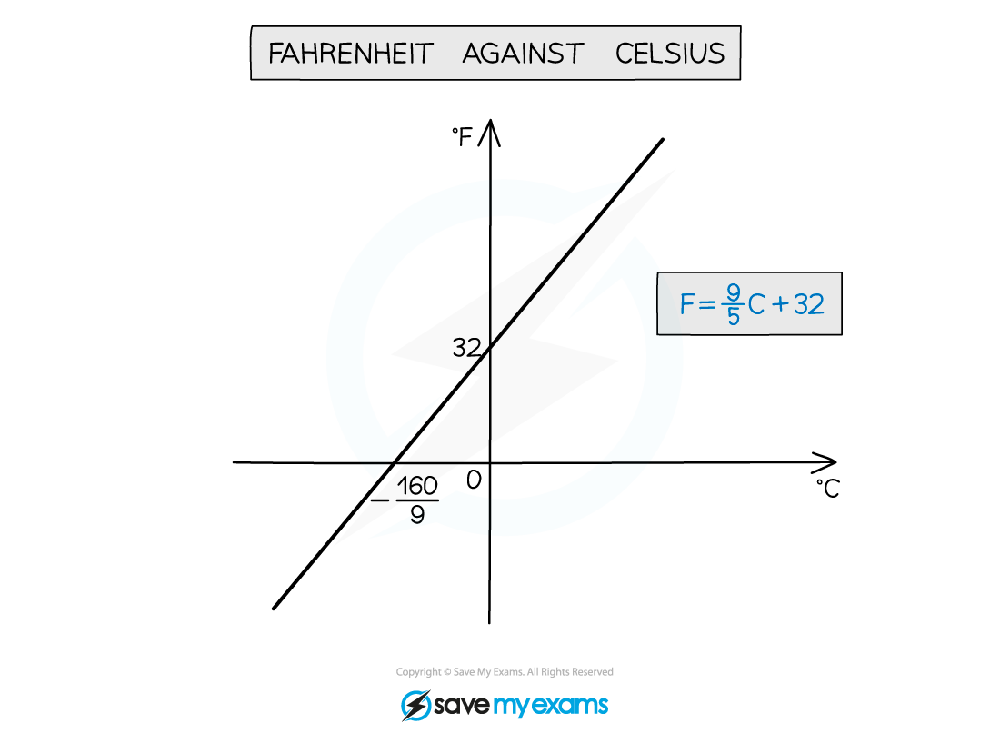
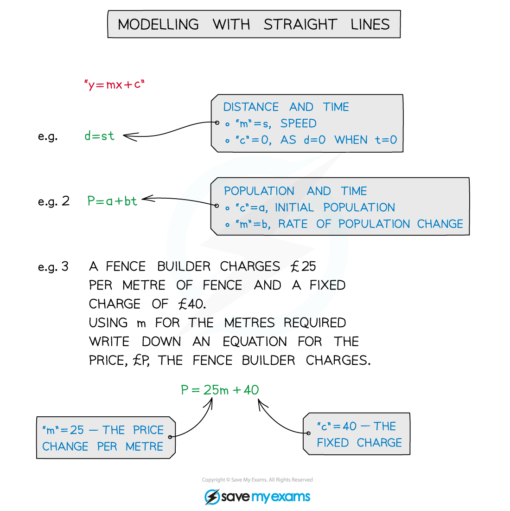

# Modelling with Straight Lines

## Modelling with Straight Lines

> **Spec point** — `spcpt_Mp2xB3kzS88pG3yz`

## Modelling with straight lines

### What is modelling with straight lines?

- **Modelling** means applying the mathematics to a **real**-**life** situation
- The model is used to **find** or **predict** future values
- Models will often need **refining** to improve their accuracy

** **

### How do I work with straight line models?

- Turn the words from the question into mathematical equations
- In **y = mx + c** constants “**m**” and “**c**” will have a meaning

  - gradient “**m**” will be the **rate** **of** **change**
  - eg extension in a spring per 1 kg of mass added
  - **y**-axis intercept “**c**” will be the **initial** **value**
  - eg resting length of a spring

- The skills needed are covered in the other pages of the section Equation of a Straight Line

> **Worked Example**
> 
