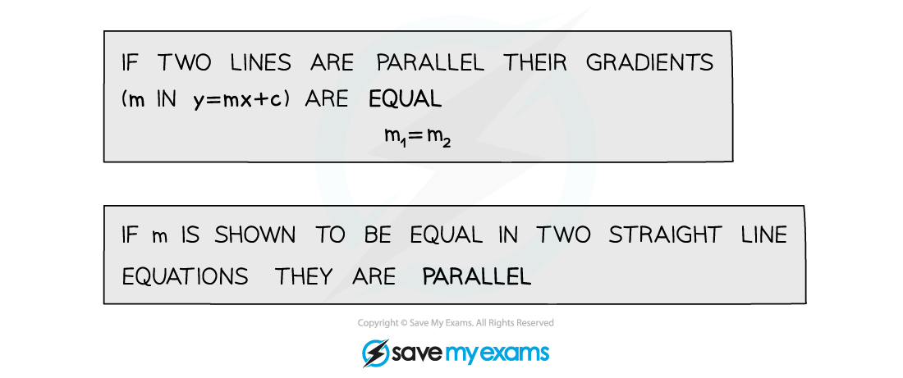
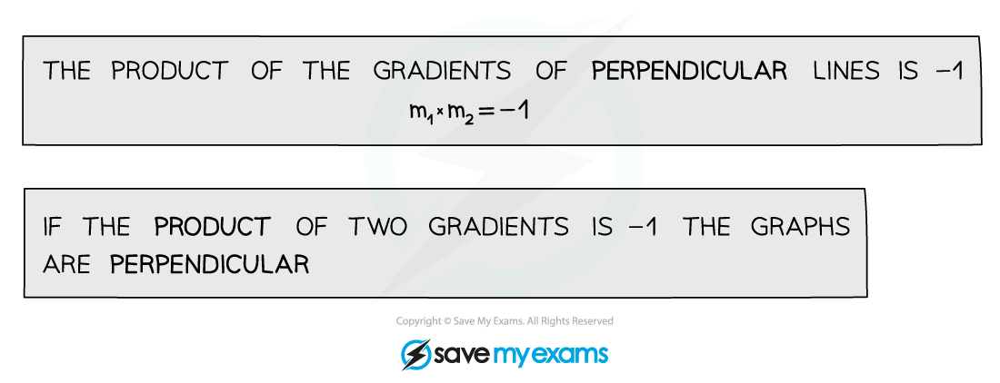
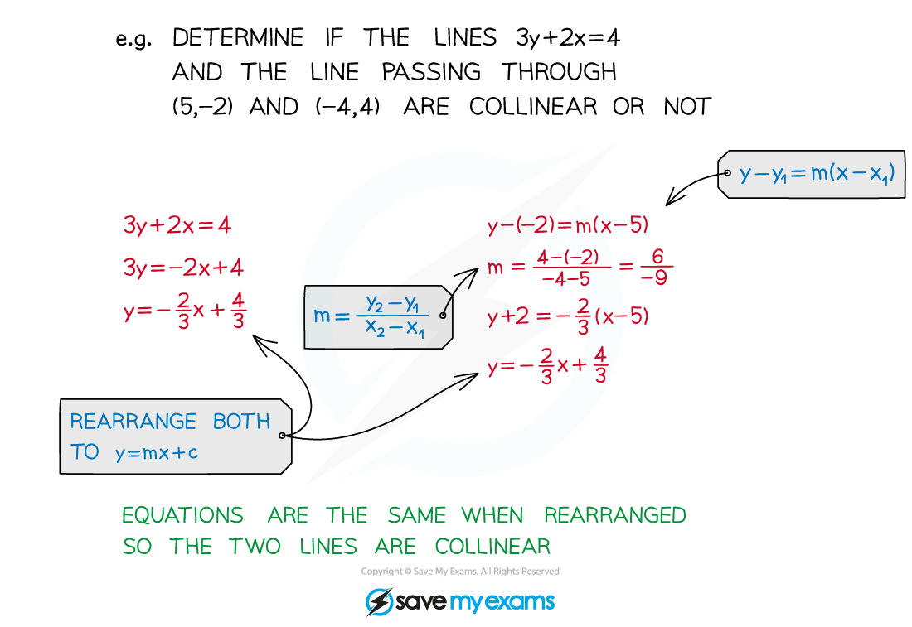
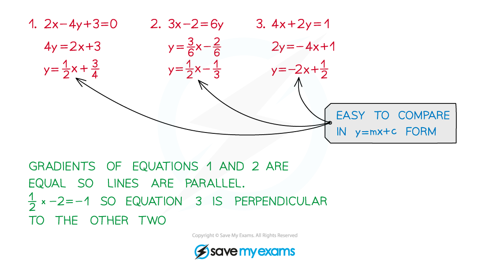

# Parallel & Perpendicular Gradients

## Parallel & Perpendicular Gradients

> **Spec point** — `spcpt_vWW6kzvGRnCvPPnr`

## Parallel & perpendicular gradients

### What are parallel lines?

- **Parallel **lines are equidistant meaning they never meet
- **Parallel** lines have **equal** **gradients**

### What are perpendicular lines?

- **Perpendicular** lines meet at **right** **angles**
- The **product** of their **gradients** is -1

### What does collinear mean?

- **Collinear** line segments are two line segments that are part of the **same** line
- They have **equal** **gradients**

  - They may **pass** through, or **meet** at, a common **point**
  - When they are extended, they become the same line
- **Rearrange** their equations into the same form and they will be identical

### How do I tell if lines are parallel or perpendicular?

- Rearrange equations into the form **y = mx + c**
- **m** is the **gradient**

> **Exam Hint**
> - Exam questions are good at “hiding” parallel and perpendicular lines.
> - For example a **tangent** and a **radius** are **perpendicular.**
> - **Parallel lines** could be implied by phrases like “… at the same rate …”

> **Worked Example**
> 
