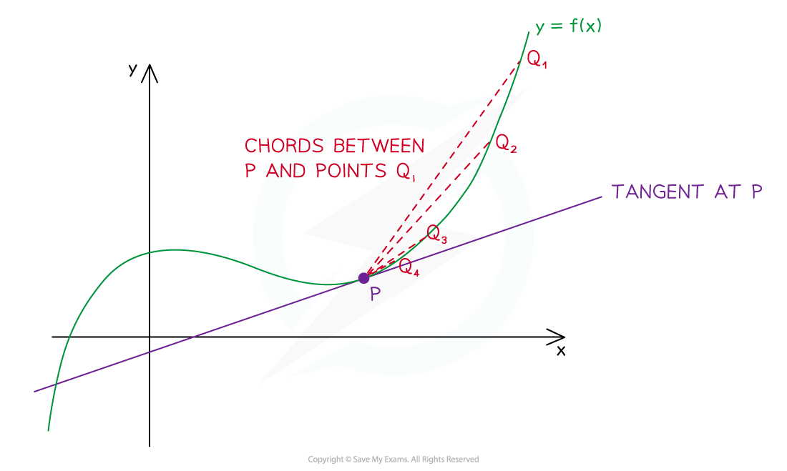

# Definition of Derivatives

## Definition of Derivatives

> **Spec point** — `spcpt_W3hwHXtqPNktSS4H`

## Definition of derivatives

### What is the derivative of a function?

- **Differentiation** is an operation that calculates the **rate of change** of a **function** with respect to a variable

  - This means how much the function varies when the variable increases by one unit
- To **differentiate** a function (f(*x*)) with respect to the variable *x *we use the **notation**

  - `fraction numerator straight d over denominator straight d x end fraction open parentheses straight f open parentheses x close parentheses close parentheses`
- The result is called the **derivative**

### What is the link between derivatives and gradients?

- The rate of change of a function f(*x*) with respect to *x *can be thought of as the **gradient** **function** of the graph *y *= f(*x*)

  - We can write the gradient function (or derivative) as
  
    - $f'(x)$ or $\frac{dy}{dx}$
- The rate of change of a function (or the gradient of its graph) varies for different values of *x*

  - For a **linear function** f(*x*)* *=* mx *+* c *the gradient is constant
  
    - We can write this as $f'(x)=m$ or $\frac{dy}{dx}=m$
  - For the **quadratic function** f(*x*) = *x*² the gradient varies
  
    - Near the origin the gradient is close to 0
    - As *x* increases the gradient of the graph increases

### How can I find the derivative of a function at a point?

- The **derivative** of a function (or gradient of its graph) at a point is equal to the **gradient of the tangent** to the graph at that point
- To **estimate** the gradient you could **draw the tangent** and calculate its **gradient**
- To find the **actual gradient** at a point *x*

  - Pick a **second point** on the curve close to the first point (call it *x* + *h*)
  - Calculate the **gradient of the chord** joining the two points
  
    - `fraction numerator straight f open parentheses x plus h close parentheses minus straight f left parenthesis x right parenthesis over denominator open parentheses x plus h close parentheses minus x end fraction equals fraction numerator straight f open parentheses x plus h close parentheses minus straight f left parenthesis x right parenthesis over denominator h end fraction`
  - Move the **second point closer to the first point** (make *h *get close to zero)
  - Examine what **happens to the gradient **of the chord
  - The gradient of the tangent will be the **limit of the gradients of the chords**
  
    - `straight f to the power of apostrophe open parentheses x close parentheses equals limit as h rightwards arrow 0 of invisible function application fraction numerator straight f open parentheses x plus h close parentheses minus straight f left parenthesis x right parenthesis over denominator h end fraction`
    - You do **not** need to remember this formula

> **Worked Example**
> 
> 
> 

> **Exam Hint**
> - Deriving a derivative from scratch is **not examinable**
> - This revision note is intended to give you an understanding of what derivatives do
