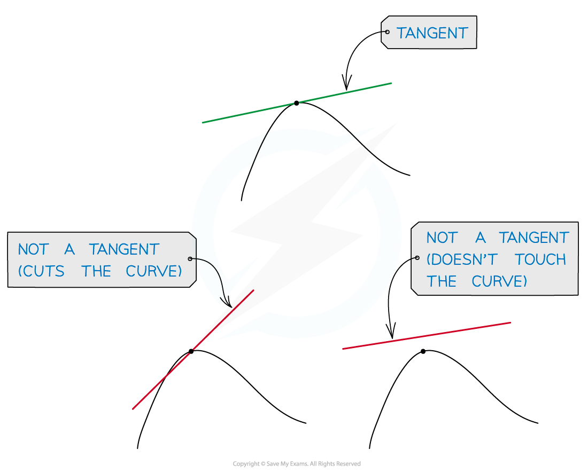
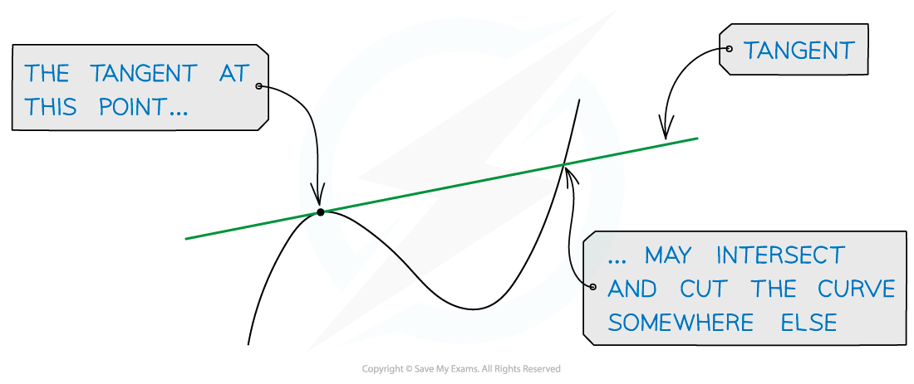

# Definition of Gradient

## Definition of Gradient

> **Spec point** — `spcpt_wJGf7zpK3Gh4tmH7`

## Definition of gradient

### What is the gradient of a curve?

- At a given point the **gradient** of a curve is defined as the gradient of the **tangent** to the curve at that point
- A **tangent** to a curve is a line that just **touches** the curve at one point but doesn't cut the curve at that point

- A tangent *may* cut the curve somewhere else on the curve

- It is only possible to draw **one** tangent to a curve at any given point
- Note that unlike the gradient of a straight line, the gradient of a curve is constantly changing

> **Exam Hint**
> - A tangent only exists at points where a curve is smooth.
> - For example, there is no tangent (or gradient) at one of the 'corners' in a modulus function. 

> **Worked Example**
> 
