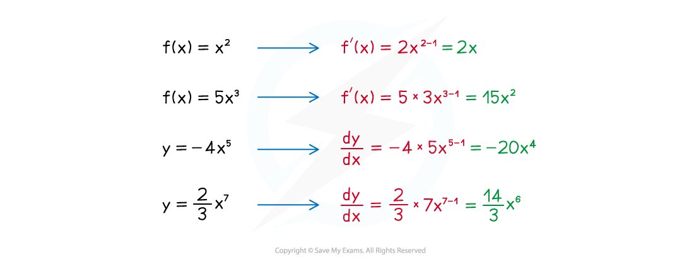
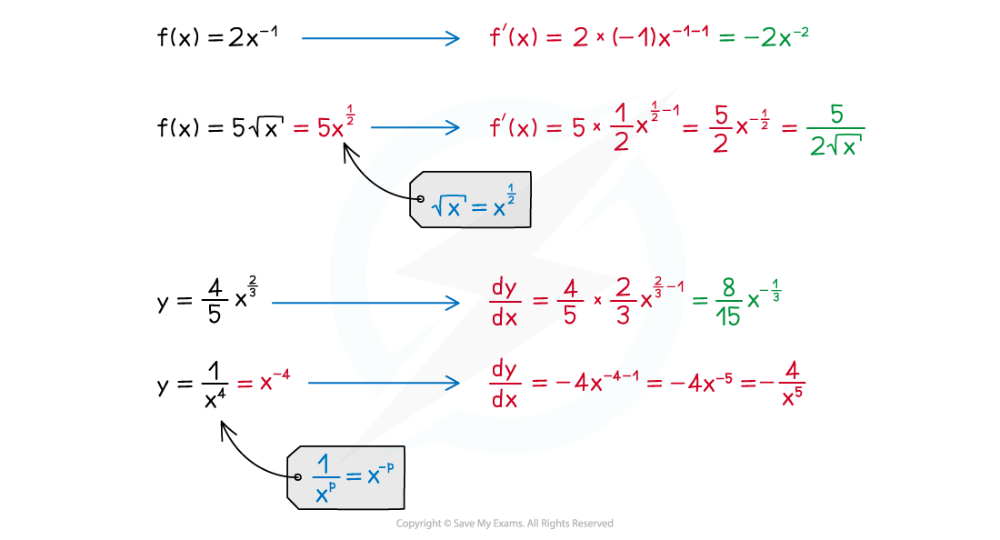
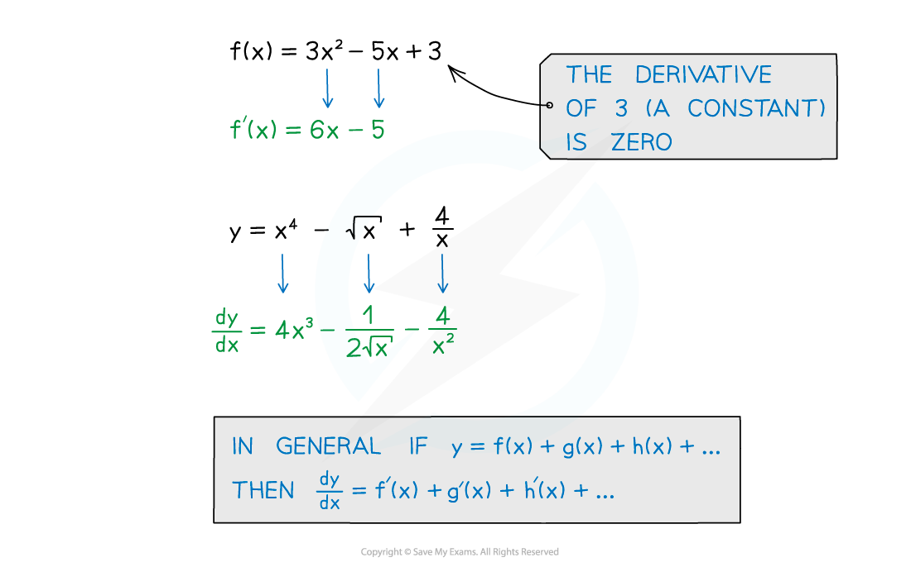

# Differentiating Powers of x

## Differentiating Powers of x

> **Spec point** — `spcpt_Jzb4MpfMDbXWqFCZ`

## Differentiating powers of x

### How do I differentiate expressions with powers of x?

- Powers of ***x*** are differentiated according to the following formula

  - `fraction numerator d over denominator d x end fraction open parentheses x to the power of n close parentheses equals n x to the power of n minus 1 end exponent`
  
    - Where $n$ is any real constant
  - This can be written as:
  
    - If `straight f open parentheses x close parentheses equals x to the power of n` then `straight f apostrophe open parentheses x close parentheses equals n x to the power of n minus 1 end exponent`
    - If $y=x^{n}$ then $\frac{dy}{dx}=nx^{n-1}$

> **Exam Hint**
> `straight f apostrophe open parentheses x close parentheses` is usually used when a function, `straight f open parentheses x close parentheses`, has been defined. $\frac{dy}{dx}$ is used when a graph of a function is given in the form $y=...$ They both represent the derivative of an expression.

- If the term involves a **scalar multiple**, then you can differentiate the power of *x* and then multiply by the scalar

  - `fraction numerator d over denominator d x end fraction open parentheses a x to the power of n close parentheses equals a n x to the power of n minus 1 end exponent`
  
    - Where $n$ and $a$ are any real constants

- Differentiating terms with positive integer powers of ***x*** is straightforward

- But negative and fractional powers of ***x*** can also be differentiated this way

- Don't forget these two special cases:

  - The derivative of a** linear function** is a **constant**
  
    - `fraction numerator d over denominator d x end fraction open parentheses a x close parentheses equals a`
    - Where $a$ is any real constant
  - The derivative of a **constant function** is **zero**
  
    - `fraction numerator d over denominator d x end fraction open parentheses a close parentheses equals 0`
    - Where $a$ is any real constant

- These allow you to differentiate constants and linear terms in ***x***

- If the expression involves a sum or difference of terms just differentiate one term at a time

> **Exam Hint**
> - Take extra care when differentiating negative and fractional powers of ***x ***as mishandling negative signs and fractions is a common way to lose marks in these sorts of questions.

> **Worked Example**
> 
