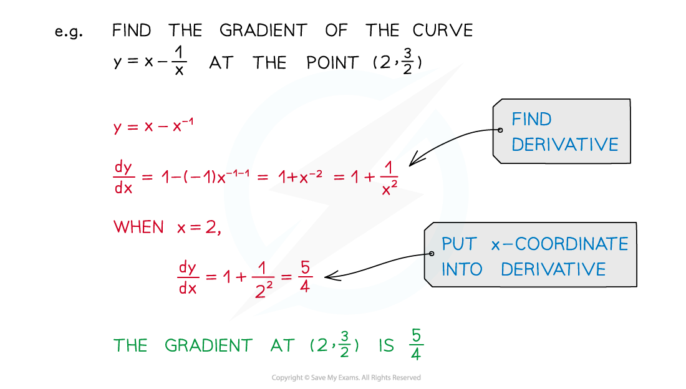
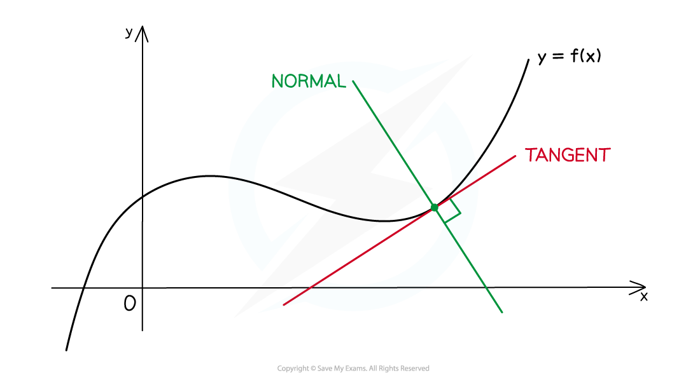

# Gradients, Tangents & Normals

## Gradients, Tangents & Normals

> **Spec point** — `spcpt_PDtz9wfdB46zhbhz`

## Gradients, tangents & normals

### How do I find the gradient at a point on a curve?

- To find the gradient of a curve ***y*****= f(*****x*****)** at any point on the curve, substitute the ***x*****‑coordinate** of the point into the derivative **f'(*****x*****)**

### How do I find the equation of a tangent to a curve?

- At any point on a curve, the **tangent** is the line that goes through the point and has the same gradient as the curve at that point

- For the curve y = f(x), you can find the equation of the **tangent** at the point (a, f(a)) using $y-f(a)=f^{'}(a)(x-a)$

### How do I find the equation of a normal to a curve?

- At any point on a curve, the **normal** is the line that goes through the point and is **perpendicular** to the tangent at that point

- For the curve y = f(x), you can find the equation of the **normal **at the point (a, f(a)) using $y-f(a)=-\frac{1}{f^{'}(a)}(x-a)$

> **Exam Hint**
> - The formulae above are not in the exam formulae booklet, but if you understand what tangents and normals are, then the formulae follow from the equation of a straight line combined with parallel and perpendicular gradients (see Worked Example below).

> **Worked Example**
> 
