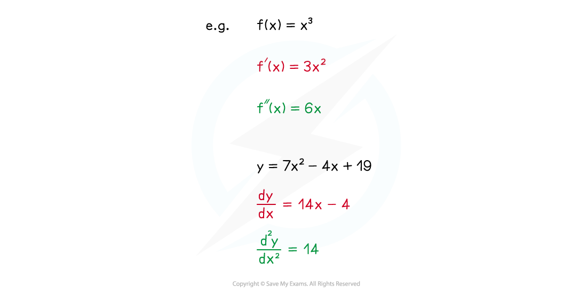

# Second Order Derivatives

## Second Order Derivatives

> **Spec point** — `spcpt_NmrvFdcBf6qPqNxM`

## Second order derivatives

### What is the second order derivative of a function?

- If you differentiate the derivative of a function (ie differentiate the function a second time) you get the **second order derivative** of the function
- For a function y = f(x), there are two forms of notation for the second derivative (or second order derivative)

$f^{''}(x)$ or $\frac{d^{2}y}{dx^{2}}$

- Note the positions of the power of 2's in the second version

- The second order derivative can also be referred to simply as the **second derivative**

  - Similarly, the 'regular' derivative can also be referred to as either the **first order derivative** or the **first derivative**
- The second order derivative gives the rate of change of the gradient function (ie of the first derivative) – this will be important for identifying the nature of **stationary points**

> **Exam Hint**
> - When finding second derivatives be especially careful with functions that have negative or fractional powers of ***x*** (see Worked Example below).
> - Mistakes made with fractions or negative signs can build up as you calculate the derivative more than once.

> **Worked Example**
> 
