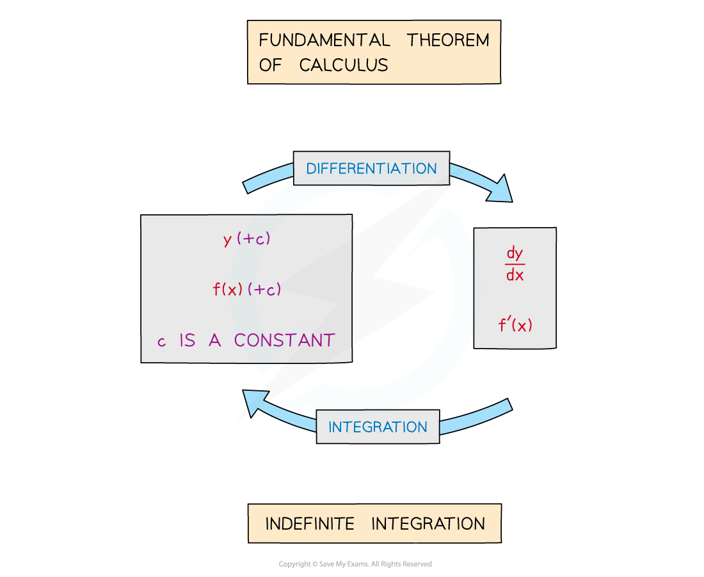
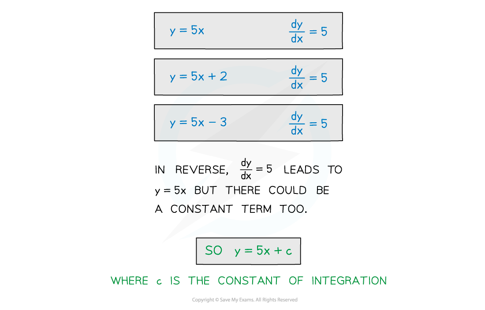
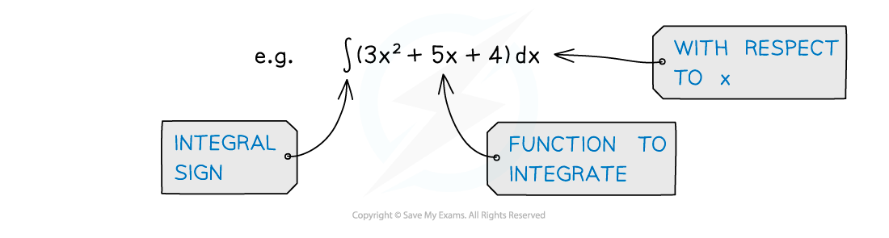

# Fundamental Theorem of Calculus

## Fundamental Theorem of Calculus

> **Spec point** — `spcpt_hBBQtQpzy6DFVZ5J`

## Fundamental theorem of calculus

### What is the fundamental theorem of calculus?

- The Fundamental Theorem of Calculus states that integration is the inverse process of differentiation

  - This form of the Theorem relates to **Indefinite** **Integration**
  - An alternative version of the Fundamental Theorem of Calculus involves **Definite Integration**

### What is a constant of integration?

- When differentiating **y**, constant terms ‘disappear’

  - for constants **y = c**, $\frac{dy}{dx}=0$
  - graphs of constants are horizontal lines and so have gradient `open parentheses fraction numerator d y over denominator d x end fraction close parentheses`** **of 0
- Integrating $\frac{dy}{dx}$, to get **y**, cannot determine the constant

  - To acknowledge this constant, “**+ c**” is used
  - **c** is called the **constant** **of** **integration**

### What notation is used in integration?

- `integral` is the sign for integration
- If it has more than one term the function to be integrated (called the **integrand**) should be in brackets

  - “Integrate” -–  “**all** of (…)”  -–  “with respect to x”
- **dx** means integrate with respect to **x**, any other letter is treated like a number (ie like a constant)

> **Worked Example**
> 
