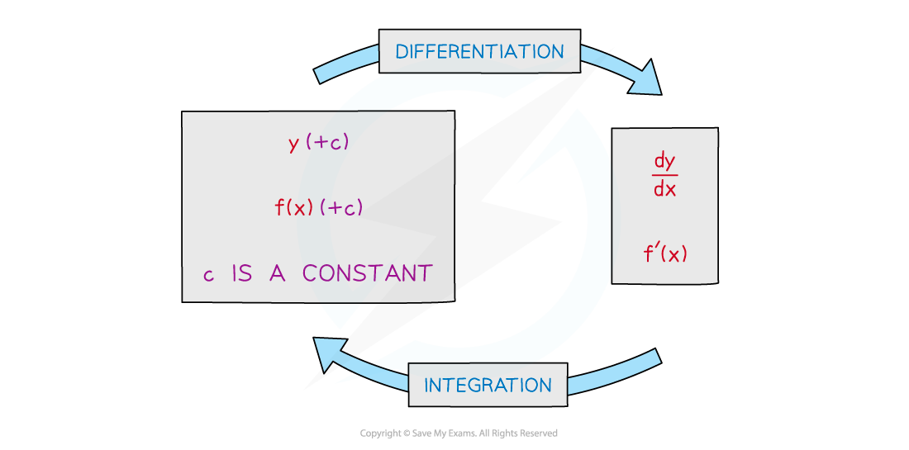
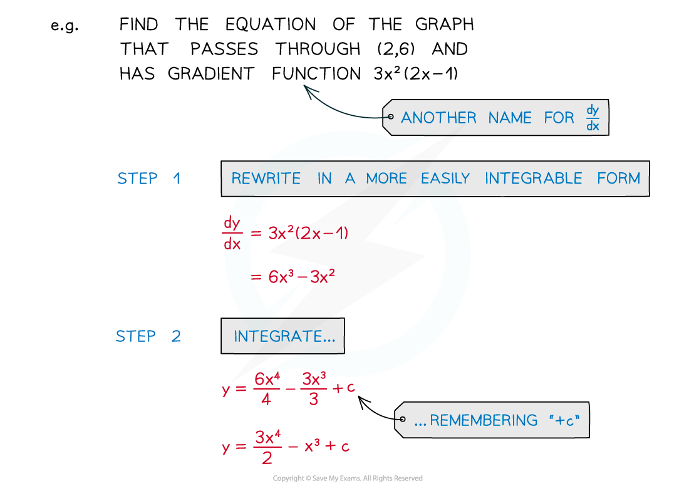
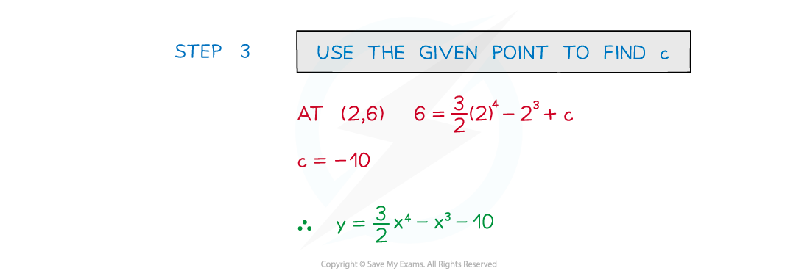

# Integrating Powers of x

## Integrating Powers of x

> **Spec point** — `spcpt_rd5TcbbZnVFFCh7N`

## Integrating powers of x

### What is integration?

- Integration is the **inverse** ('opposite') of differentiation

### How do I integrate powers of x?

- For each term …

  - … increase the power (of x) by 1
  - … divide by the new power
- This does not apply when the original power is -1

  - the new power would be 0 and division by 0 is undefined

## Finding the Constant of Integration

> **Spec point** — `spcpt_K8vvF73Wwzx3844Q`

## Finding the constant of integration

### How do I find the constant of integration?

- STEP 1  Rewrite the function into a more easily ***integrable*** form

  - Each term needs to be a power of **x** (or a constant)
- STEP 2  Integrate each term and remember “+c”

  - Increase power by 1 and divide by new power
- STEP 3  Substitute the coordinates of a given point in to form an equation in **c**

  - Solve the equation to find **c**

> **Worked Example**
> 
> 
> 
