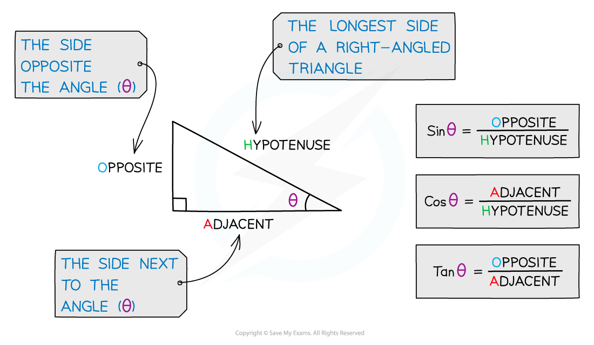
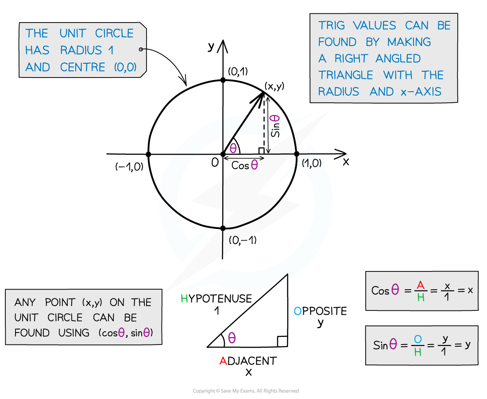

# Definitions of Trigonometric Functions

## Trigonometry - Definitions

> **Spec point** — `spcpt_MMkgfX7dMcgYqnsz`

## Definitions of trigonometric functions

### What is trigonometry?

- Trigonometry looks at the relationship between side lengths and angles of triangles
- It comes from the Greek words trigonon meaning ‘triangle’ and metron meaning ‘measure’
- The three trigonometric functions Sine, Cosine and Tangent come from ratios of side lengths in right angled triangles

### What is the unit circle in trigonometry?

- The unit circle is a circle with radius 1 and centre (0, 0)
- It can be used to calculate trig values as a co‑ordinate point (x, y) on the circle
- (x, y) = (cos θ, sin θ), where θ is the angle measured anticlockwise from the positive x‑axis
- It allows us to calculate **sin**, **cos** and **tan** for angles greater than 90°

> **Worked Example**
> 
> 
> 
