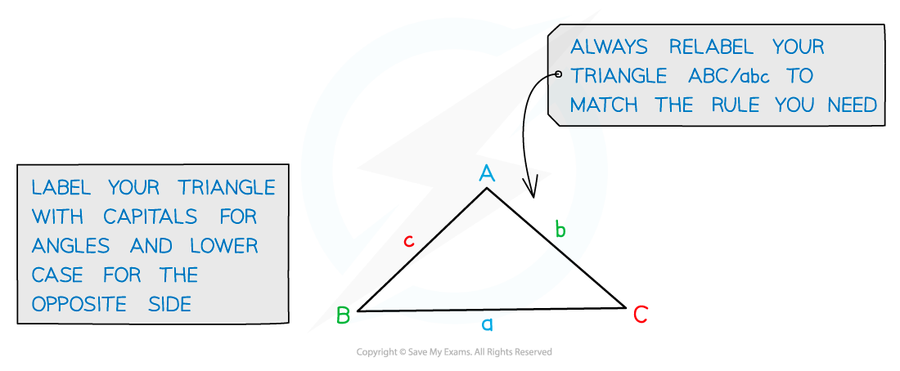
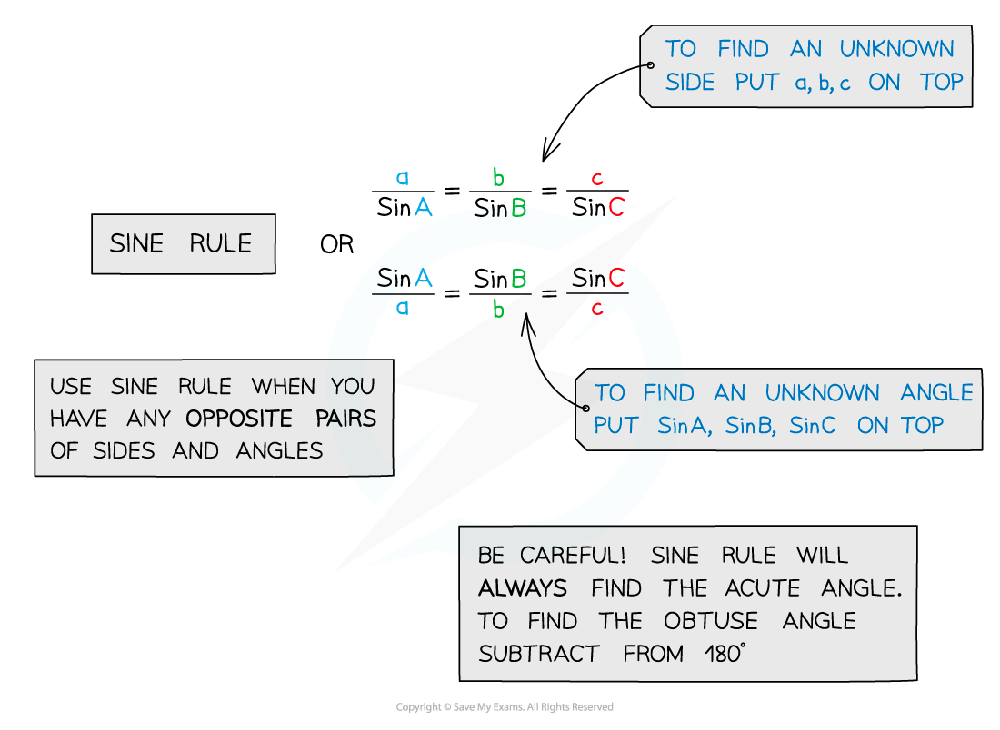
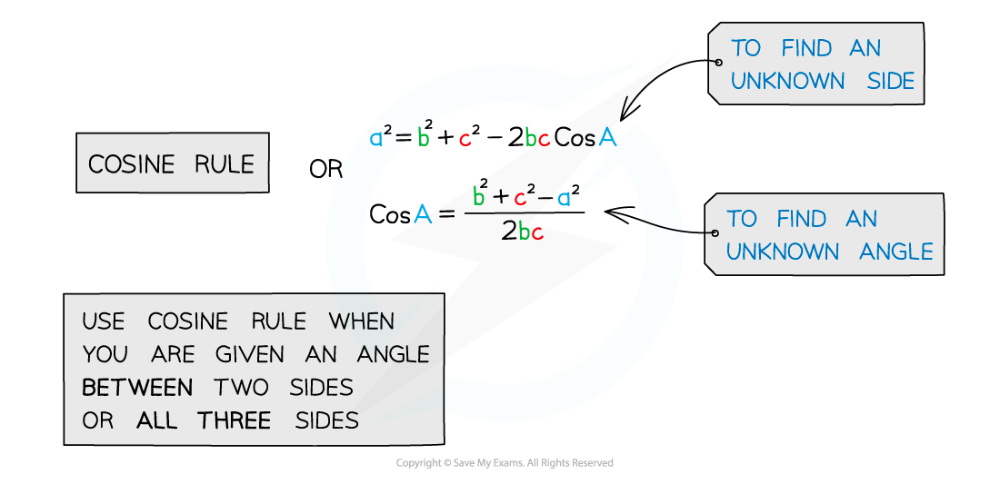
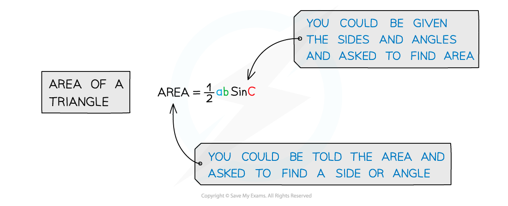
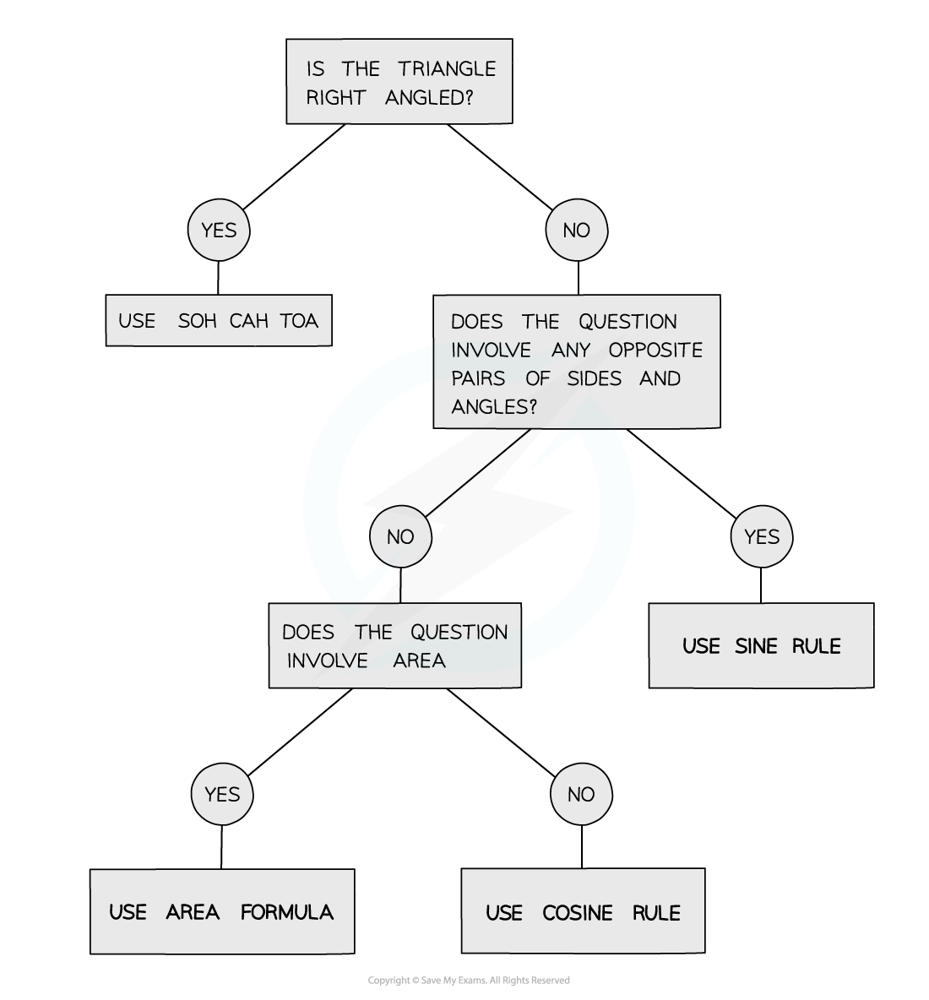

# Non-Right-Angled Triangles

## Non-Right-Angled Triangles

> **Spec point** — `spcpt_nzB9Nyk9jpsF5HPY`

## Non-right-angled triangles

### What is the sine rule, cosine rule and area rule for non-right-angled triangles?

- The Sine Rule, Cosine Rule and Area Formula can be used for ANY type of triangle
- They can help us calculate missing side lengths, angles and area

### How do I know which rule to use?

- Once you know which rule to use, simply label your triangle, substitute in the values and rearrange if necessary

> **Exam Hint**
> - If you are given two angles in a triangle, finding the missing angle by subtracting from 180° might help.
> - Make sure you are careful to pick the correct rule to use, you’ll need to remember all the rules as they aren’t in the formula booklet.
> - Make sure your calculator is in degree mode (D).
> - Always check your answers are sensible…
> 
>   - Have I remembered to square root at the end?
>   - Have I remembered to use -1?
> - Check if the question asks you to round your answer.

> **Worked Example**
> 
> 
> 
