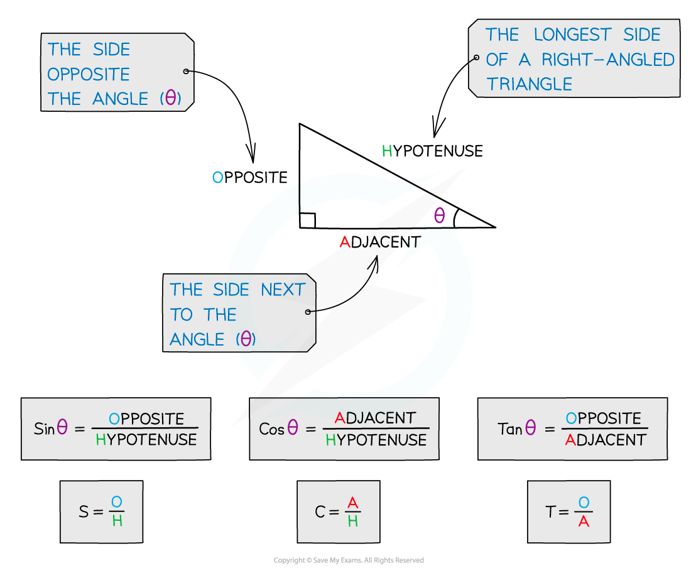
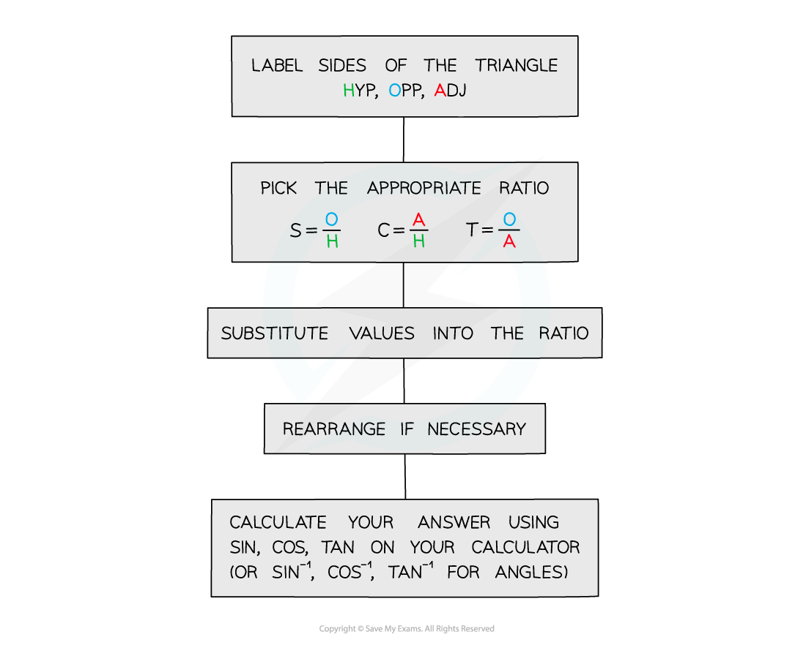

# Right-Angled Triangles

## Right-Angled Triangles

> **Spec point** — `spcpt_Zzm9k5BsSf5z36TF`

## Right-angled triangles

### What is SOHCAHTOA?

- SOH, CAH, and TOA are an easy way to remember the three basic trigonometry ratios
- They show the relationship between an angle and the different sides of a right-angled triangle which we can label **Hypotenuse**, **Adjacent** and **Opposite**
- We use them to find missing angles and sides for right‑angled triangles

  - **Hypotenuse **is the longest side of a right-angled triangle
  - **Adjacent **is the side next to the angle you are working with (in between the angle and the right angle)
  - **Opposite **is the side opposite the angle you are working with

- We use the inverse trig functions to find missing angles

### How do I use SOHCAHTOA?

> **Exam Hint**
> - Remember SOHCAHTOA are only for calculating missing sides and angles for right‑angled triangles
> 
>   - For non-right‑angled triangles you will need to use the Sine or Cosine rules.
> - Make sure your calculator is in degree mode (D).
> - Always check your answers are sensible…
> 
>   - Should my answer be longer or shorter than the sides I have already i.e. is it the hypotenuse?
>   - Is my angle sensible…
>   - Have I remembered to use -1?
> - Check if the question asks you to round your answer.

> **Worked Example**
> 
> 
> 
