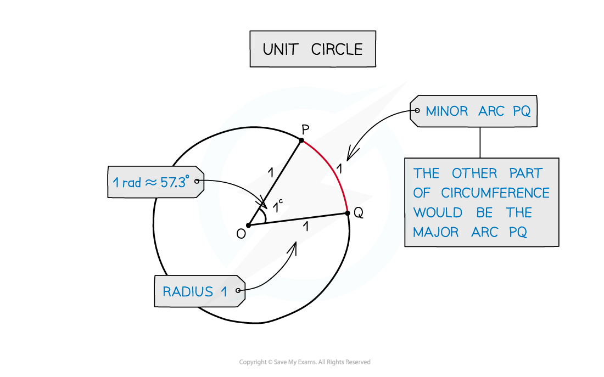
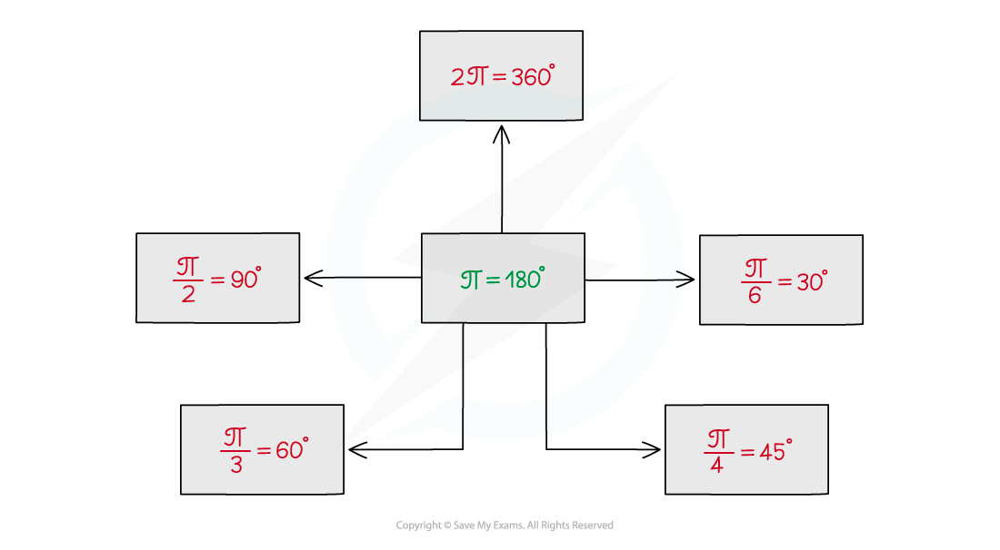
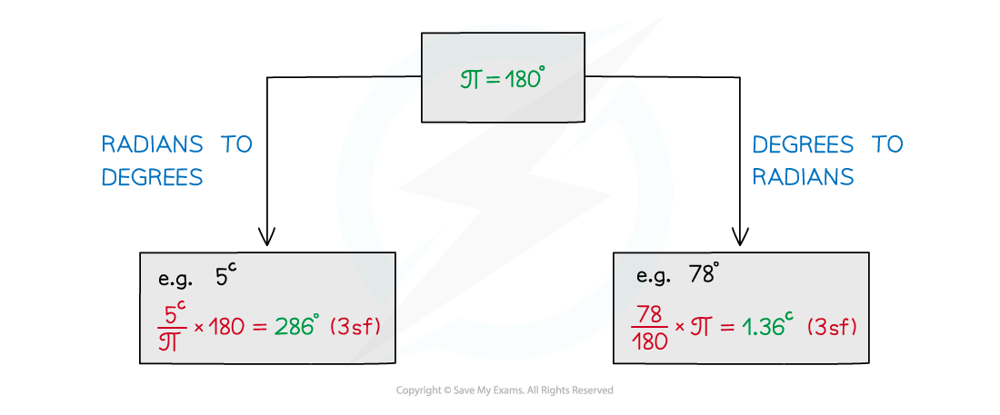
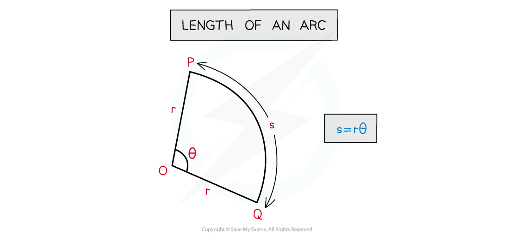
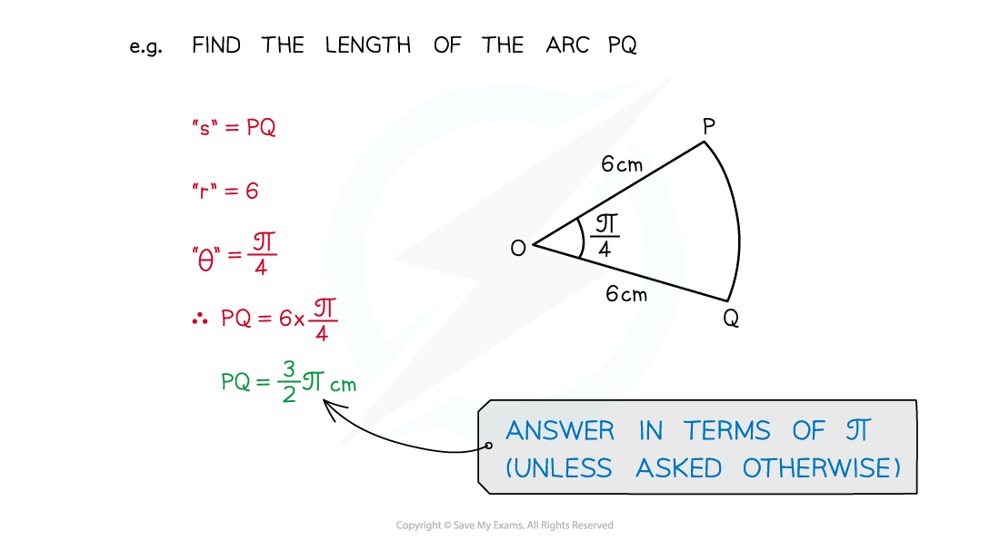
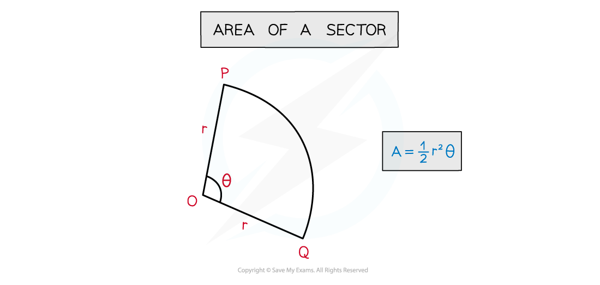
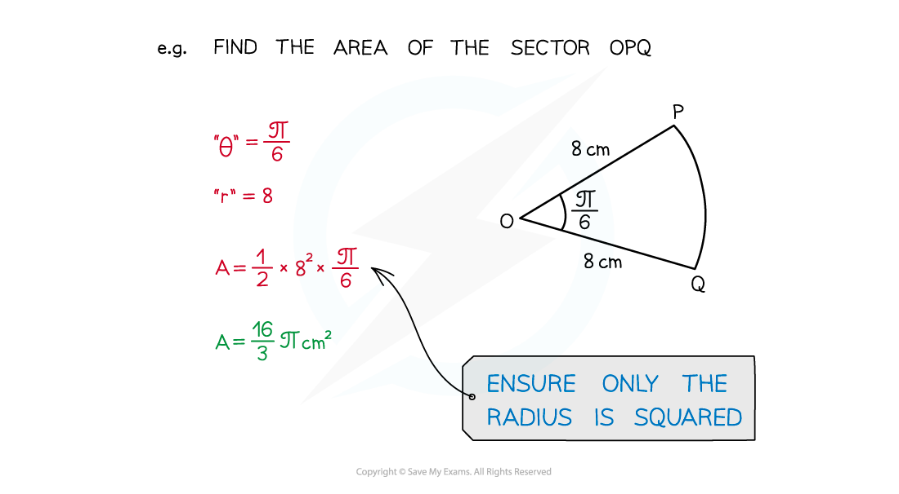
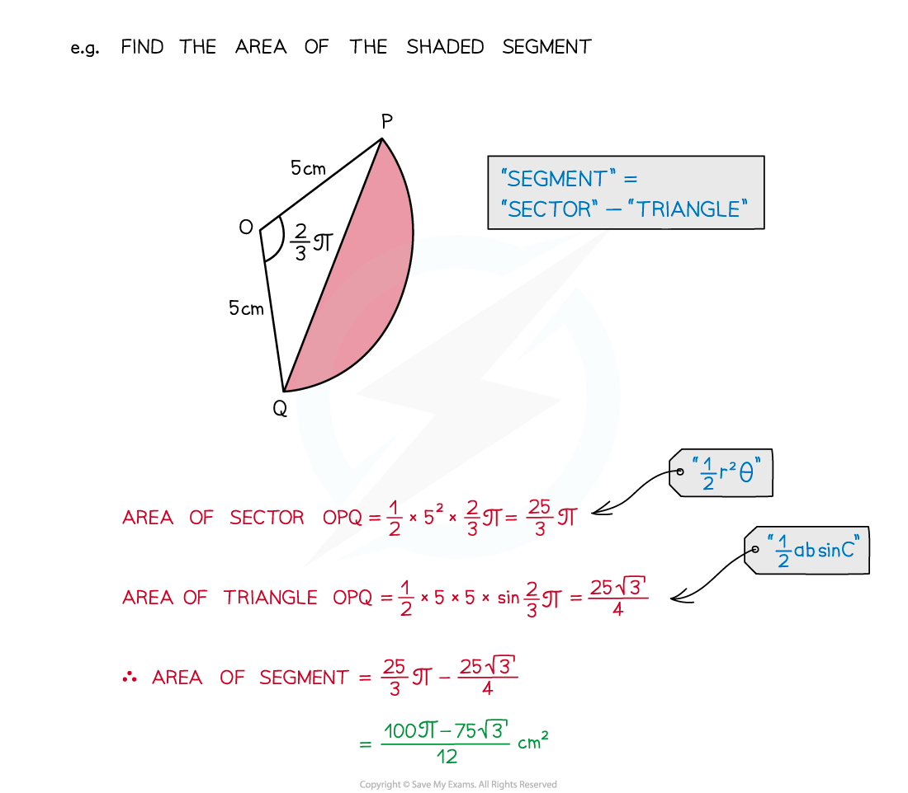

# Radian Measure

## Radian Measure

> **Spec point** — `spcpt_xvsNPZQmYwPq9VcG`

## Radian measure

### What are radians?

- **Radians** are an alternative to degrees for measuring angles

- 1 radian is the angle in a sector of radius 1 and arc length 1
- Radians are normally quoted in terms of π
- This leads to

  - **2π = 360°**
  - **π = 180°**
- The symbol for radians is **c** but it is more usual to see **rad**

  - Often, when π is involved, no symbol is given as it is obviously in radians
- Radians are used in **trigonometry** (see Exact Values) and **calculus** (First Principles Differentiation – Trigonometry)

### How do I convert between radians and degrees?

- The most common are below, these are helpful to know

- Multiples of these are quite common too, eg ¾π = 135°
- For less familiar angles use **π = 180°** to convert

### How do I find the arc length of a sector with radians?

- The length of an arc is **s = rθ**

### How do I find the area of a sector with radians?

- The area of a sector is** A = ½r****2****θ**

### How do I solve sector problems with radians?

- Other **angle**, **circle**, **area**, etc skills may be needed
- For example, area of a triangle **A = ½absinC**

> **Exam Hint**
> - Exam papers will have a mixture of questions in degrees and radians
> - Check the mode (degrees/radians) of your calculator before using it
> - Ensure you know how to change the mode on your calculator
> - For the Casio fx-991EX Classwiz
> 
>   - **SHIFT** then **MENU** **SETUP**
>   - Choose option **2:** **ANGLE** **UNIT**
>   - Choose either **1:** **DEGREE** or **2:** **RADIAN**
> 
> 
> 
> 
> 
> 

> **Worked Example**
> 
> 
> 
